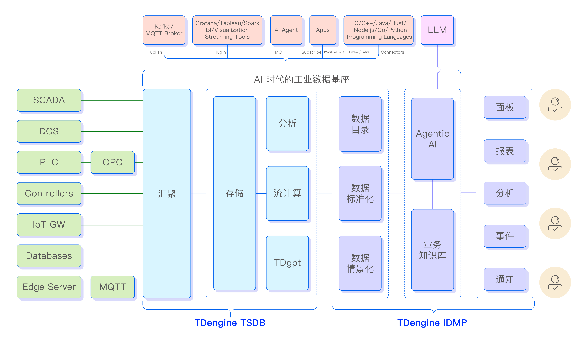

# 第一章 产品简介

## 1.1 什么是 TDengine IDMP

TDengine IDMP（Industrial Data Management Platform，工业数据管理平台）是一款 AI 原生的工业数据管理平台，专为管理、分析工业运营数据并从中提取业务洞察而设计。

TDengine IDMP 与 TDengine TSDB 协同工作。TDengine TSDB 是一款高性能分布式时序数据库，负责存储和处理传感器、设备及控制系统产生的海量时序数据。TDengine IDMP 构建于时序数据存储层之上，为工业数据管理提供更高层次的能力，包括：

- 基于元素与属性的工业数据建模
- 原始传感器数据的情景化处理
- 跨系统的工业数据标准化
- 数据可视化与仪表板
- 基于事件的运营分析
- 实时数据分析
- AI 驱动的业务洞察生成

借助这些能力，IDMP 帮助企业将原始采集的数据转化为结构化信息，用于监控、分析、优化与决策。真正做到让数据自己说话。

与那些以仪表板展示为核心目标的传统监控工具不同，TDengine IDMP 的设计初衷是帮助工程师和运维人员真正理解设备运行规律，直接从工业数据中发现有价值的洞察，而不仅仅是把数据摆到炫酷的屏幕上。

IDMP 是一个数据管理与分析平台，而非完整的工业物联网平台。它不提供设备连接管理、控制命令下发或固件升级功能，但可以与提供这些功能的平台无缝集成。它也不是制造执行系统，也不提供人员排班、维修工单、仓储或生产调度功能。

TDengine IDMP 的定位是明确的：成为管理、情景化、标准化、可视化、分析工业时序数据并从中提取决策智能的最强平台。

---

## 1.2 AI 时代工业数据基座的重要性

工业系统每时每刻都在产生巨量数据——温度、压力、流量、振动信号、能耗、设备状态——来自数千乃至数百万个测点，以极高频率持续涌入。表面上看，这是一座信息宝库；但在实际应用中，绝大多数数据都处于闲置状态。这些原始信号散落在不同系统中，采用各异的命名规则和单位，彼此之间没有共同的语义理解——这就是困扰工业企业多年的"数据孤岛"问题：IT 与 OT 之间的壁垒、数据本身的碎片化、以及应用系统之间的割裂，三座孤岛叠加，让数据的价值大打折扣。

AI 有潜力重新定义工业软件的格局。但 AI 改变不了数据采集系统，改变不了数据标准化，改变不了数据基础设施。一个 4.7 mm/s 的振动读数，对 AI 系统来说毫无意义——除非它知道这个读数属于哪台电机、在哪条产线上、在什么负载条件下运行、处于三小时前开始的哪个批次生产过程中。问题越根本——"昨天产量为何下降？""哪台压缩机最可能在下周发生故障？"—— AI 越高度依赖结构化、情景化、语义丰富的数据，否则它无法给出有效答案。

这正是工业数据基础基座在 AI 时代不可或缺的原因。AI 有潜力取代很多软件工具——报表生成器、排班助手、表单填写流程——但它无法取代采集、组织和维护工业数据上下文的基础层。谁掌控了这个数据基座，谁就能决定 AI 在工业领域能做什么。从孤立数据点到 AI 可推理的数据基座，这个转变的核心不是 AI 本身，而是让数据基座真正具备 AI-Ready 的能力。

这一转变已经开始。传统工业软件以可视化为中心——目标是在屏幕上展示当前的运营状态。在 AI 时代，目标已经改变：将采集的数据转化为真正的业务洞察和决策。这不仅需要存储数据，还需要将数据组织成人类和 AI 系统都能浏览和推理的形式。工业数据基座正是实现这一目标不可替代的关键一层。

---

## 1.3 TDengine 整体架构

TDengine 由两个相互补充的组件构成，共同形成完整的工业数据基座。

**TDengine TSDB**（时序数据库）是数据基础设施层。它负责从工业网关、PLC、SCADA 系统、物联网设备及其他数据源实时接入数据，以大规模方式存储时序数据——支持数百万个测量序列、数十亿数据点，并提供毫秒级响应的高性能查询。TDengine TSDB 还内置流式计算引擎，无需独立的流处理平台即可对实时数据流进行在线计算。

**TDengine IDMP** 是数据语义层与智能层。它运行在 TSDB 之上，提供原始时序存储所不具备的组织结构、业务上下文和分析智能。IDMP 本身不存储时序数据，而是在查询时从 TSDB（或其他已连接的时序数据库）读取数据。IDMP 存储和管理的是资产模型：赋予时序数据意义的元素树、属性定义、关系、模板及元数据。这一层是打破数据孤岛、构建数据语义层的关键所在。

两个组件共同覆盖完整工业数据基座所必须具备的三个层次：

| 层次 | 能力 | 组件 |
|---|---|---|
| 数据基础设施层 | 实时接入、高吞吐写入、弹性存储、高性能查询 | TDengine TSDB |
| 数据语义层 | 资产建模、数据情景化、数据标准化、事件管理 | TDengine IDMP |
| 智能分析层 | 实时分析、AI 业务洞察、自然语言问数、异常检测、趋势预测 | TDengine IDMP + AI |

该平台具有高度开放性。它提供 MCP（Model Context Protocol）接口，使 AI 智能体可直接访问工业数据；支持 REST API、JDBC、ODBC 及 Java、Python 客户端 SDK。数据可通过 Kafka、MQTT 和数据订阅接口向外流出，供下游 AI 系统、BI 工具及第三方应用实时消费。这种开放性确保 TDengine 能够成为更广泛工业 AI 生态的数据基座，而不是制造新的数据孤岛。

---

## 1.4 IDMP 与 TDengine TSDB 的关系

TDengine TSDB 是一款强大的时序数据库，但仅有数据库本身还不够。即便拥有数十亿存储数据点和出色的查询性能，单纯的数据库也无法告诉你某个测量值属于哪台设备、它的工程单位是什么、正常运行范围是多少，或者当数值超过阈值时意味着什么。它无法将设备组织成层级结构，无法跨站点统一命名规范，也无法自动检测异常并通知相应的责任工程师。数据存在，但数据语义层缺失——这是从原始数据到 AI-Ready 数据资产之间的鸿沟。

TDengine IDMP 正是对此的补充。它提供 TSDB 有意留出范围之外的元数据管理、业务上下文和分析能力。当 IDMP 连接到 TSDB 后，可自动同步资产拓扑——若 TSDB 中新增设备或配置发生变更，IDMP 会相应更新资产层级结构，无需手动对账即可保持数据目录的准确性。

有必要明确两个系统之间的边界：IDMP 不存储时序数据。每一次测量值查询、每一张趋势图、每一个实时分析结果——所有这些数据都在查询时从 TSDB 实时获取。IDMP 只存储结构性和上下文性信息：元素树、属性定义、元数据、模板、事件记录和分析配置。这种分离意味着在现有 TDengine TSDB 部署上添加 IDMP 是无损操作，不会产生数据冗余。

IDMP 主要为与 TDengine TSDB 配合使用而设计，两者之间的集成最为深入、高效。同时也支持连接其他时序数据库。

---

## 1.5 与传统实时数据库的对比

工业实时库（data historian）几十年来一直是工业采集数据管理的行业标准。应用最广泛的是 **AVEVA PI System**，由多个组件构成：PI 接口/连接器负责数据采集，PI Data Archive 负责时序存储，PI Asset Framework（AF）负责资产建模，PI Vision 负责可视化。

从功能上看，**TDengine TSDB + IDMP 与这套技术栈直接对应**：TDengine TSDB 对应 PI 接口/连接器 + PI Data Archive，TDengine IDMP 对应 PI Asset Framework + PI Vision。熟悉 PI System 的用户会认出其中的核心概念——资产层级、属性、事件帧、模板——并会发现 IDMP 在现代化、AI-Ready 的架构上重新实现了这些概念。

主要差异体现了自传统实时库设计以来技术格局的深刻变化：

| 能力维度 | 传统实时库（如 PI System） | TDengine TSDB + IDMP |
|---|---|---|
| AI 集成 | 有限，需借助第三方工具 | 原生支持；无问智推、智能问数、AI 问答 |
| 事件规则 | 由 OT 工程师手动配置 | 支持手动或 AI 辅助；大模型可基于采集数据自动生成规则 |
| 可视化定位 | 以展示为核心 | 以洞察为核心；AI 自动生成并推荐面板 |
| 高级分析 | 有限，需借助第三方工具 | 内置批次分析、趋势预测、异常检测、插值、聚类、回归等 |
| 数据规模 | 通常支持百万级测点 | 设计支持十亿级数据点 |
| 数据流向 | 主要为单向流入（采集与存储） | 双向；支持数据订阅，可实时向下游系统流出 |
| 开放性 | 私有接口，导出能力有限 | REST API、JDBC、ODBC、Kafka、MQTT、MCP、开放 SDK |
| 部署环境 | 主要支持 Windows | Linux、容器、虚拟机、私有云、云原生 |

TDengine 目前与成熟实时库相比的不足在于数据源接入能力。PI System 经过数十年积累，支持极为广泛的工业接口和协议。TDengine 目前原生支持 OPC-UA、OPC-DA 和 MQTT，其他数据源可通过 TDengine TSDB 的数据接入框架接入。这一差距正在随着每个版本的发布持续缩小。

对于正在评估从 PI System 或其他实时库迁移的企业，两者的功能映射已足够接近，现有资产模型和分析逻辑通常无需根本性重新设计，即可在 TDengine IDMP 中重新表达。

---

## 1.6 核心概念

理解 TDengine IDMP，首先需要掌握贯穿整个平台的一组核心概念。这些概念构成了系统的基本词汇，从建模到可视化再到 AI 洞察，每项功能都构建于这些概念之上。

### 1.6.1 元素（Element）

**元素**是资产模型的基本单元。资产树中的每个节点都是一个元素。元素代表物理或逻辑实体：一个传感器、一台电机、一条产线、一座工厂、一座城市、一个业务单元——任何对运营有意义、需要组织和追踪其数据的事物。

元素按树状层级排列。每个元素可以有零到多个子元素，除根节点外每个元素都有父元素。这种层级结构映射了运营的真实世界架构：一个风力发电场包含多台风机，每台风机包含多个子系统，每个子系统包含各自的传感器。浏览元素树是用户探索运营全貌、定位所需数据的基本方式。

每个元素拥有自己的属性、实时分析、事件、面板和仪表板集合，是系统中其他一切内容的组织锚点。

### 1.6.2 属性（Attribute）

**属性**是元素的一个特性维度。属性代表与资产相关的各个数据维度——温度、运行状态、功率输出、地理位置、额定容量等。

属性可以有不同类型。有些是直接存储在 IDMP 中的静态配置值（如电机的额定功率或资产的安装日期）；有些是动态属性，通过数据引用与 TSDB 中的实时时序数据关联；还有一些是衍生属性，由实时分析计算后写回。每个动态属性都有可配置的元数据：工程单位、显示单位、小数精度、上限与下限，以及目标值等。

### 1.6.3 时序数据（Time Series）

**时序数据**是存储在 TDengine TSDB 中的带时间戳测量值流。这是传感器、仪表和控制系统产生的原始数据——每秒钟涌入数千乃至数百万个数据点。

如果你有 OT 背景，可能更熟悉**测点**（tag）这个术语。测点——在 PI System、SCADA 系统、DCS 平台及大多数工业实时库中使用——与时序数据是完全相同的概念：一个产生连续带时间戳数值流的单一命名测量点。两个术语可以互换使用。TDengine 采用"时序数据"以对齐现代数据术语，但你现有系统中的每个测点都直接对应 TDengine TSDB 中的一条时序数据。

在 IDMP 中，时序数据不直接管理，而是通过元素的属性访问。当某个属性关联了时序数据引用后，IDMP 会按需从 TSDB 获取数值——用于趋势图、分析、AI 问数以及其他需要底层数据的操作。这种间接访问方式是有意为之：它使数据语义层（IDMP）与存储层（TSDB）保持清晰的分离。

### 1.6.4 情景数据（Contextual Data）

**情景数据**是赋予时序数值意义的元数据。一个原始传感器读数——"14:23:07 时为 42.7"——脱离上下文毫无意义。情景数据回答的正是那些让数据开口说话的问题：测量的是什么？在哪里？在什么条件下？符合什么标准？

在 IDMP 中，情景数据附加在元素及其属性上。它包括描述性信息（该元素是什么、该属性代表什么）、物理维度（工程单位、显示精度、上限与下限、目标值），以及分类标签（类别、位置、组织单元、运行工况）。情景数据也是 IDMP AI 功能的基础：系统利用这些结构化的业务上下文理解运营场景，进而生成相关的分析和洞察。从孤立的数据点到 AI 可推理的数据资产，情景数据是中间那道不可缺失的桥梁。

### 1.6.5 事件（Event）

**事件**是一次具有明确开始时间、结束时间、持续时长、严重等级以及发生时刻相关数据的离散运营事项。事件是连续时序数据与离散运营知识之间的桥梁。

IDMP 中的事件由实时分析生成。当分析检测到某种条件——超出阈值、工艺偏差、批次生产的开始或结束——它会创建一条事件记录，不仅记录该事项本身，还捕获当时相关属性的数值和计算结果。事件可以要求确认，可以触发向责任人员的通知，事后还可以对事件进行浏览、对比和分析。

这一概念在 PI System 中称为事件帧（Event Frame），是工业数据管理中最具价值的理念之一。它将连续传感器数据流转化为结构化的、有名称的运营片段，让工程师和 AI 系统都能对其进行推理："上个季度发生了多少次压缩机喘振事件？""哪些批次偏离目标温度曲线最大？""电机故障前 10 分钟发生了什么？"

### 1.6.6 面板（Panel）

**面板**是单个可视化组件——图表、仪表、表格、状态显示——展示来自一个或多个元素属性的数据。面板是 IDMP 所有可视化的基本构建单元。

IDMP 支持多种面板类型：趋势图、柱状图、饼图、仪表盘图、条形仪表图、散点图、统计值、状态时间轴图、状态历史图、表格、资产列表表格、事件列表表格、事件趋势图、地图和富文本面板。每种面板类型适合不同类型的数据和不同的分析需求。

面板可以手动创建，也可以由 AI 引擎根据元素的数据和上下文自动生成。

### 1.6.7 仪表板（Dashboard）

**仪表板**是将多个面板组织到一个视图中的集合。仪表板为一个或一组元素提供连贯、结构化的全局视图——将趋势图、仪表、表格及其他面板类型整合为统一的运营画面。

IDMP 中的每个元素可以拥有多个仪表板，每个仪表板面向不同的用途或受众：一个供运维人员监控实时状态，一个供工程师进行根因分析，一个供管理层查看每日 KPI。仪表板可以共享、导出为定期报表，也可以嵌入外部 Web 应用。

与面板一样，仪表板可以手动创建，也可以由 AI 引擎自动生成。

### 1.6.8 洞察（Insight）

**洞察**是 IDMP 基于元素数据和上下文生成的 AI 分析输出。洞察不仅仅是展示数据，而是对数据进行解读——让数据真正开口说话。

IDMP 的洞察引擎能够根据数据的结构和内容自动感知元素的应用场景（风机、污水处理罐、物流车队），进而生成该场景下最相关的面板、实时分析和总结报告——无需用户进行任何配置。这项能力称为**无问智推**：系统主动推断你需要看什么，而不是等待你去配置和查询。它还能够回答关于数据的自然语言问题（**AI 问答**）、检测异常、生成预测、插补缺失值，并进行根因分析。

洞察是工业数据基座与构建这一基础的 AI 智能之间的交汇点。

### 1.6.9 模板（Template）

**模板**为某类资产或运营模式定义可复用的标准结构。无需从零开始逐一配置每个元素、属性、分析、面板或仪表板，只需在模板中定义一次结构，然后一致地应用于所有同类资产。

模板存在于平台的每个层面：元素模板定义某类资产的标准属性集（如泵、仪表、锅炉）；属性模板定义可复用的单个测量定义；分析模板封装标准检测逻辑；面板和仪表板模板统一可视化规范；事件与通知规则模板统一运营事项的命名和上报方式。

模板使大规模工业部署变得可管理。更新模板时，变更会自动传播到所有基于该模板派生的元素——确保数百乃至数千台资产的一致性，无需手动逐一修改。
