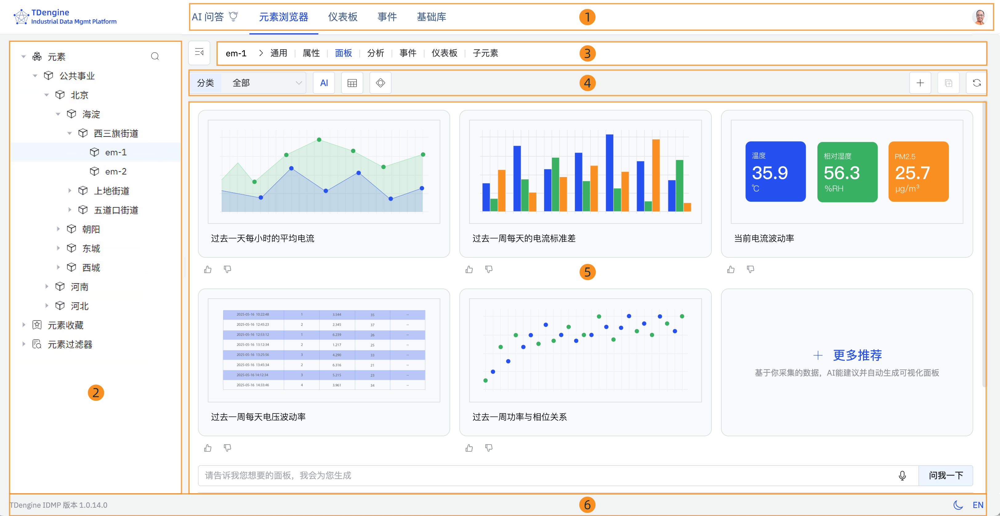
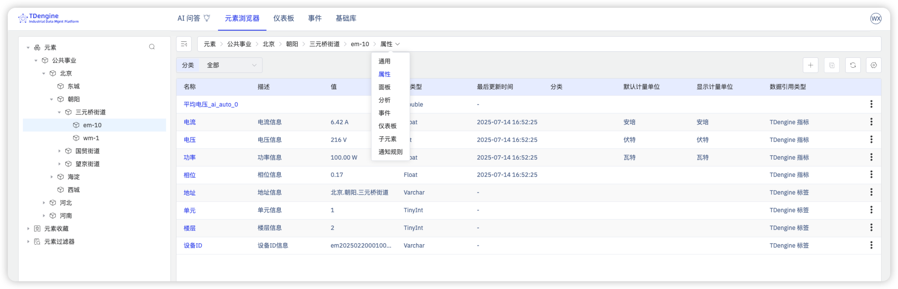
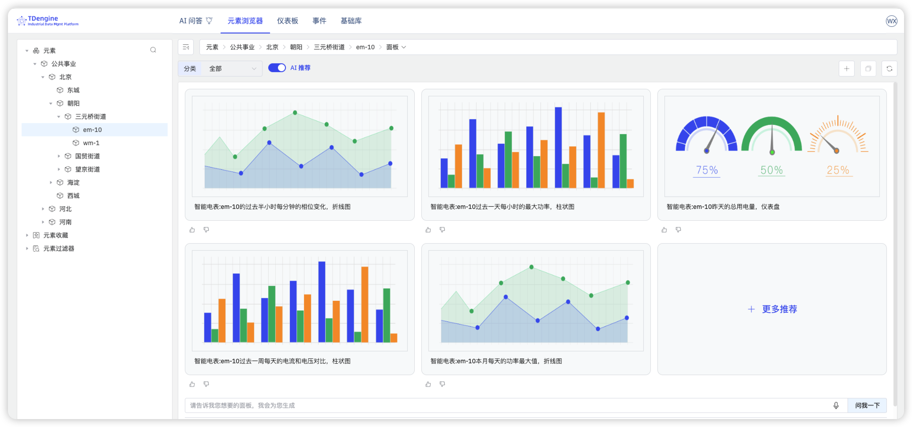
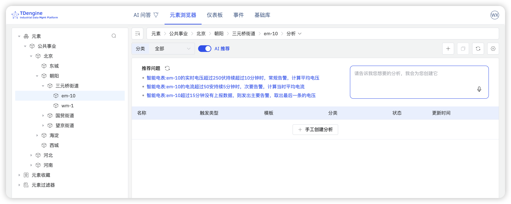

完成激活后，您距离真正用起来只差几步。本节将带您快速走一遍 IDMP 的核心界面，并亲手体验 AI 驱动的数据可视化与实时分析——感受工业数据的智能价值从何而来。

## 2.4.1 导览

**导览**会在您首次登录时自动弹出，引导您了解 IDMP 界面的各个主要区域。点击**下一步**逐步查看，随时可以点击 **X** 关闭。如需重新查看，点击右上角的头像图标，选择**引导页**。

界面分为以下几个区域：

**1. 顶部导航栏**

顶部导航栏横跨页面全宽。左侧是 TDengine 徽标，中间是五个主要模块：

- **AI 问答** — 以自然语言提问，查询工业数据。
- **元素浏览器** — 浏览和管理资产层次结构、属性、面板、实时分析及事件。
- **仪表板** — 查看和管理跨所有元素的仪表板。
- **事件** — 浏览、筛选和分析全系统的事件。
- **基础库** — 管理共享资源，包括元素模板、事件模板、枚举集、计量单位等。

最右侧是您的**头像**图标，点击可管理个人信息、进入系统管理页面或启动引导页。

**2. 左侧面板**

左侧面板显示当前模块的树状层次结构。在**元素浏览器**中，分为三个部分：

- **元素** — 资产层次结构。点击箭头展开节点，点击元素名称选中该元素。点击搜索图标可按名称查找元素。
- **元素收藏** — 您标记为收藏的元素，方便快速访问。
- **元素过滤器** — 已保存的搜索过滤条件，可快速召回特定的元素集合。

**3. 上下文标签栏**

上下文标签栏位于左侧面板右侧，显示当前选中对象的名称，以及该对象可用视图的标签页。选中元素后，标签页包括：**通用**、**属性**、**面板**、**分析**、**事件**、**仪表板**和**子元素**。点击标签页切换视图。上下文标签栏最左侧有一个折叠图标，可隐藏左侧面板以最大化工作区。

:::note
系统内置的导览将此区域称为"路径栏"。
:::

**4. 操作栏**

上下文标签栏下方是一排控件。左侧通常显示过滤下拉框（如**类别**）和视图切换按钮（如 **AI** 推荐按钮或网格/列表视图切换）。右侧显示操作图标，包括用于新增条目的 **+** 图标和刷新按钮。

**5. 主工作区**

操作栏下方是主工作区，显示当前选中标签页的内容——元素详情、属性列表、面板、事件等。可在此区域直接查看和编辑内容。

**6. 状态栏**

状态栏位于页面底部。左侧显示当前 IDMP 版本，右侧提供**主题切换**（亮色/暗色模式）和**语言切换**。

## 2.4.2 查看元素信息

以下步骤以 **公共事业** 场景为例。如果在激活时未加载该场景，请进入**管理后台** > **示例数据**，先加载后再继续。

1. 在左侧面板中点击**元素**，公共事业 场景的元素将以树状层次结构显示。
2. 选择 **公共事业** > **北京** > **朝阳** > **三元桥街道** > **em-10**。该元素代表加利福尼亚州圣地亚哥县丘拉维斯塔市编号为 10 的电表。
3. 在上下文标签栏中选择**通用**，查看该电表的描述和基本信息。
4. 选择**属性**，查看其属性信息，如电流、电压等。

## 2.4.3 体验 AI 生成面板

1. 选择元素 **公共事业** > **北京** > **朝阳** > **三元桥街道** > **em-10**。
2. 在上下文标签栏中选择**面板**，页面将显示 5 个 AI 推荐面板。点击 **+ 更多推荐**可生成更多选项。
3. 您也可以在推荐面板下方的输入框中，以自然语言告诉 AI 您想要的面板，例如：

   *"以折线图展示电表 em-10 过去 24 小时每分钟电压和电流的变化。"*

   点击**问我一下**，AI 会自动生成您期望的面板。

## 2.4.4 体验 AI 实时分析

1. 选择元素 **公共事业** > **北京** > **朝阳** > **三元桥街道** > **em-10**。
2. 在上下文标签栏中选择**分析**，页面将显示 3 个 AI 推荐问题。
3. 点击推荐问题的链接，进入实时分析创建页面，可对 AI 生成的配置进行进一步调整，确认后点击**保存**。
4. 您也可以在推荐问题旁边的输入框中，以自然语言描述分析需求，例如：

   *"如果电表 em-10 的功率波动超过正负 20% 持续 30 分钟，产生'警告'级别的告警，并计算波动幅度。"*

   按**回车**，AI 会自动生成您期望的实时分析。

## 2.4.5 下一步

恭喜您完成了 IDMP 的初步探索！您已经亲身体验了界面导览、AI 生成面板和 AI 实时分析——这只是 IDMP 能力的冰山一角。接下来，您可以：

- 阅读**第 3 章**，学习如何通过元素和属性构建属于您自己业务场景的资产模型。
- 阅读**第 12 章**，将您自己的数据源接入 IDMP，开始处理真实的工业数据。
- 加载更多示例场景，探索更多行业应用案例。点击右上角的头像图标，选择**管理后台**，然后在左侧面板中点击**示例数据**。
