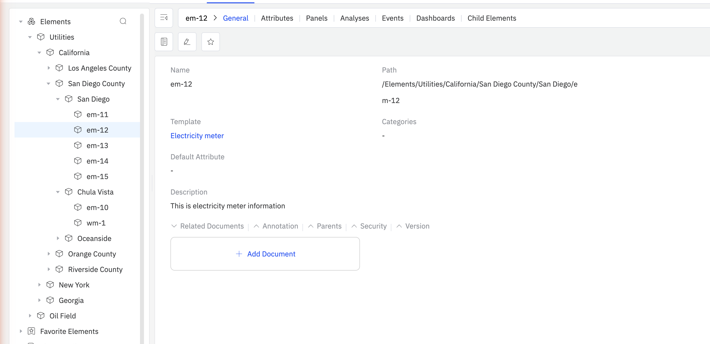
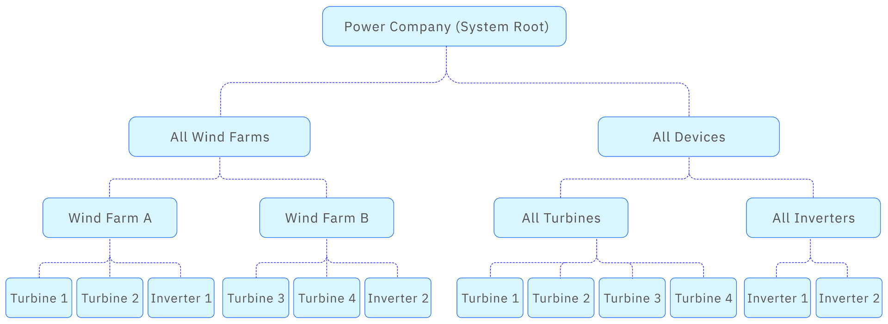
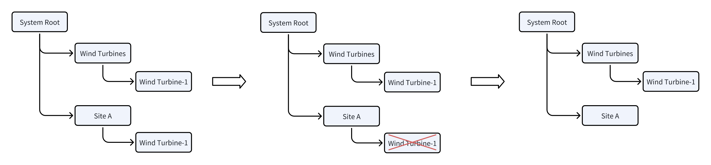
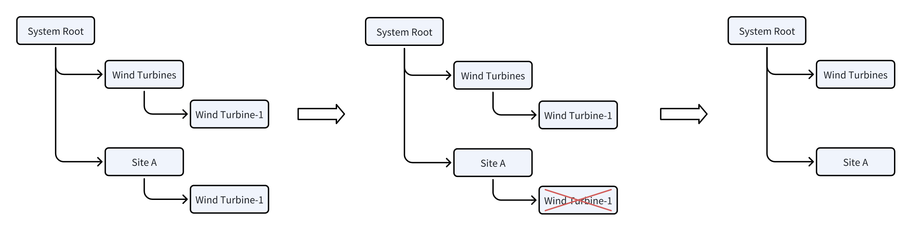

# 3.1 元素与数据目录

在 TDengine IDMP 中，工业环境中的每一个物理或逻辑资产——工厂、产线、设备或传感器——都以**元素**的形式表示。元素是资产模型的基础构建单元，为原始时序数据提供了结构化的归属和有意义的上下文。

元素按层级组织为**资产树**，构成企业的**数据目录**——一张涵盖所有资产与数据流的结构化导航地图。在 AI 时代，数据目录至关重要：它是 AI 智能体定位、理解并推理工业数据的索引，无需任何人工干预。

## 3.1.1 什么是元素

元素是工业环境中真实资产或逻辑分组的数字化表示。通过元素，您可以按资产而非原始数据表来组织、检索和分析数据。



在资产树中选中某个元素后，**通用标签页**会显示以下信息：

| 字段 | 说明 |
|---|---|
| **名称** | 元素在其父级范围内的唯一标识符 |
| **路径** | 该元素在资产树中的完整层次路径（例如 `/Elements/Utilities/California/San Diego County/Chula Vista/em-10`） |
| **模板** | 该元素所基于的元素模板。点击模板名称可跳转到模板定义页。 |
| **类别** | 用于分组和筛选元素的一个或多个用户自定义类别标签 |
| **默认属性** | 在汇总视图中显示该元素时默认展示的属性 |
| **描述** | 对该资产所代表内容的自由文本描述 |
| **位置** | 物理资产的 GPS 坐标：经度、纬度和海拔。用于基于地图的可视化。 |
| **附加特性** | 用于存储该元素特有的自定义元数据的自由键值对，如制造商、型号、序列号、安装日期或维护联系人 |

通用标签页主要字段下方还包含以下可展开区域：

### 3.1.1.1 关联文档

上传文件——如用户手册、工程手册、P&ID 图纸、校准报告或任何领域专用参考资料——并将其直接附加到元素。这些文档会被索引，并提供给 TDengine IDMP 的 AI 引擎使用。当用户通过 AI 问答提问时，AI 可以调用这些文档，提供更准确、更贴近具体资产的回答。例如，附加一台泵的操作手册后，AI 就能回答关于其预期运行范围、维护间隔和报警阈值的问题。

添加文档：展开**关联文档**并点击 **+ 添加文档**。

### 3.1.1.2 注解

为元素添加自由文本备注。注解可用于记录观察结果、维护历史或不适合填写到结构化属性字段的运营背景信息。

添加注解：展开**注解**并点击 **+ 新建注解**。详情请参见[注解](../11-collaboration/02-annotations.md)。

### 3.1.1.3 父元素

显示资产层次结构中的所有父元素。一个元素可以同时出现在多个层次结构中（例如，一台泵可以同时属于地理层次结构和功能设备层次结构）。父元素区域会列出每个父元素及其完整路径。

**安全** *(即将推出)*

该元素的基于角色的访问控制。此功能尚未实现。

**版本** *(即将推出)*

该元素配置变更的版本历史和审计追踪。此功能尚未实现。

## 3.1.2 资产树与数据目录

元素按照层级结构组织为**资产树**，该结构映射了工业环境的物理或逻辑组织形式。典型的层级结构如下：

```text
企业
└── 工厂
    └── 产线
        └── 设备
            └── 传感器
```

资产树中的每个节点都是一个元素。每个元素不仅可以关联时序数据，还可以附加属性、可视化面板、实时分析任务、事件、文档与注解——均挂载在层级的适当位置。这将原始传感器数据转化为具有业务含义的上下文化信息。

### 资产树即数据目录

资产树不只是一个导航面板。当完整构建后，它将成为企业的**数据目录**——涵盖工业环境中所有资产与数据流的结构化可浏览地图。

数据目录让 AI 与用户都能在无需了解底层数据库表名或原始数据模式的情况下，*定位、理解并导航*数据资产。用户或 AI 智能体无需追问"TDengine 中哪张超级表存储了站点 A 三号泵的振动数据？"，只需导航至 `站点A → 公用工程 → 三号泵 → 振动`，即可立即找到所需数据，连同其工程单位、历史趋势、分析规则和关联文档一并获取。

这正是 TDengine IDMP 实现 AI 就绪的关键所在。IDMP 的 AI 引擎以资产树为索引检索数据。当您在 AI 问答中提问——例如"上周站点 A 哪些泵超过了振动阈值？"——AI 会遍历数据目录，识别相关元素，获取正确属性，并给出有据可查、针对具体资产的回答。一个结构清晰的数据目录，不仅是组织管理的便利工具，更是让 AI 查询准确、上下文感知、可付诸行动的根本基础。

任何元素都可以拥有一个或多个子元素，形成父子关系，从而支持：

- 跨资产树某一分支聚合数据（例如，统计某条产线上所有设备的总能耗）
- 在层级的任意节点应用配置、分析规则和看板模板

元素树的根节点——没有父元素的顶级元素——通常代表企业或站点级别的资产。您可以创建多个根级元素，以表示不同的站点或业务单元。

### 多视角组织同一批资产



资产树支持**同时维护多棵层级树**，每棵树从不同的业务视角呈现同一批资产：

| 视角 | 示例层级 |
|---|---|
| 组织架构 | 集团 → 工厂 → 产线 → 设备 |
| 地理位置 | 区域 → 站点 → 厂房 → 区域 → 设备 |
| 设备类型 | 风机 → 变频器 → 传感器 |
| 功能分类 | 公用工程 → 电表 → 相位测量 |

一台物理设备——例如一台泵——可以同时出现在地理层级树和功能设备层级树中。两个视图指向同一个元素及其数据，不存在任何重复。这是通过*元素引用*实现的。详情参见 [3.1.7 元素引用](#317-元素引用)。

这种多视角组织确保数据目录能服务于企业中的每个团队：运维团队按站点导航，维护团队按设备类型导航，AI 智能体则可沿任意路径找到所需数据。

### 每个节点承载的内容

数据目录中的每个元素不只是一个名称。每个节点承载：

- **标识信息** — 名称、路径、模板、类别及描述性元数据
- **数据** — 将元素与 TDengine TSDB 中实时和历史时序数据关联的属性绑定
- **智能分析** — 实时分析规则、异常检测与告警条件
- **可视化** — 由模板自动生成的面板与看板
- **知识库** — 附加文档（操作手册、P&ID 图纸、校准记录），由 AI 引擎索引
- **上下文** — 注解、地理坐标与运营备注

这种丰富性正是数据目录区别于普通文件夹结构之处。数据目录不仅告诉您数据*在哪里*，还告诉您数据*意味着什么*、*归谁所有*以及*如何解读*。

## 3.1.3 创建元素

新元素始终作为已有父元素的子元素创建。有三种方式可以完成此操作：

### 3.1.3.1 方式一：从元素树悬停菜单创建

1. 在元素树中，将鼠标悬停在父元素上，显示其名称旁的 **⋮** 图标。
2. 点击 **⋮** 并选择**新建子元素**。
3. 填写元素信息并点击**保存**。

### 3.1.3.2 方式二：从子元素选项卡工具栏创建

1. 在元素树中选中父元素。
2. 在元素详情面板中点击**子元素**选项卡。
3. 点击工具栏中的 **+** 图标（子元素选项卡右上角）。
4. 填写元素信息并点击**保存**。

:::tip
建议在组织内统一命名规范。例如，在元素名称前加上站点代码前缀（如 `SF-Line-01`），以便在大型资产树中快速定位。创建元素时选择**模板**，系统会自动预填该资产类型的标准属性集。
:::

## 3.1.4 编辑元素

编辑已有元素的步骤如下：

1. 在元素树中选中该元素。
2. 在通用标签页中，点击工具栏中的**编辑**图标（铅笔图标）。
3. 按需修改字段：名称、描述、模板、类别、默认属性、位置和附加特性。
4. 点击**保存**以应用更改。

如需添加或更新**关联文档**、**注解**或其他区域，直接在通用标签页中展开相应区域即可，无需进入编辑模式。

:::note
更改已有元素的父元素会将其连同所有子元素一起迁移到元素树的新位置。此操作不会影响其属性所关联的底层时序数据。
:::

## 3.1.5 删除元素

删除元素有以下几种方式：

### 3.1.5.1 方式一：从通用标签页工具栏删除

1. 在元素树中选中该元素。
2. 点击通用标签页右上角的**删除**图标（垃圾桶图标）。
3. 在对话框中确认删除。

### 3.1.5.2 方式二：从父元素的子元素选项卡删除

1. 导航到父元素并点击**子元素**选项卡。
2. 在子元素列表中，点击要删除的元素所在行的 **⋮**（三点）菜单。
3. 选择**删除**并确认。

### 3.1.5.3 方式三：从元素树右键菜单删除

1. 将鼠标悬停在元素树中的该元素上，显示 **⋮** 菜单。
2. 选择**删除**并确认。

:::warning
删除父元素将同时永久删除其所有子元素，此操作不可撤销。TDengine TSDB 中的底层时序数据不会被删除，但与已删除元素相关联的所有元素配置、属性映射、关联文档、注解及其他元数据将永久丢失。
:::

## 3.1.6 元素模板

在工业环境中，同一类型的资产往往数量庞大——数百台电表、数十台泵或数千个传感器。逐一创建每个元素既不实际，也容易出错。**元素模板**通过定义可复用的资产类型蓝图来解决这一问题：属性、分析、面板、仪表板和通知规则等，都在模板中统一定义，并自动应用于每个从该模板创建的元素。

元素模板在主导航菜单的**基础库**下进行管理。

### 3.1.6.1 模板继承

模板支持继承。您可以创建一个基础模板（例如"电机"），然后从中派生出更专用的模板（例如"交流电机"、"直流电机"）。标记为**仅用作基础模板**的模板只能被继承，不能直接用于创建元素。

### 3.1.6.2 替换字符串

由于一个模板会被多个元素共用，模板中的字段值不能硬编码。IDMP 提供**替换字符串**，在创建元素时会被解析为实际值。常用替换字符串包括：

| 替换字符串 | 解析为 |
|---|---|
| `${Template#name}` | 模板名称 |
| `${Element#name}` | 元素名称 |
| `${Attribute#name}` | 属性名称 |
| `${attributes["AttrName"]#value}` | 指定属性的当前值 |
| `${startTime}` | 事件开始时间 |
| `${endTime}` | 事件结束时间 |

您无需记忆这些字符串——凡是可以使用替换字符串的地方，IDMP 都会显示 **+** 选择器，列出该字段所有适用的替换字符串。

除系统提供的字符串外，您还可以在模板上定义自定义的 **KEYWORD** 替换字符串。KEYWORD 是您定义的参数——附带描述性帮助文本——在创建元素时由用户填写。例如，名为"设备 ID"的 KEYWORD 会在创建每个元素时提示用户输入具体的设备 ID，使模板能够自动将该元素绑定到 TDengine TSDB 中正确的数据源。

### 3.1.6.3 关键模板设置

| 设置 | 说明 |
|---|---|
| **仅用作基础模板** | 若启用，该模板只能作为其他模板的父模板，不能直接用于创建元素。 |
| **允许扩展** | 若启用，从该模板创建的元素可以在模板定义的基础上添加自定义属性、分析或面板。若禁用，则不允许任何自定义。 |
| **元素命名模式** | 由固定字符串和替换字符串组成的模式，用于决定从此模板创建的每个元素的自动生成名称。例如，`DEV-${KEYWORD1}` 会将元素命名为 `DEV-smeter-1` 等。 |

### 3.1.6.4 通用标签页字段

打开元素模板时，**通用标签页**显示：

| 字段 | 说明 |
|---|---|
| **模板名称** | 模板的名称 |
| **描述** | 可选描述 |
| **基础模板** | 本模板继承的父模板（如有） |
| **类别** | 类别标签 |
| **默认属性** | 在汇总视图中显示元素时默认展示的属性 |
| **元素命名模式** | 使用替换字符串的自动生成名称模式（如 `${KEYWORD1}`） |
| **仅用作基础模板** | 若为 true，该模板不能直接用于创建元素，只能作为其他模板的基础模板 |
| **允许扩展** | 若为 true，元素可以在模板定义的基础上添加自定义属性、分析或面板 |
| **位置** | 元素继承的默认 GPS 坐标（海拔、纬度、经度） |
| **关键字** | 为该模板定义的自定义 KEYWORD 替换字符串，每个字符串附带在创建元素时展示的描述性帮助文本 |
| **关联文档** | 附加到模板的文件，由 AI 引擎索引 |

### 3.1.6.5 元素模板包含的内容

模板创建后，其详情页会显示以下选项卡。每个选项卡管理一类子模板，这些子模板在每次从此模板创建元素时自动实例化：

| 选项卡 | 说明 |
|---|---|
| **通用** | 上述元素级别设置 |
| **属性模板** | 标准属性集，包括 TDengine TSDB 数据引用绑定。参见[属性模板](./02-attributes.md#属性模板)。 |
| **面板模板** | 为每个元素自动创建的标准面板（趋势图、仪表、报表等）。参见[面板与仪表板模板](../04-visualization/07-panel-dashboard-templates.md)。 |
| **分析模板** | 在该类型每个元素上运行的可复用分析规则。参见[分析模板](../07-real-time-analysis/07-analysis-templates.md)。 |
| **仪表板模板** | 与每个元素自动关联的标准仪表板。参见[面板与仪表板模板](../04-visualization/07-panel-dashboard-templates.md)。 |
| **通知规则模板** | 应用于从此模板创建的元素的默认通知规则，包括联系点、重发间隔、升级设置和消息模板。 |

### 3.1.6.6 创建元素模板

1. 在主菜单中导航至**基础库**，选择**元素模板**。
2. 点击 **+** 打开元素模板创建表单。
3. 输入模板名称，配置关键设置，按需定义关键字，然后点击**保存**。
4. 在模板详情页中，依次点击各选项卡（**属性模板**、**面板模板**、**分析模板**、**仪表板模板**、**通知规则模板**），添加对应的子模板。

### 3.1.6.7 示例：使用 KEYWORD 映射 TDengine 超级表

本示例展示 KEYWORD 替换字符串的实际用法。假设您的 TDengine 数据库 `smdb` 中有一张超级表 `SMeter`，含两个指标列（`current`、`voltage`）和一个标签列（`model`）。该超级表的子表名为 `smeter-1`、`smeter-2` 等。您希望为每张子表创建一个 IDMP 元素，并使每个元素自动绑定到对应的表。

#### 第一步——创建元素模板

创建一个名为 `Smart Meter` 的新元素模板。在**元素命名模式**字段中输入 `DEV-`，然后点击 **+** 并选择 **KEYWORD**。系统会提示您输入帮助文本——输入类似"SMeter 超级表中的子表名（如 smeter-1）"的内容。命名模式变为：

```text
DEV-${KEYWORD1}
```

#### 第二步——创建属性模板

在 `Smart Meter` 模板上创建三个属性模板：

| 属性 | 数据引用类型 | 数据引用设置 |
|---|---|---|
| Current | TDengine 指标 | `TDengine/smdb/${KEYWORD1}/current` |
| Voltage | TDengine 指标 | `TDengine/smdb/${KEYWORD1}/voltage` |
| Model | TDengine 标签 | `TDengine/smdb/${KEYWORD1}/model` |

对于每个属性，将**数据引用类型**设置为 **TDengine 指标**或 **TDengine 标签**，然后打开数据引用设置弹窗。选择 TDengine 连接和数据库 `smdb`，在**表名模式**字段中点击 **+** 并选择 `KEYWORD1`，填入列名（`current`、`voltage` 或 `model`）。输入一个示例子表名，点击**检查**以验证绑定是否正确。

#### 第三步——从模板创建元素

使用 `Smart Meter` 模板创建新元素时，IDMP 会提示您输入 `KEYWORD1` 的值，并显示您定义的帮助文本。输入子表名——例如 `smeter-1`。IDMP 会自动完成以下操作：

- 将元素命名为 `DEV-smeter-1`
- 解析全部三个属性绑定：
  - Current：`TDengine/smdb/smeter-1/current`
  - Voltage：`TDengine/smdb/smeter-1/voltage`
  - Model：`TDengine/smdb/smeter-1/model`

对 `smeter-2`、`smeter-3` 等依此类推，每个元素只需在创建时输入一个值即可完成全部配置。

## 3.1.7 元素引用

:::note
本节为进阶话题。大多数用户可以跳过此节，待需要跨多个层次结构组织资产时再回来阅读。
:::

在父元素下创建子元素时，两者之间会建立**引用**关系。一个元素可以有多个引用——这意味着它可以同时出现在元素树的多个位置，而无需物理复制。这类似于文件系统中的符号链接。

例如，一台风机可以同时出现在地理层次结构（`站点A → 风机 → 风机-1`）和设备类型层次结构（`所有风机 → 风机-1`）下。两者都是同一元素及其数据的视图。

元素通用标签页中的**父元素**区域列出了所有当前引用——即该元素在元素树中出现的每个位置。

### 3.1.7.1 引用类型

IDMP 定义了三种引用类型，用于控制元素或其父元素被删除时的行为。

### 3.1.7.2 强引用

默认的引用类型。拥有至少一个强引用的元素始终存在于元素树的某处。从某一位置删除该元素只会移除该引用——元素在其他强引用所在位置依然存在。



上图中，风机-1 在"风机"和"站点A"下均有强引用。从"站点A"下删除风机-1，只是移除了该引用——风机-1 仍然存在于"风机"下。

### 3.1.7.3 组合引用

用于元素在物理上属于其父元素的情况——例如，电机是风机的一个组件。组合引用是一种更强的绑定关系：如果父元素被删除，子元素将从所有位置彻底删除，无论其是否还有其他引用。


上图中，电机-A 在风机-1 下有组合引用，同时也出现在其他位置。当风机-1 被删除时，电机-A 将从所有位置永久删除。

一个元素最多只能有一个组合引用。

### 3.1.7.4 弱引用

用于在不影响元素生命周期的前提下，使其出现在附加的层次结构中。弱引用是信息性的——删除弱引用不会对元素或其他引用产生任何影响。


但是，如果所有强引用和组合引用都被移除，元素将不再存在，其所有弱引用也会被自动清理。



### 3.1.7.5 引用规则

元素引用遵循以下规则：

1. 创建子元素时，引用类型可以设置为**强引用**或**组合引用**。
2. 一个元素可以有任意数量的弱引用；移除弱引用不会对元素产生任何影响。
3. 一个元素最多只能有一个组合引用。
4. 如果元素没有组合引用，则必须至少有一个强引用才能存在。
5. 如果拥有组合引用的父元素被删除，子元素将从所有位置彻底删除。
6. 如果删除操作后某元素的强引用和组合引用均为零，其所有弱引用将自动移除，该元素不再存在。

在同一棵元素树中，一个元素只能出现一次。它可以跨越多棵独立的元素树出现，但不能在同一棵树内的多个路径下出现。
