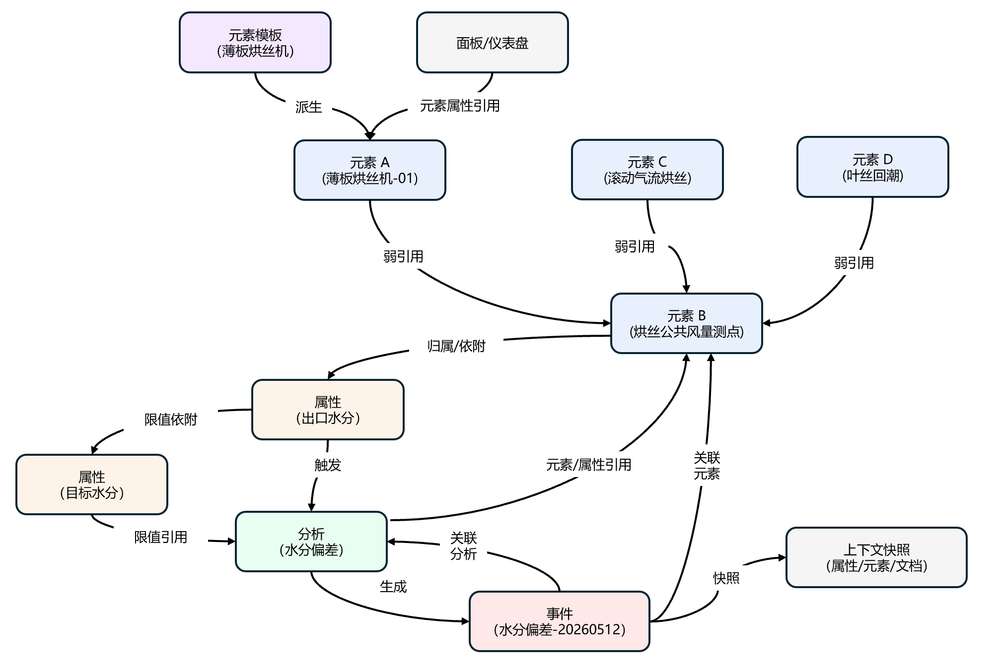

# 3.5 数据关联与工业本体

:::note
本节为进阶话题。大多数用户可以跳过此节，待需要构建复杂数据模型时再回来阅读。
:::

工业数据建模的真正难点，从来不是"采到数据"，而是**把数据之间的关联性管起来**。

一台设备从哪条产线来、向下游送什么、由谁负责、影响哪些业务指标、出过哪些事件、挂着哪些分析、归属哪个公共风量点——这些联系散落在业务人员的脑海里，散落在 SCADA 与 MES 的接线表里，散落在工艺手册与 Excel 表里。只要它们持续处于"散落"状态，那么无论底层时序数据采集得再多、频率再高，**数据依然是一座座孤岛**——人查不全、应用对不齐、AI 更无从推理。

TDengine IDMP 的核心工作，就是把这些联系从"隐性知识"变成"显性对象"，并以统一、可治理、可查询、可被 AI 遍历的形式持续维护。IDMP 采用**树 + 网络**两层结构来管理与组织这些对象与联系：

- **树型结构**承担最主要、最直观的层级关系——这是用户登录系统后第一眼看到的**资产目录树**，也是 IDMP 已经非常成熟、用户日常依赖的建模形态；
- **网络结构**则在树之上补全那些层级结构无法覆盖的非层级关系——上下游、公共点、分析与事件引用、属性间的派生与限值动态关联等。

两者共同构成了 IDMP 眼中的**工业本体**——即现实工业世界在数字空间中的语义化镜像。

## 3.5.1 工业数据建模的对象与关系

描述"树"与"网络"之前，需要先理解 IDMP 中的**对象类型（Object Type）** 与 **关系类型（Reference Type）** ——它们是后续一切建模工作的语法。

### 3.5.1.1 对象类型：元素、属性、分析、事件

IDMP 把工业现场的所有"实体"统一抽象为四类核心对象。这四类对象就是后续树与网络中的关键节点。

| 对象类型                    | 含义                                                 | 现实对应                                                         |
| --------------------------- | ---------------------------------------------------- | ---------------------------------------------------------------- |
| **元素（Element）**   | 资产模型的基本单元，代表一个物理或逻辑资产           | 集团、工厂、车间、产线、工艺段、设备、传感器、公共点、业务单元等 |
| **属性（Attribute）** | 元素的某项可测量维度或描述特征                       | 温度、压力、流量、电流、运行状态、KPI 等                         |
| **分析（Analysis）**  | 引用元素及其属性运行的实时计算逻辑                   | SPC 监控、批次水分分析、能耗对比、根因分析                       |
| **事件（Event）**     | 由分析或规则生成的、带起止时间与上下文快照的运营事项 | 喘振事件、水分偏差、批次启停、停机事件                           |

围绕这四类核心对象，IDMP 还提供一组**信息消费类**对象：**面板（Panel）**、**仪表板（Dashboard）**、**模型（Machine Learning Model）**、**注解（Annotation）**、**关联信息（文档 / 图片 / 视频 / 其他文件等）**——它们本身不是工业实体，而是不同视角下的信息呈现方式。

此外，对于每种对象，IDMP 都提供了**模板（Template）**——用于批量定义这些对象可复用的信息结构，再实例化出具体对象（参见 [3.1.6 元素模板](./01-elements.md#316-元素模板)、[6.1 事件模板](../06-events/01-event-templates.md)）。

#### 独立对象与依附对象

这些对象虽然都参与数据建模，但它们的**独立性是不一样的**——这是后面理解"树"与"网络"如何组织的关键。按照"能否脱离其他对象单独存在"这个标准，IDMP 中的对象可以分成两类：

| 类别               | 含义                                                                                                           | 典型对象                                                                             |
| ------------------ | -------------------------------------------------------------------------------------------------------------- | ------------------------------------------------------------------------------------ |
| **独立对象** | 自身不依附于任何其他对象而存在；它们当然会与其他对象建立**关联**，但这些关联只是"连接"，并非"赖以存在"。 | **元素**、**事件**、**模板**                                       |
| **依附对象** | 自身不能单独存在，必须**依附于**某个独立对象；独立对象被删除时，其依附对象也一并消失。                   | **属性**（必须依附于某个元素或事件）、**注解**（必须归属于某个具体对象） |

例如：

- **元素**是独立对象——它通过引用关系连接到父元素、子元素、上下游元素，也会被分析与事件引用，但删除弱引用对象不会让它消失；
- **事件**是独立对象——它通过"关联元素"、"关联分析"等字段指向元素与分析，但即使关联的元素或分析被删除，事件本身（作为历史记录）仍然可以保留；
- **属性**则是典型的依附对象——它必须挂载在某个元素之上，离开元素的属性没有意义；删除元素，该元素的属性也一并消失。

把"独立对象 / 依附对象"区分清楚之后，"树用来组织什么、网络用来组织什么"就有了清晰的边界：**树主要组织独立对象之间的层级骨架**（最典型的就是元素之间的归属层级），依附对象天然跟随这些独立对象，而**对象之间的跨层级横向引用**则用网络来表达。

### 3.5.1.2 关系类型：Reference 与 Reference Type

IDMP 用 **Reference（引用）** 统一表达对象之间的联系。

> Reference 是一个**有向三元组**：`(对象 A, 对象 B, 引用类型)`——即"从 A 到 B 存在一条具有某种业务语义且有方向的连接"。

Reference 不只是"谁连到谁"，它还携带语义——这一语义由 **Reference Type（引用类型）** 来描述。**强引用**、**弱引用**、**组合引用**、**派生**、**触发**、**生成**、**关联元素**、**限值动态关联** 等，都是 IDMP 中已经预定义的引用类型。

这一思路与 **OPC-UA** 的 Reference / ReferenceType 体系一脉相承：在 OPC-UA 中，节点之间通过具名的 ReferenceType 互连，从而表达组成、属性归属、事件触发等关系。IDMP 把这一机制扩展到了整个工业数据。

有了"对象 + 引用类型"这套语法之后，剩下的问题就只有一个：**如何把现实世界中的纷繁联系，组织成一种既直观、又能完整表达的数据结构？** IDMP 的答案是"先树后网"——树负责最主要、最直观的层级骨架，网络在树之上补全剩余的非层级关系。

## 3.5.2 树型建模：IDMP 的数据模型基石

工业组织本身就高度层级化——**集团 → 工厂 → 车间 → 产线 → 设备 → 测点**这种自上而下的组织方式，是几乎所有制造业、能源、公用事业企业天然的资产管理形态。IDMP 围绕这一点，构建了一套**已经非常成熟**的树型建模能力：用户登录系统后第一眼看到的就是**资产目录树**，绝大多数日常浏览、配置、授权和数据查询，都围绕这棵树展开（参见 [3.1.2 资产树与数据目录](./01-elements.md#312-资产树与数据目录)）。

### 3.5.2.1 元素与元素之间的三种引用类型

IDMP 中元素与元素之间只有三种引用类型，正是这三种引用类型支撑起了多棵资产管理树的灵活组织：

| Reference Type                    | 语义                                                 | 典型场景                                                           |
| --------------------------------- | ---------------------------------------------------- | ------------------------------------------------------------------ |
| **强引用（Strong）**        | 父子归属关系，支持一个元素同时挂到**多棵树**下 | 同一台风机既出现在"地理树"也出现在"运营责任树"中                   |
| **组合引用（Composition）** | 不可拆分的"组成"关系，子元素的生命周期完全由父决定   | 风机由机舱、塔筒、叶片组成；电机隶属于某台具体设备                 |
| **弱引用（Weak）**          | 附加层级或交叉视角，不影响元素生命周期               | 把同一台设备额外挂到"设备类型库"、"重点关注清单"、"巡检计划"等视图 |

借助这三种引用类型，IDMP 允许同一个元素拥有**多个父元素**与**多个子元素**——围绕地理视角、工艺视角、设备类型视角、责任分区视角等不同业务目的，可以**同时构建多棵资产管理树**，而底层始终只有一份元素实体与一份数据。多棵树之间互相独立又共享底层资产，是 IDMP 树型建模最有特色的一点。

引用类型的详细规则与界面操作，参见 [3.1.7 元素引用](./01-elements.md#317-元素引用)。

### 3.5.2.2 为什么树是工业建模的最佳起点

把工业组织和资产用树来管理，并不是 IDMP 的发明，而是工业软件几十年沉淀下来的最佳实践（AVEVA PI System 的 AF 资产框架、ABB / Siemens 的资产数据库都以树为基础）。原因在于，**树**这一形态在工业场景中具备很多其他结构难以替代的优势：

- **直观、易理解**：树形结构与企业的组织结构图、车间布置图天然同构——一线班长、工艺工程师、IT 运维人员看一眼就懂，无需培训；
- **导航与定位高效**：层层下钻即可定位到任意一台设备、一个测点，路径本身就是业务语义化的全局唯一标识，例如 `/Elements/卷烟一厂/制丝车间/A 线/烘丝段/薄板烘丝机-01`；
- **权限设置简单**：基于树的子树授权是工业系统最自然的权限模型——只要把某个节点授权给某个角色，其下所有子节点自动继承，无需逐项配置（参见 [14.4 用户管理](../14-administration/04-user-management.md)）；
- **批量操作友好**：模板、命名规则、可视化面板、分析等都可以挂在树的某个层级上，自动作用于其下所有子节点；
- **维护与治理成本低**：节点的增删改、上下线、组织结构调整，都只是树的局部操作，影响范围清晰可控；
- **可视化天然适配**：从 Web Explorer 的资产树侧栏，到面板的级联选择器，再到事件浏览的过滤器，几乎所有 UI 都可以直接复用同一棵树作为入口；
- **AI 索引友好**：树的路径本身就是一份天然的数据目录索引，AI 无需借助额外结构，就能沿层级定位任意资产和数据。

IDMP 已经把树型建模做到了**开箱即用**：用户创建元素、套用元素模板、配置属性绑定、设定权限、浏览数据，都围绕这棵资产目录树发生；同一份数据可以通过**多棵树**从多个业务视角同时呈现。**对绝大多数工业场景而言，把树建好，工业数据建模的工作就已经完成了一大半。**

## 3.5.3 仅有树是不够的：用网络补全非层级关系

树解决了**层级归属**这一最主要的问题，但工业对象之间的联系并不只是层级关系，还有一些关系是层级结构难以直接表达的，例如：

- 元素与元素之间的**横向引用**——上下游、公共点、备用关系、跨产线的依赖；
- 元素与分析、事件、面板等其他对象之间的**功能性引用**；
- 属性与属性之间的**引用、计算与限值依赖**；
- 模板与实例之间的**派生与扩展**。

这些关系彼此交叉、跨越层级，强行套到一棵树里只会让树变形。IDMP 的做法是：**让这些关系以"网络中的点与边"的形式存在于树形结构之上**，而不是强行塞进树里。在 IDMP 当前版本中，这部分关系虽然没有像资产树那样直接呈现在主界面上，但已经通过引用关系、分析与事件的关联字段、模板的派生与扩展等机制完整建模。

下面是几类最典型的非层级关系。

**元素 ↔ 元素（横向引用）**：除了树形模型包含的强 / 弱 / 组合引用之外，元素之间还存在部分**横向关系**——上下游、备用、跨产线依赖等，这些关系不适合用树型层级结构表达。IDMP 借助**元素属性的对象类型**承载：把元素属性的值类型设为 `Element`（元素引用）或 `Attribute`（属性引用），让一个元素的属性直接指向另一个元素或属性。这一做法的好处是横向引用与树形结构共享同一套展示、授权、AI 遍历能力。

**元素 ↔ 属性**：属性具有**归属关系**——属性不能独立存在，必须归属于某个对象（最常见的是元素，也可以是事件等）。属性既可以是**静态**（如额定功率、安装日期）也可以是**动态**（绑定到 TDengine TSDB 的指标列或标签）；属性的取值除了基础数值、枚举/分类，还可以是**对象类型**（如文件、视频、属性引用、元素引用等）——其中后两者本身就是显式的跨对象引用。

**属性 ↔ 属性**：元素的某个属性可以引用其他属性参与计算；属性的高限、低限、目标值等限值可以**动态关联**到另一个属性，实现随实时状态变化的动态限值管理。

**元素 ↔ 分析 / 事件 / 面板 / 仪表板**：元素和这些数据消费对象不是"挂载"关系，而是通过**引用**建立联系。树是这些消费对象的**快捷入口与浏览索引**——通过元素树可以方便地找到所有该元素相关的分析、事件、面板，但树无法管理或维护这些跨对象、跨层级的联系：

- 实时分析**引用**一个或多个元素及其属性作为计算对象（参见 [7. 实时智能分析](../07-real-time-analysis/index.md)）；
- 元素或属性的状态变化**触发**分析；
- 分析在触发条件满足且配置了事件生成时，**生成事件**（参见 [6. 事件](../06-events/index.md)）；
- 事件通过"关联元素"和"关联分析"字段指向元素与分析，并在发生时记录相关属性的上下文快照（参见 [6.4 事件详情](../06-events/04-event-detail.md)）；
- 面板与仪表板**引用**元素及其属性来展示数据趋势与规律（参见 [4. 可视化](../04-visualization/index.md)）。

**模板 ↔ 实例**：IDMP 的每类对象如元素、属性、分析、事件、面板、仪表板、通知规则等都有对应模板，通过**派生关系**让实例继承模板定义；模板支持**继承**（基础模板 → 普通模板）和**扩展**（启用"允许扩展"时实例可在模板基础上追加内容）。模板和实例之间有持续的"派生"引用关系——模板定义一旦修改，变更会沿着这条引用自动同步到所有由它派生出来的实例，做到"一处定义、处处生效"。

把上述这些关系汇总到一起，就形成了一张超出树形结构的、具备业务语义的**有向网络**。

## 3.5.4 树 + 网络 = 工业本体

把"树"和"网络"叠加到一起，就构成了 IDMP 眼中的**工业本体**：

- **树**给出主要的层级骨架——企业、工厂、车间、产线、设备、测点层层归属，这是用户每天在 Web Explorer 里看到的资产目录树；
- **网络**在树之上叠加非层级的引用关系——分析、事件、面板、上下游、公共点、限值动态关联、模板派生等，这些关系横向跨越树的不同分支。

**树** + **网络** 共同构成的这套信息结构，是一份源于现实工业世界、面向工业运营分析与决策、可被 AI 和人共同操作的数字镜像。其中树型结构是用户日常感知最强、IDMP 已经做得非常成熟的功能；而网络模型在树之上叠加补充，让 AI 能够回答"为什么"、"谁影响谁"、"下一步会怎样"这类层级结构无法直接回答的问题。

### 3.5.4.1 一棵树的例子：制丝车间资产目录

下面是一棵以"制丝车间"为根的资产目录树片段。同一台公共风量测点通过**弱引用**同时出现在不同工艺段下，使得三个工艺段都能在自己的子树中看到这台测点：

```text
/Elements/卷烟一厂
└── 制丝车间
    ├── A 线
    │   ├── 真空回潮段
    │   ├── 烘丝段
    │   │   ├── 薄板烘丝机-01      ← 组合引用 / 强引用
    │   │   │   ├── 出口水分        (属性)
    │   │   │   ├── 入口温度        (属性)
    │   │   │   └── 蒸汽压力        (属性)
    │   │   └── 烘丝公共风量测点    ← 弱引用（同时出现在多个工艺段下）
    │   └── 加香段
    ├── B 线
    │   └── 滚筒气流烘丝段
    │       └── 烘丝公共风量测点    ← 弱引用（同一元素，另一路径）
    └── 叶丝回潮线
        └── 烘丝公共风量测点        ← 弱引用（同一元素，第三路径）
```

这棵树是 IDMP 用户最熟悉的视图——浏览元素、创建分析、查看面板、事件洞察的入口几乎都从这里开始。

### 3.5.4.2 一张网络的例子：以薄板烘丝机为中心

在上面这棵树的基础上，把元素、属性、分析、事件、模板、面板之间的引用关系显式化，就得到了多种工业对象的关联网络。它不再是一棵树，而是一张携带多种业务语义的有向图：



这张网络具备几个关键特征：

1. **节点同构** —— 元素、属性、分析、事件被统一对待为网络节点，使得"以任意节点为起点的导航与查询"成为可能。
2. **关系显式具体** —— 每一条边都有 Reference Type，AI 和应用都能区分"组成"、"引用"、"触发"、"生成"、"限值动态关联"等不同语义。
3. **多视角共存** —— 同一个元素可以同时出现在多个层级树、多个分组、多个过滤器中，但只有一份数据、一份语义。
4. **动态演进** —— 数据接入、新设备投运、新工艺上线时，网络随之扩展；模板的修改会沿派生关系自动传播到所有实例。

## 3.5.5 工业本体的业务价值

工业本体把数据与对象的关联性从"散落/隐藏"变成"显式/网络"，可以为 AI 、平台与业务带来三个以前难以实现的能力。

### 3.5.5.1 对 AI：让复杂任务的自动执行变得可能

IDMP 内置的 AI 智能洞察（参见 [8. AI 智能洞察](../08-ai-powered-insights/index.md)）目前提供四类典型的 AI 应用场景，它们都建立在"树 + 网络"这套工业本体之上——树告诉 AI "这是谁、归属于谁"，网络告诉 AI "它和谁相关、影响谁、被谁影响"。

- **无问智推**（参见 [8.2 AI 生成面板](../08-ai-powered-insights/02-ai-generated-panels.md)、[8.4 AI 生成分析](../08-ai-powered-insights/04-ai-generated-analyses.md)）：用户打开任意元素的面板或分析标签页，AI 已经根据元素的模板、属性、采集到的数据以及相邻节点上下文，主动推送好可视化面板与分析建议。**前提**：AI 必须能沿模板派生关系识别这是"哪一类设备"，沿元素归属与属性引用知道"它有哪些可分析的量"——这正是树 + 网络提供的。
- **智能问数**（参见 [8.6 AI 问答](../08-ai-powered-insights/06-natural-language-queries.md)）：用户用自然语言直接提问——"em-1 上周的平均电流是多少？""制丝车间所有薄板烘丝机昨天的出口水分合格率？"——AI 把问句翻译成针对工业本体的查询。**前提**：AI 必须能沿资产树路径解析"em-1"是哪个元素、"制丝车间下所有薄板烘丝机"覆盖到哪些节点，沿属性引用找到正确的指标列，再去 TDengine 取数。没有这棵树，自然语言里的"它""那台""这条线"都无法落到具体对象上。
- **面板解读**（参见 [8.3 AI 面板洞察](../08-ai-powered-insights/03-ai-panel-insights.md)）：在任意面板上点一下"解读面板"，AI 用自然语言总结这张图当下表达了什么——范围、峰谷、与正常运行限值的关系、与历史均值的对比。**前提**：AI 必须能识别面板引用了哪些元素与属性、这些属性的工程单位与上下限来自模板的哪条定义、当前值在历史窗口里处于什么水平——所有这些线索都顺着面板对元素的"引用元素与属性"以及属性的归属、限值关系拉出来。
- **根因分析**（参见 [8.10 根因分析](../08-ai-powered-insights/10-root-cause-analysis.md)）：事件发生后，AI 自动检索相关历史数据、生成假设、验证假设、形成结构化调查报告。**前提**：AI 顺着 "事件 → 关联元素 / 关联分析 → 触发属性 → 同元素其他属性 → 上游公共点 → 上游元素"逐层回溯，**网络越完整，Reference 越扎实，AI 就走得越远、定位的根因越准确**。这是工业本体在 AI 场景中价值最直接的体现。

把这四类场景一起看，规律是清晰的：**AI 在工业现场的每一次"看得懂、答得准、找得到、推得动"，本质上都是在工业本体上做遍历**。元素资产树越规整、关系网络越显式，AI 能承接的任务就越复杂——从"描述现象"、"回答事实"，逐步走向"判断异常"、"定位根因"、"预判影响"、"给出建议"。

### 3.5.5.2 对平台：让 AI 和数据应用都有了安全护栏

没有安全管控，企业是不敢让 AI 真正参与生产决策的。AI 必须在一个**可信、可控、可审计**的空间里工作。建立数据模型，实现对象与引用关系的显式管理，企业级的数据资产治理与安全管控就有了抓手：

- **资产可审计**：每一个对象、每一条引用都有创建者、创建时间、版本——谁加的、什么时候加的、为什么加的，都可追溯。AI 的每一次访问、每一次推理路径也都可记录、可回放，事后能讲清楚"AI 是依据什么得出的结论"。
- **对象可授权**：可以按元素、子树、引用粒度做精细化授权——哪些角色能看到哪些资产、哪些 AI Agent 能沿哪些网络结构遍历、哪些属性允许被读取或被回写，都可以在 IDMP 中显式定义。AI Agent 不再是"无差别访问全库"，而是被限定在被授权的可信子图中工作。
- **作业边界可控**：AI 即便能查、能算、能建议，也只能在被授权的对象与引用范围内执行；越权访问、跨域遍历、未授权回写都会被拒绝。这让企业敢于让 AI 参与从根因分析、影响评估，到逐步走向操作建议、闭环控制等更复杂的任务。
- **结构可复用**：网络结构本身就是企业最珍贵的资产之一——新工厂、新产线上线时，沿着已有的模板与引用类型快速复制，授权策略也可以一并复用，上线周期从月级缩短到周级。

**有了数据资产治理与安全管控，AI in the Loop 才真正具备了落地的可能。**

### 3.5.5.3 对业务：让专家经验沉淀下来

工业现场最有价值的资产之一，是**专家脑子里的经验**——"这台薄板烘丝机出口水分异常时，要去看哪几个上游测点、参考哪份工艺手册、对照哪条历史相似事件"——这套判断逻辑过去几乎全部以**隐性知识**的方式存在：一部分在工艺手册里、一部分在 Excel 表里、更大一部分在老工程师的脑子里。一旦专家离开、岗位轮换，新人就要从头摸索同样的问题。

把这些联系沉淀到 IDMP 的数据模型之后：

- **隐性知识显式化**：上下游、公共点、备件关系、相关文档、事件与分析都以引用的形式连接到元素与属性上，谁影响谁、出问题先看哪里，不再依赖个人记忆；
- **新人快速上手**：一线班长打开元素页，看到的不再只是几条曲线，而是一张已经被组织过的"运营画像"——这台设备的位置、状态、上下游、历史事件、相关文档一并呈现，新员工也能在第一天就拿到资深工程师才能掌握的视角；
- **跨班次 / 跨厂区共享**：A 厂工程师在某台设备上沉淀的经验（比如"出口水分异常时优先检查的属性组合"），可以通过模板一次性复制到 B 厂同类设备上，避免"同一个坑踩多次"；
- **专家被释放**：他们不再被反复"回答同样的问题"占满精力，可以专注于**改进系统的思考方式**——优化模板、新增引用关系、训练更精准的分析——经验越用越厚，组织能力随之沉淀。

工业本体让经验从"人"沉淀到"系统"，这是工业组织从"依赖人"走向"依赖体系"的关键一步。

---

通过数据建模构建的工业本体不是一个独立的功能模块，而是**贯穿整个 IDMP 产品的设计哲学**。也正是因为这样，IDMP 才成为了 AI 时代的工业数据基座，真正成为 AI 在工业场景落地的基础能力与前提条件。
