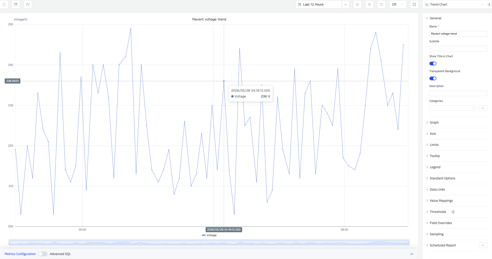
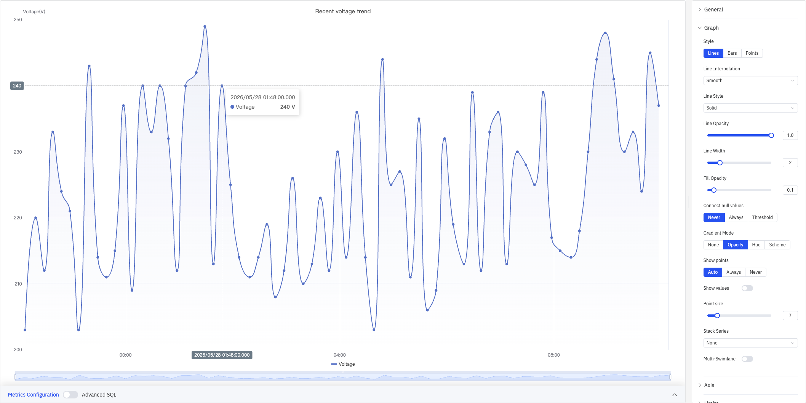
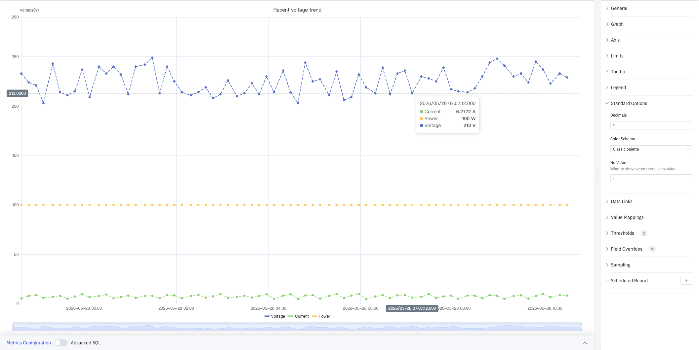
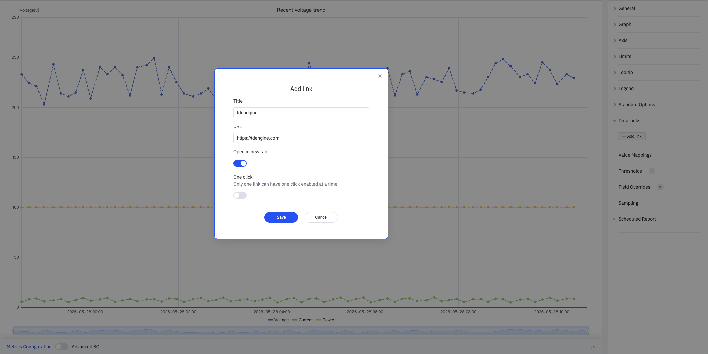
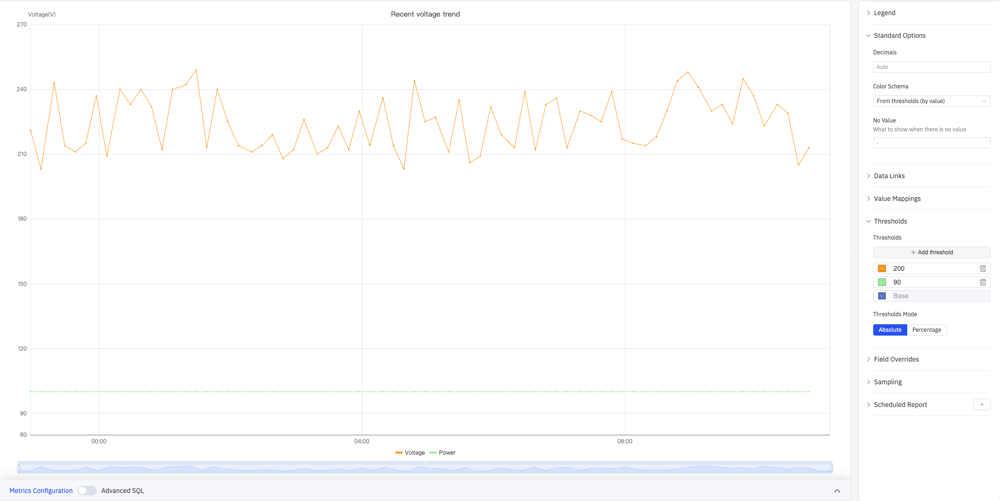
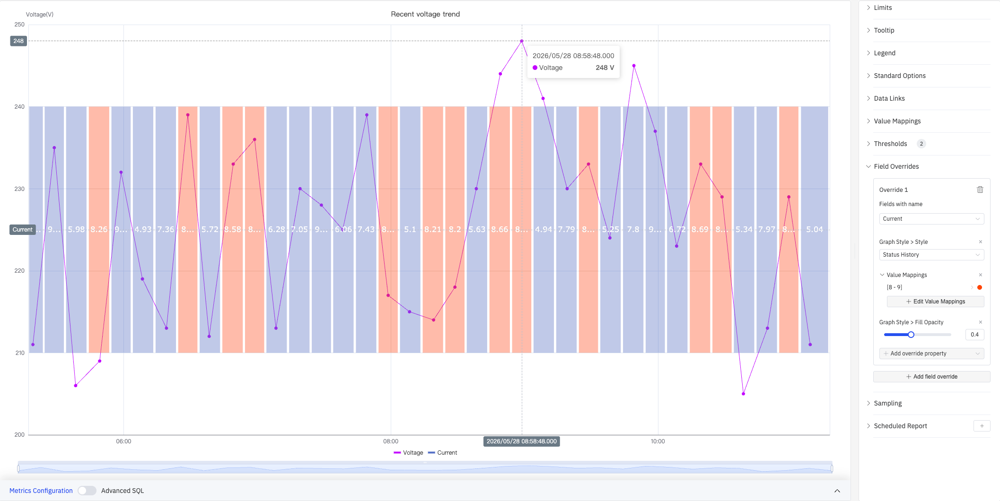
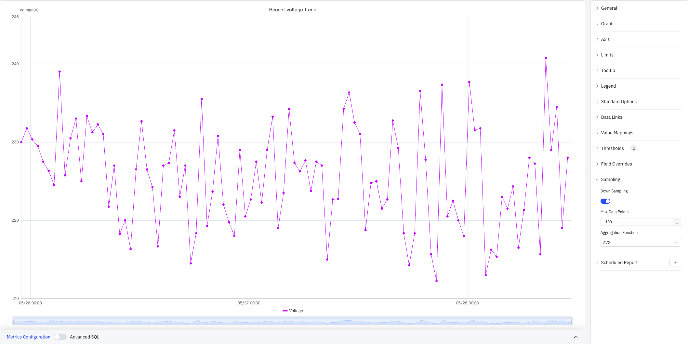

# 4.2.1 趋势图

## 4.2.1.1 概述

趋势图是 TDengine IDMP 中最核心的面板类型，用于将一个或多个时序属性以折线、条形或点状的形式绘制在时间轴上，直观呈现数值随时间的变化规律。无论是温度、压力、流量、能耗还是振动，只要数据具有时间连续性，趋势图就能将其背后的规律清晰地呈现出来。

多个指标可叠加在同一图表上，每个指标独立成线，便于发现相互关联或异步变化的规律。在此基础上，趋势图还集成了多项高级分析能力：通过 AI 预测未来走势、对数据缺口进行智能填补、利用时间偏移叠加历史时段进行横向比较，以及以多泳道布局同时展示多路信号而不相互干扰。

## 4.2.1.2 适用场景

在以下情况下使用趋势图：

- 监控连续测量值（温度、压力、流量等）随时间的变化趋势
- 并排比较同一设备上的多个相关指标，识别关联与滞后关系
- 发现信号中的异常、阶跃突变或缓慢漂移
- 将当前运行曲线与历史基准进行时间偏移叠加对比
- 叠加操作限值线，直观查看数值是否在安全范围内运行
- 对时序属性执行 AI 预测或缺口填补分析

对于离散状态信号（开/关、运行/停止等枚举值），请使用状态时间线面板。对于两个连续属性之间的相关性分析（X 对 Y，而非两者都对时间），请使用散点图面板。

## 4.2.1.3 配置

### 查看模式工具栏

趋势图在查看模式下提供一组专属工具按钮（如下图红框所示），用于快速进行分析操作：

| 控件               | 说明                                                                                                     |
| ------------------ | -------------------------------------------------------------------------------------------------------- |
| **多泳道**         | 将每个指标显示在各自独立的水平带中，而非共享同一 Y 轴                                                    |
| **窗口分析**       | 对当前时序数据执行窗口分析，支持滑动窗口、状态窗口、事件窗口、异常检测、会话窗口和计数窗口等多种分析类型 |
| **预测**           | 对当前图表上的指标运行 AI 预测，在时间范围末尾延伸显示预测走势                                           |
| **填补**           | 进入填补模式，在图表上拖拽选取数据缺口区域，系统将使用 AI 趋势估算自动填充                               |
| **重置填补**       | 移除当前图表上已应用的所有填补结果                                                                       |
| **解读面板**       | 对当前图表数据运行 AI 解读，输出文字分析结论                                                             |
| **打开为分析面板** | 在新窗口中以分析面板模式打开当前趋势图                                                                   |

### 图形配置

图形配置区域决定数据的绘制样式和布局方式：

| 设置           | 说明                                                                                            |
| -------------- | ----------------------------------------------------------------------------------------------- |
| **样式**       | 渲染模式：折线（Lines）、条形（Bars）、点状（Points）                                           |
| **线点交叉**   | 折线模式下数据点之间的连接方式：直线（Linear）、平滑（Smooth）、阶梯-开始、阶梯-中间、阶梯-结尾 |
| **线条样式**   | 线条图案：实线（Solid）、虚线（Dashed）、点线（Dotted）                                         |
| **线条透明度** | 折线的不透明度（0–1）                                                                           |
| **线条宽度**   | 描边粗细（0–10）                                                                                |
| **填充透明度** | 折线下方区域填充的不透明度（0–1，0 = 无填充）                                                   |
| **空值连接**   | 遇到空值时的处理方式：从不（Never）、始终（Always）、阈值（Threshold）                          |
| **渐变模式**   | 颜色渐变方式：无（None）、透明度（Opacity）、色调（Hue）、配色方案（Scheme）                    |
| **显示数据点** | 数据点的显示策略：自动（Auto）、始终（Always）、从不（Never）                                   |
| **显示数值**   | 是否在图中显示数据值标签（开关）                                                                |
| **点大小**     | 数据点标记的像素大小（1–40）                                                                    |
| **堆叠系列**   | 堆叠模式：不堆叠（None）、相同正负号（Same Sign）、堆叠所有、只堆叠正值、只堆叠负值             |
| **多泳道**     | 将每个系列显示在独立的水平泳道中，各自拥有独立 Y 轴                                             |

#### 堆叠系列

启用堆叠系列后，多个系列的值纵向叠加，适合展示整体与各部分的构成关系：

#### 多泳道

开启多泳道后，每个指标拆分到各自独立的水平区域，每个泳道拥有独立 Y 轴刻度，避免量程差异悬殊时信号被压缩：

### 坐标轴

坐标轴设置用于控制 X 轴的显示格式和 Y 轴的标题、量程及双轴配置：

| 设置               | 说明                                                           |
| ------------------ | -------------------------------------------------------------- |
| **X 轴**           | 显示（Show）或隐藏（Hidden）                                   |
| **X 轴时间格式**   | X 轴时间戳的显示格式（如 YYYY-MM-DD HH:mm）                    |
| **标签旋转**       | X 轴标签的旋转角度（-90° 至 +90°，步进 45°）                   |
| **标签间隔**       | 标签密度：自动（auto）、小（small）、中（medium）、大（large） |
| **显示网格线**     | 网格线显示策略：自动（Auto）、显示（On）、隐藏（Off）          |
| **左坐标轴标题**   | 左侧 Y 轴的标签文字                                            |
| **数值范围**       | 左侧 Y 轴的最小值和最大值（留空则自动缩放）                    |
| **右坐标轴**       | 启用右侧辅助 Y 轴（开关）                                      |
| **右坐标轴标题**   | 右侧 Y 轴的标签文字（右坐标轴开启后可用）                      |
| **右坐标轴系列**   | 选择绑定到右侧 Y 轴的系列（右坐标轴开启后可用）                |
| **数值范围（右）** | 右侧 Y 轴的最小值和最大值（右坐标轴开启后可用）                |

两个指标的量程相差数量级时（如电压 200+ V 与电流 4–10 A），启用右坐标轴并将小信号绑定到右侧刻度，两路信号均可清晰展示。

### 边界值

边界值用于在趋势图中叠加水平参考线或参考区域，帮助快速判断曲线是否越界：

通过**添加边界值**下拉菜单选择指标来源后，可添加以下预定义限值类型：Maximum（上上限）、HiHi（高高报）、Hi（高报）、Target（目标值）、Lo（低报）、LoLo（低低报）、Minimum（下下限）。每条限值均支持自定义数值和颜色。

| 设置           | 说明                                                                                             |
| -------------- | ------------------------------------------------------------------------------------------------ |
| **添加边界值** | 选择指标来源，然后从下拉菜单中选择要添加的限值类型（可多次添加）                                 |
| **显示为**     | 限值展示方式：线（As lines）、区域（As filled regions）、线和区域（As filled regions and lines） |

### 提示框

提示框控制鼠标悬停时的数据展示方式：

| 设置           | 说明                                                                |
| -------------- | ------------------------------------------------------------------- |
| **提示框模式** | 悬停显示方式：单个（Single）、全部（All）、隐藏（Hidden）           |
| **值排序**     | 提示框内数值排序：无（None）、升序（Ascending）、降序（Descending） |
| **隐藏零值**   | 是否在提示框中隐藏数值为 0 的项（开关）                             |
| **最大宽度**   | 提示框最大宽度（像素）                                              |
| **最大高度**   | 提示框最大高度（像素）                                              |

### 图例

图例支持列表模式和表格模式。表格模式可在每个系列名称旁显示汇总统计数据（如 Count、Range、First），方便跨指标快速比较：

| 设置       | 说明                                                                                                         |
| ---------- | ------------------------------------------------------------------------------------------------------------ |
| **显示**   | 图例模式：列表（List）、表格（Table）、隐藏（Hidden）                                                        |
| **位置**   | 图例位置：底部（Bottom）、右侧（Right）                                                                      |
| **宽度**   | 图例区域宽度（像素，仅右侧布局时可用）                                                                       |
| **图例值** | 表格模式下在每个系列旁显示的统计项，可多选：最大值、最小值、平均值、总和、计数、第一个值、最后一个值、范围等 |

### 标准配置

标准配置提供数据显示和配色的全局设置：

| 设置         | 说明                                                                                                                                  |
| ------------ | ------------------------------------------------------------------------------------------------------------------------------------- |
| **小数位数** | 数值显示的小数位数（留空则自动判断）                                                                                                  |
| **配色方案** | 系列颜色分配策略：单色、单色深浅映射（按系列）、阈值取色（按值）、经典调色板（Classic palette）、经典调色板（按系列名）、自定义调色板 |
| **无值显示** | 数据为空时的展示文本（默认 `-`）                                                                                                      |

### 数据链接

数据链接为图表上的数据点附加可点击的跳转 URL。配置后悬停时提示框底部会出现链接入口：

点击 **+ Add link** 打开编辑对话框：

| 设置               | 说明                                                     |
| ------------------ | -------------------------------------------------------- |
| **标题**           | 链接的显示名称                                           |
| **URL**            | 跳转目标地址，支持变量插值                               |
| **在新标签页打开** | 是否在新浏览器标签页中打开链接                           |
| **一键跳转**       | 启用后点击数据点直接跳转（同时只能有一条链接启用此功能） |

### 值映射

值映射将数据值替换为自定义的显示文本并赋予颜色。配置后，提示框中对应值将以映射颜色高亮显示：

点击 **+ Edit Value Mappings** 打开编辑对话框，支持以下映射类型：

| 映射类型    | 说明                               |
| ----------- | ---------------------------------- |
| **Value**   | 精确匹配特定数值或文本             |
| **Range**   | 匹配指定数值范围                   |
| **Regex**   | 使用正则表达式匹配并替换           |
| **Special** | 匹配 null、NaN、布尔值、空字符串等 |
| **Others**  | 匹配所有未被前面规则覆盖的值       |

### 颜色阈值

颜色阈值根据数据值动态改变系列的颜色，用于高亮显示超出正常范围的数据段：

| 设置         | 说明                                                   |
| ------------ | ------------------------------------------------------ |
| **阈值模式** | 阈值判断方式：绝对值（Absolute）、百分比（Percentage） |
| **添加阈值** | 新增一条阈值规则，每条规则包含数值边界和对应颜色       |

颜色阈值生效需在标准配置中将**配色方案**设置为**阈值取色（按值）**（From thresholds (by value)）。

### 个性化配置

个性化配置允许对单个指标覆盖全局图形设置，实现每个系列的独立样式：

选定目标指标名称（Fields with name）后，可添加需要覆盖的属性，包括：系列样式（Graph Style > Style）、填充透明度（Fill Opacity）、值映射（Value Mappings）等。

### 降采样

当查询结果中的数据点过多时，可启用降采样减少渲染数量以提升显示性能：

| 设置             | 说明                                                                |
| ---------------- | ------------------------------------------------------------------- |
| **启用降采样**   | 开关（Down Sampling），默认关闭                                     |
| **最大数据点数** | 降采样后保留的最大数据点数量（Max Data Points）                     |
| **聚合函数**     | 降采样时使用的聚合方式（Aggregation Function），如 AVG、MAX、MIN 等 |

### 定时报告

定时报告可按预设周期自动生成并推送该面板的快照：

| 设置             | 说明                                               |
| ---------------- | -------------------------------------------------- |
| **周期**         | 发送频率：每周（Weekly）、每日（Daily）等          |
| **任务开始时间** | 首次执行的日期时间（Job Start Time）               |
| **结束日期**     | 定时任务的终止日期（留空则不限制）                 |
| **通知联系点**   | 接收报告的通知联系点（Notification Contact Point） |

## 4.2.1.4 使用示例

**能耗堆叠监控。** 能源管理员需要同时掌握电压和电流及总负荷。将两个指标添加到同一趋势图，启用堆叠系列（Stack Series: Same Sign）并将填充透明度设为 0.5。图表将以面积累加直观反映总量的峰谷变化。

**量程悬殊的双信号监控。** 工艺工程师需要在同一图表中监控电压（200+ V）和电流（4–10 A）。如使用共用 Y 轴，电流线几乎显示为一条水平线。启用右坐标轴（Right Y Axis），将电流绑定至右侧刻度，两条曲线便可各自清晰展示。

**操作限值实时监控。** 运营团队需要监控电压是否越过上限（Maximum: 240）或低于下限（Minimum: 210）。在边界值中添加限值后，超限区域以填充色标示（Show as: As filled regions and lines），越界时段一目了然。

**个性化混合样式。** 维护工程师在同一面板同时展示电压折线和电流状态色块。通过个性化配置为 Current 指标设置 Style = Status History，实现折线与状态色块的混合视图，直观展示连续值和离散区间的关联。
