# 4.2.1 趋势图

## 4.2.1.1 概述

趋势图将一个或多个时序指标以折线的形式绘制在时间轴上，连接各数据点以展示数值随时间的变化趋势。它专为连续测量数据而生——温度、压力、流量、能耗、振动等——这类数据的时间形态本身就承载着意义。多个指标可以绘制在同一图表上，每个指标作为独立的折线，一眼便可发现关联关系和相对变化规律。

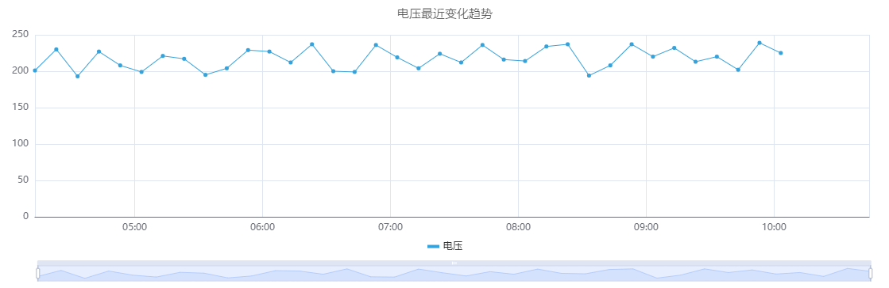

除基本绘图外，趋势图是 TDengine IDMP 中的主要面板类型，也是高级分析功能的入口：使用 AI 预测未来值、通过填补修复数据缺口、使用时间偏移叠加历史时段，以及在归一化时间轴上比较批次数据。

## 4.2.1.2 适用场景

在以下情况下使用趋势图：

- 需要监控连续测量值随时间的变化
- 希望并排比较多个相关指标（如进口和出口温度）
- 需要发现信号中的异常、阶跃变化或渐变漂移
- 希望使用时间偏移将当前行为与历史基准进行比较
- 需要叠加限值线，以查看数值与其操作范围的关系
- 正在对时序属性进行预测或填补分析

对于离散状态信号（开/关、运行/停止），请使用状态时间线。对于两个连续属性之间的相关性分析（X 对 Y，而非两者都对时间），请使用散点图。

## 4.2.1.3 配置

### 查看模式工具栏

除[通用查看模式控件](../01-panels.md#413-面板查看模式)外，趋势图还增加了以下控件：

| 控件 | 说明 |
|---|---|
| **启用多泳道** | 将每个指标显示在各自的水平带中，而不是共享一个 Y 轴 |
| **禁用采样** | 获取未降采样的原始数据。当需要查看每个单独数据点时使用。 |
| **填补** | 进入填补模式。点击并拖动选择数据中的缺口；IDMP 使用基于 AI 的趋势估算填充该缺口。 |
| **重置填补** | 移除当前图表上已应用的任何填补 |

### 编辑模式工具栏

除[通用编辑模式控件](../01-panels.md#414-面板编辑模式)外，趋势图还增加了以下控件：

| 控件 | 说明 |
|---|---|
| **禁用采样** | 为预览切换原始数据模式 |
| **显示预测** | 在图表预览上叠加 AI 预测 |
| **填补** | 在预览中进入填补模式 |
| **重置填补** | 从预览中移除填补 |
| **保存为图片** | 将当前预览下载为 PNG 图片 |
| **全屏** | 将编辑器预览扩展为填满浏览器窗口 |
| **解读面板** | 对当前预览数据运行 AI 分析 |

### 图形设置

#### 折线样式

**样式**设置控制数据点的连接方式。有三个选项：**折线**（点间直线段）、**平滑曲线**（曲线样条）和**阶梯**（保持值直到下一个点的阶梯折线）。

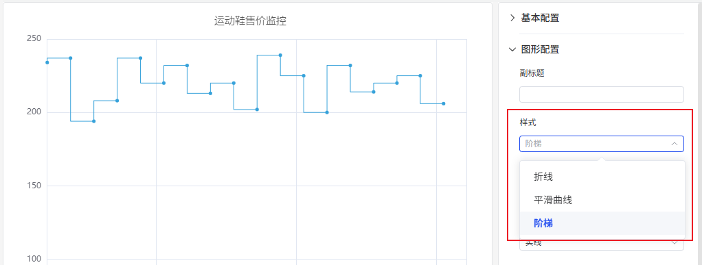

阶梯线非常适合离散变化而非连续变化的信号——例如设定值、模式代码或在变化之间保持恒定水平的价格值。

**线条样式**、**线条宽度**、**线条透明度**和**填充透明度**设置可调整每条折线的渲染方式：

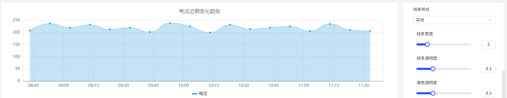

**填充透明度**在每条折线下方绘制阴影区域。这对于累积量——能耗、产量——特别有效，填充区域强化了累积感。

| 设置 | 说明 |
|---|---|
| **样式** | 折线渲染模式：折线、平滑曲线或阶梯 |
| **线条样式** | 折线图案：实线、虚线或点线 |
| **线条宽度** | 描边宽度（滑块） |
| **线条透明度** | 折线的透明度，0–1 |
| **填充透明度** | 每条折线下方的区域填充，0–1（0 = 无填充） |

#### 标签

当时间范围较长或图表较窄时，X 轴标签可能重叠而难以阅读：

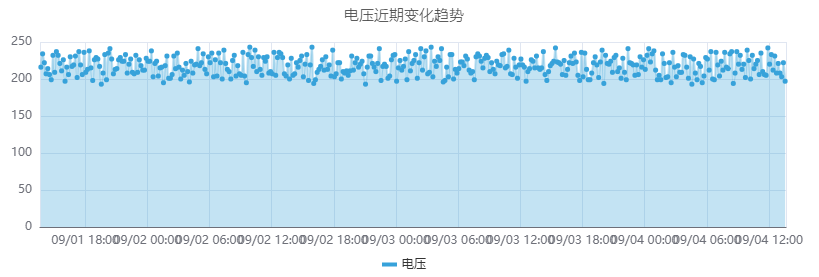

两个设置可以解决这个问题：

1. **标签旋转** — 旋转标签文字以减少重叠：

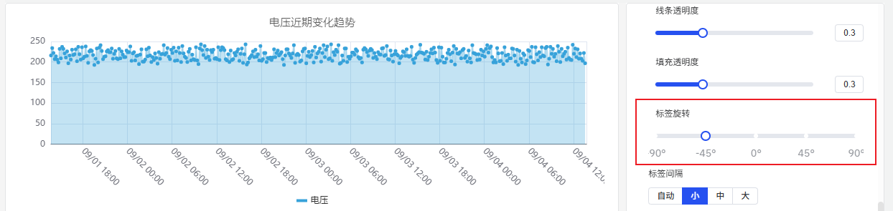

2. **标签间隔** — 减少显示的标签数量：

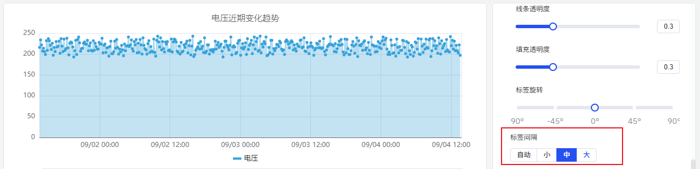

| 设置 | 说明 |
|---|---|
| **标签旋转** | X 轴标签的旋转角度，–90° 至 +90° |
| **标签间隔** | 标签密度：自动、小、中、大 |

#### 数据堆叠

当绘制多个代表整体各部分的系列时（例如居民用电和工业用电），**系列堆叠**会将值累加以呈现总量：

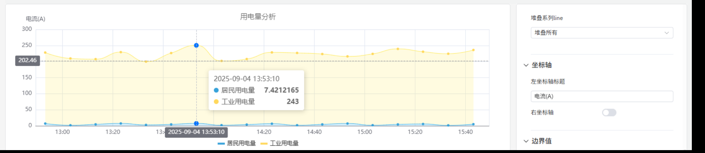

在启用堆叠的同时开启填充透明度，可使累积效果在视觉上更加清晰。

| 设置 | 说明 |
|---|---|
| **系列堆叠** | 堆叠模式：无、同符号、全部、正值、负值 |
| **多泳道** | 将每个指标显示在各自的水平带中 |

### 坐标轴设置

#### 坐标轴标题

左侧 Y 轴标签可以配置标题和单位：

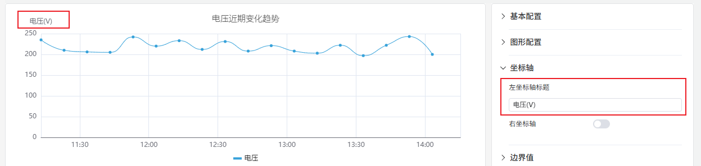

#### 双 Y 轴

当两个指标的量程相差数量级时，将它们绘制在同一 Y 轴上会导致较小的信号显得平坦而难以阅读：

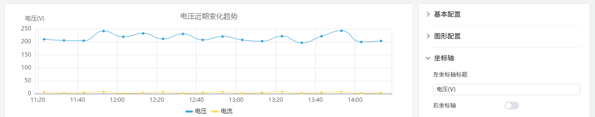

启用**右坐标轴**将第二个指标分配到右侧的独立刻度，使两个信号都清晰可读：

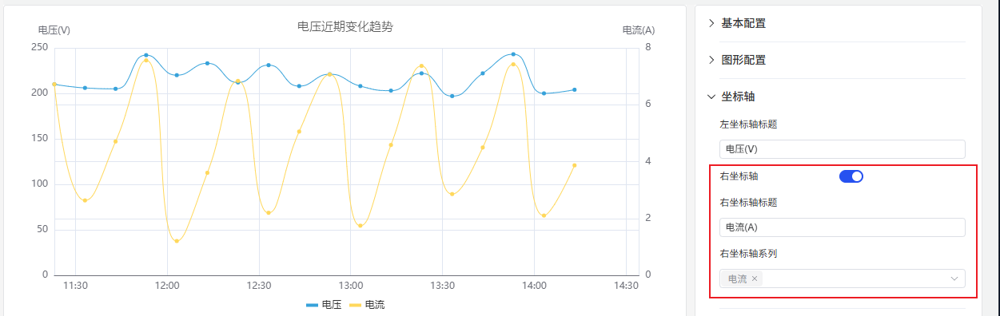

| 设置 | 说明 |
|---|---|
| **左 Y 轴标题** | 左 Y 轴的标签 |
| **数值范围** | 左 Y 轴的最小值和最大值（留空 = 自动缩放） |
| **右坐标轴** | 启用右侧辅助 Y 轴 |

### 边界值设置

属性定义的操作限值——LoLo、Lo、目标值、Hi、HiHi——可以作为水平参考线显示在图表上。这使数值是否在正常操作范围内一目了然：

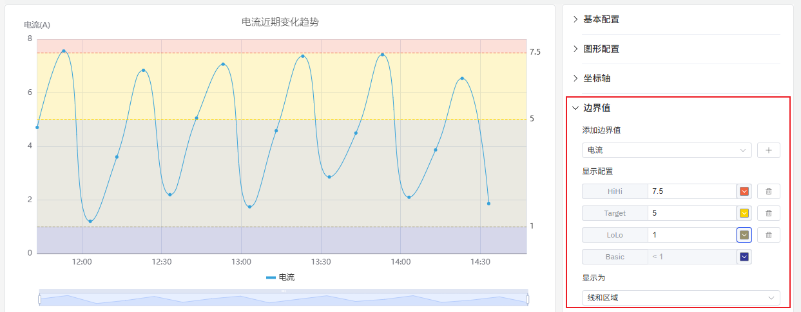

限值在属性本身（元素的属性配置中）定义，无需在此重新输入即可自动获取。

### 图例设置

图例可以在每个系列名称旁边显示汇总统计数据，包括最小值、最大值、平均值和最新值。这对于跨多个指标的一览式比较非常有用：

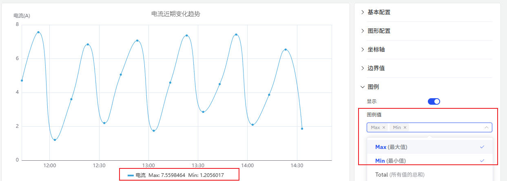

| 设置 | 说明 |
|---|---|
| **显示** | 显示模式：列表、表格或隐藏 |
| **位置** | 放置位置：底部或右侧 |
| **图例值** | 在表格模式下显示的统计数据：最新值、最小值、最大值、平均值、总计等 |

## 4.2.1.4 使用示例

**带堆叠的能耗监控。** 能源管理员需要跟踪居民和工业用户的用电量。将两个指标——居民用电量和工业用电量——添加到同一趋势图中，启用系列堆叠并将填充透明度设为 0.4。结果在单一图表上同时显示各自的贡献量和总负荷。

**混合信号的双 Y 轴。** 工艺工程师在同一图表上同时监控电压（数百伏）和电流（个位数安培）。在共用 Y 轴下，电流线几乎是平的。启用右坐标轴将电压分配到左侧刻度，电流分配到右侧刻度，使两条趋势线都清晰可见。

**限值线监控。** 运营团队监控泵的出口压力是否超出定义的 Hi 和 HiHi 限值。在趋势图上启用边界值后，任何超限情况都会立即显现为压力线越过参考线。图表会根据属性上定义的报警严重程度对限值区域进行颜色编码。

**时间偏移对比。** 质量工程师通过添加同一温度属性两次来比较今天和昨天的批次温度曲线——一次不偏移，一次设置 24 小时时间偏移。两条线叠加在同一时间轴上，清楚地突出了今天的运行与前一次的差异。
