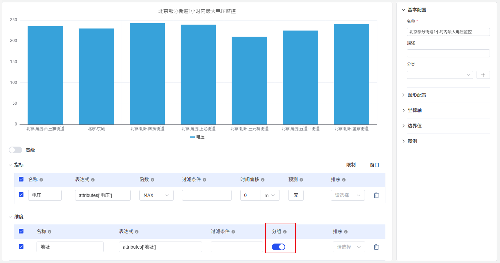
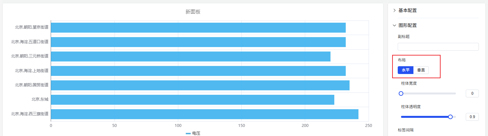
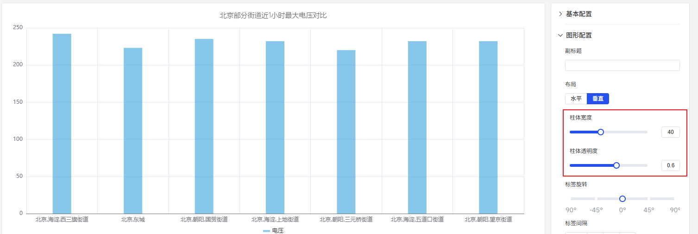
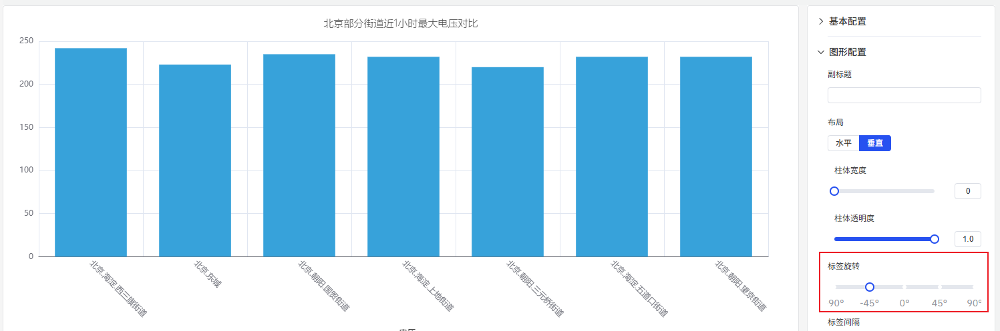
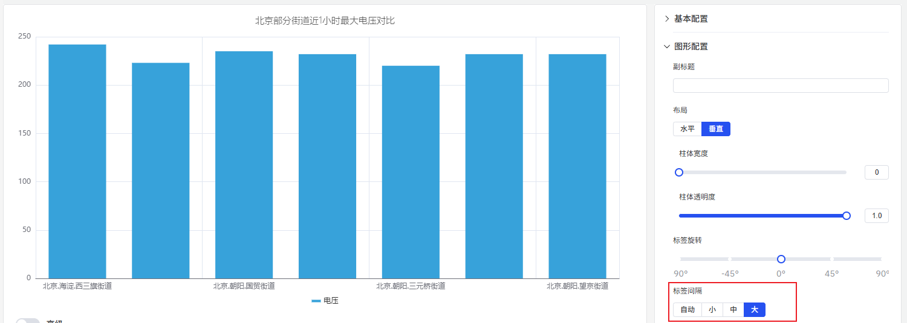
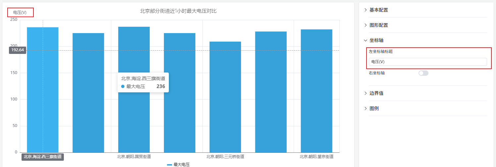
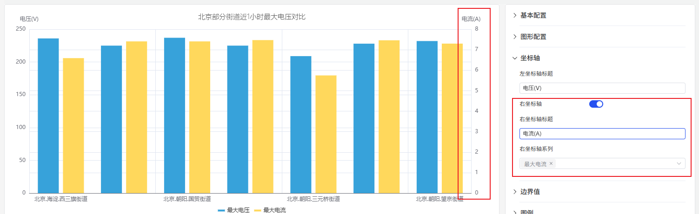
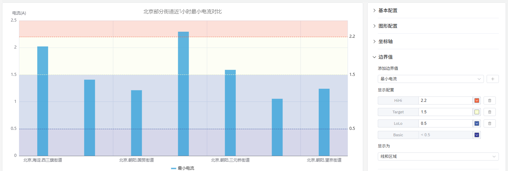
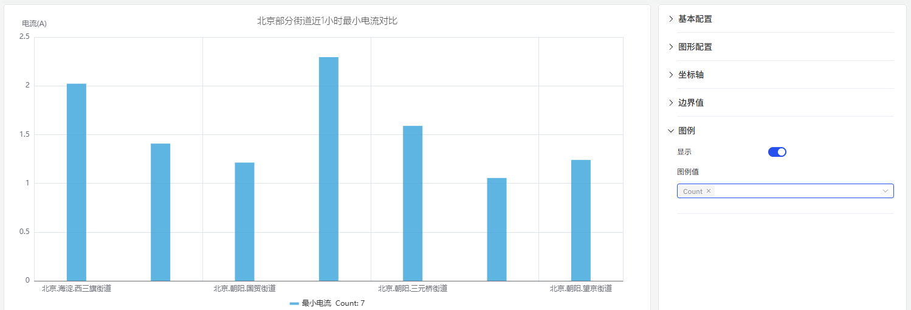

# 4.2.2 柱状图

## 4.2.2.1 概述

柱状图通过柱体的高度（横向布局时为宽度）来表示数值大小。它适用于聚合数据——按时间桶或分类维度分组的值——非常适合跨时期或跨组的比较场景。

每个柱体对应一个聚合值：时间窗口内的总和、平均值或计数（如每小时能耗），或某一分类的值（如每条生产线的产量）。多个指标可以以分组或堆叠柱体的形式展示。

## 4.2.2.2 适用场景

在以下情况下使用柱状图：

- 比较不同时间段（每小时、每天、每月）的离散数量
- 比较同一指标在多个分类或站点间的差异
- 使用堆叠柱体可视化各部分对整体的贡献
- 数据本质上是聚合的，而非连续时序数据

对于趋势形态很重要的连续时序数据，请使用趋势图。对于单一汇总值（如今日总消耗），请使用统计值面板。

## 4.2.2.3 配置

### 编辑模式工具栏

除[通用编辑模式控件](../01-panels.md#414-面板编辑模式)外，柱状图还增加了以下控件：

<table>
<colgroup><col style="width:8em"/><col/></colgroup>
<thead><tr><th>控件</th><th>说明</th></tr></thead>
<tbody>
<tr><td><strong>保存为图片</strong></td><td>将当前预览下载为 PNG 图片</td></tr>
<tr><td><strong>全屏</strong></td><td>将编辑器预览扩展为填满浏览器窗口</td></tr>
<tr><td><strong>解读面板</strong></td><td>对当前预览数据运行 AI 分析</td></tr>
</tbody>
</table>

### 图形设置

#### 布局方向

柱状图支持**垂直**（默认）和**水平**两种布局。当分类标签较长或需要并排比较多个组时，水平柱体更易读：

#### 柱体样式

**柱体宽度**和**柱体透明度**控制单个柱体的外观：

如果未设置柱体宽度，图表会根据整体宽度和柱体数量自动计算——这种自适应行为在大多数情况下效果良好。只有在固定分辨率屏幕上需要精确间距时才设置固定宽度。

<table>
<colgroup><col style="width:8em"/><col/></colgroup>
<thead><tr><th>设置</th><th>说明</th></tr></thead>
<tbody>
<tr><td><strong>布局方向</strong></td><td>垂直（柱体向上延伸）或水平（柱体向右延伸）</td></tr>
<tr><td><strong>柱体宽度</strong></td><td>单个柱体的宽度（滑块；留空则自动计算）</td></tr>
<tr><td><strong>柱体透明度</strong></td><td>柱体的透明度，0–1</td></tr>
<tr><td><strong>系列堆叠</strong></td><td>堆叠多个指标：无、同符号、全部、正值、负值</td></tr>
</tbody>
</table>

#### 标签

当分类标签较长或数量较多时，可能在坐标轴上重叠。两个设置可以解决这个问题：

1. **标签旋转** — 倾斜标签文字以防止重叠：

2. **标签间隔** — 减少显示的标签数量：

<table>
<colgroup><col style="width:7em"/><col/></colgroup>
<thead><tr><th>设置</th><th>说明</th></tr></thead>
<tbody>
<tr><td><strong>标签旋转</strong></td><td>坐标轴标签的旋转角度</td></tr>
<tr><td><strong>标签间隔</strong></td><td>标签密度：自动、小、中、大</td></tr>
</tbody>
</table>

### 坐标轴设置

#### 坐标轴标题

Y 轴可以配置名称和单位标签：

#### 双 Y 轴

当同时绘制两个量程相差数量级的指标时，共用坐标轴会压缩较小的信号使其难以阅读。启用**右坐标轴**将每个指标分配到各自的刻度：

<table>
<colgroup><col style="width:8em"/><col/></colgroup>
<thead><tr><th>设置</th><th>说明</th></tr></thead>
<tbody>
<tr><td><strong>左 Y 轴标题</strong></td><td>左 Y 轴的标签</td></tr>
<tr><td><strong>数值范围</strong></td><td>Y 轴的最小值和最大值（留空 = 自动缩放）</td></tr>
<tr><td><strong>右坐标轴</strong></td><td>启用右侧辅助 Y 轴</td></tr>
</tbody>
</table>

### 边界值设置

来自属性配置的限值——LoLo、Lo、目标值、Hi、HiHi——可以作为水平参考线显示在柱体上，标记安全和警戒区域：

### 图例设置

在表格模式下，图例可以在每个系列旁边显示汇总统计数据：

<table>
<colgroup><col style="width:6em"/><col/></colgroup>
<thead><tr><th>设置</th><th>说明</th></tr></thead>
<tbody>
<tr><td><strong>显示</strong></td><td>显示模式：列表、表格或隐藏</td></tr>
<tr><td><strong>位置</strong></td><td>放置位置：底部或右侧</td></tr>
<tr><td><strong>图例值</strong></td><td>在表格模式下显示的统计数据：最新值、最小值、最大值、平均值、总计等</td></tr>
</tbody>
</table>

## 4.2.2.4 使用示例

**每日能耗对比。** 能源分析师需要比较过去一个月每天的用电量。使用 1 天滑动窗口的柱状图每天显示一个柱体。Hi 限值线突出显示了超过目标消耗水平的天数。

**站点间产量对比。** 运营经理按站点名称添加维度分组。每个柱体代表所选时间段内一个站点的总产量。当站点名称较长时，切换到水平布局可提高可读性。

**居民与工业负荷堆叠。** 将两个指标——居民用电量和工业用电量——添加到同一柱状图中，并启用系列堆叠。每个柱体显示总负荷，两个组成部分用颜色分隔，便于一眼看出哪个组成部分在每个时间桶中占主导地位。
