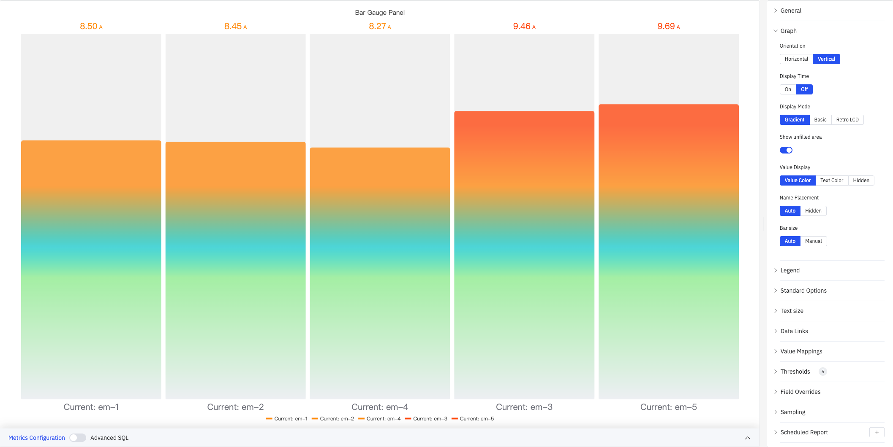
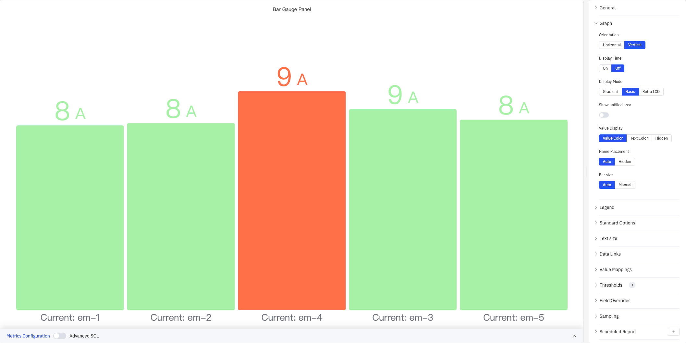
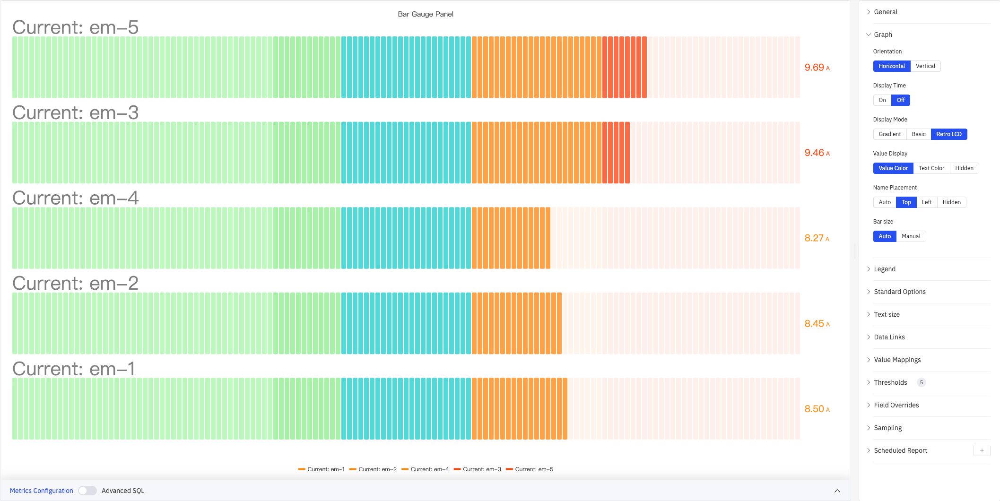
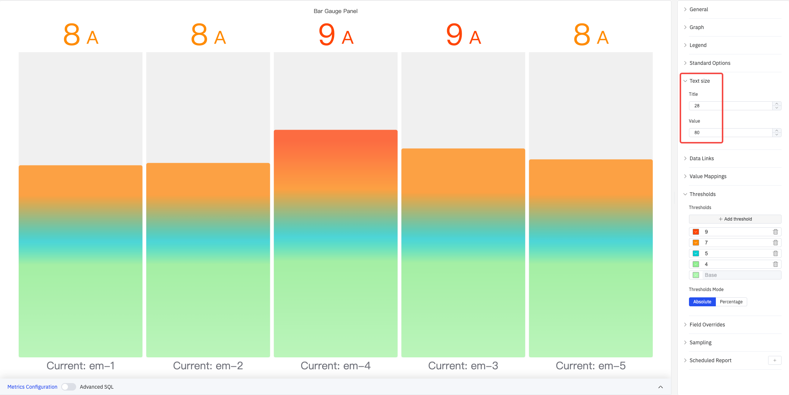

# 4.2.3 条形仪表盘

## 4.2.3.1 概述

条形仪表盘以填充条形的方式显示数值，类似于温度计或进度条，展示当前值在可配置刻度范围内的位置。条形上的颜色阈值将刻度直观地划分为不同区域，便于一眼看出数值在范围内的相对位置。

多个指标在面板中渲染为并排的条形，使条形仪表盘非常适合同时比较多个相似测量值。支持三种显示模式（渐变、基础、复古 LCD）和两种布局方向（水平、垂直），适配不同仪表板风格。

## 4.2.3.2 适用场景

在以下情况下使用条形仪表盘：

- 希望使用线性填充隐喻而非圆形表盘
- 显示容量利用率、填充液位或完成百分比
- 需要在紧凑布局中比较多个相似测量值（如多个设备的电流）
- 对受众来说进度条视觉比指针仪表更直观

对于没有刻度参考的单个大数值，请使用统计值面板。对于表盘式仪表，请使用仪表盘。

## 4.2.3.3 配置

### 图形配置

图形配置决定条形的方向、显示样式和标注方式：

| 设置 | 说明 |
|---|---|
| **Orientation** | 条形方向：Horizontal（从左向右填充）或 Vertical（从底部向上填充）；默认 Vertical |
| **Display Time** | 是否显示当前数据点的时间戳：On 或 Off；默认 Off |
| **时间格式** | 时间戳的显示格式（Display Time 为 On 时可用） |
| **Display Mode** | 视觉样式：Gradient（平滑颜色过渡）、Basic（纯色填充）、Retro LCD（分段显示）；默认 Gradient |
| **Show unfilled area** | 是否显示条形未填充部分的背景（开关）；Retro LCD 模式下不可用 |
| **Value Display** | 数值呈现方式：Value Color（数值颜色随阈值变化）、Text Color（使用默认文本色）、Hidden（隐藏数值） |
| **Name Placement** | 指标名称的位置：Auto、Top（水平布局时在上方）、Left（水平布局时在左侧）、Hidden（隐藏） |
| **Bar size** | 各条形的尺寸模式：Auto（自动计算）或 Manual（手动指定） |
| **最小宽度** | 每个条形的最小宽度（像素，Manual 模式且垂直布局时可用） |
| **最小高度** | 每个条形的最小高度（像素，Manual 模式且水平布局时可用） |
| **最大高度** | 每个条形的最大高度（像素，Manual 模式且水平布局时可用） |

#### 显示模式对比

**Basic** 模式使用纯色填充，颜色由当前阈值区间决定，视觉简洁清晰：

**Gradient** 模式从低值到高值呈现平滑颜色过渡，同时反映数值大小与阈值区间：

**Retro LCD** 模式将条形拆分为离散分段，模拟液晶显示屏外观。适合工业仪表风格仪表板：

#### 水平布局

将 Orientation 设为 Horizontal 时，条形从左向右填充，配合 Retro LCD 模式和 Name Placement = Top 可实现堆叠列表样式：

### 图例

| 设置 | 说明 |
|---|---|
| **显示** | 显示模式：List、Table、Hidden |
| **位置** | 放置位置：Bottom、Right |
| **宽度** | 图例区域宽度（像素，Right 布局时可用） |
| **图例值** | 在 Table 模式下显示的统计数据，可多选：Max、Min、Mean、Sum、Count、First、Last 等 |

### 标准配置

| 设置 | 说明 |
|---|---|
| **小数位数** | 数值显示的小数位数（留空则自动判断） |
| **配色方案** | 系列颜色分配策略：单色、单色深浅映射（按系列）、阈值取色（按值）、经典调色板、经典调色板（按系列名）、自定义调色板 |
| **无数据** | 无数据时显示的文本（默认 `-`） |

### 字体大小

通过独立设置名称和数值的字体大小，可调节信息的视觉层次：

| 设置 | 说明 |
|---|---|
| **Title** | 指标名称标签的字体大小（留空则自动） |
| **Value** | 数值的字体大小（留空则自动） |

### 数据链接

数据链接为条形仪表盘附加可点击的跳转 URL：

| 设置 | 说明 |
|---|---|
| **标题** | 链接的显示名称 |
| **URL** | 跳转目标地址，支持变量插值 |
| **在新标签页打开** | 是否在新浏览器标签页中打开链接 |
| **一键跳转** | 启用后点击条形直接跳转（同时只能有一条链接启用此功能） |

### 值映射

值映射将数据值替换为自定义的显示文本并赋予颜色：

| 映射类型 | 说明 |
|---|---|
| **值** | 精确匹配特定数值或文本 |
| **范围** | 匹配指定数值范围 |
| **正则表达式** | 使用正则表达式匹配并替换 |
| **特殊值** | 匹配 null、NaN、布尔值、空字符串等 |
| **其他值** | 匹配所有未被前面规则覆盖的值 |

### 颜色阈值

颜色阈值定义条形上的颜色带——每个阈值指定一个数值边界和对应颜色，数值越过边界时条形颜色随之改变：

如上图所示，配置阈值 9（红色）、7（橙色）、5（青色）、4（浅绿）、Base（绿色），条形将根据当前值所在区间显示对应颜色。

| 设置 | 说明 |
|---|---|
| **Thresholds Mode** | 阈值判断方式：Absolute（按原始数据值）或 Percentage（按最小值–最大值范围的百分比） |
| **+ Add threshold** | 新增一条阈值规则，每条规则包含数值边界和对应颜色 |

颜色阈值生效需在标准配置中将**配色方案**设置为**阈值取色（按值）**。

### 个性化配置

个性化配置允许对单个指标覆盖全局设置。选定目标指标名称（Fields with name）后，可覆盖的属性包括：系列样式、填充透明度、值映射等。

### 降采样

当查询结果中的数据点过多时，可启用降采样减少计算量：

| 设置 | 说明 |
|---|---|
| **启用降采样** | 开关，默认关闭 |
| **最大数据点数** | 降采样后保留的最大数据点数量 |
| **聚合函数** | 降采样时使用的聚合方式（如 AVG、MAX、MIN 等） |

### 定时报告

定时报告按预设周期自动生成面板快照并推送：

| 设置 | 说明 |
|---|---|
| **频率** | 发送间隔：每周、每天等 |
| **任务开始时间** | 首次执行的日期和时间 |
| **结束日期** | 定时任务终止日期（留空则持续执行） |
| **通知联系人** | 接收报告的通知联系点 |

## 4.2.3.4 使用示例

**多设备电流比较。** 五台设备的电流指标添加到同一条形仪表盘面板，使用垂直布局 + Gradient 显示模式。在颜色阈值中设置 9 A（红色）、7 A（橙色）、5 A（青色），超过 9 A 的设备条形立即变为红色，操作员可快速定位过载设备。

**水平 LCD 仪表板。** 将布局设为 Horizontal、显示模式设为 Retro LCD、Name Placement 设为 Top，多个指标以堆叠列表形式呈现分段条形。阈值颜色从绿到红逐级变化，模拟传统工业仪表风格。

**大屏远距离读数。** 在控制室大屏上，将字体大小的 Value 设为 80，使数值在远处清晰可读。配合 Gradient 模式和阈值颜色渐变，操作员无需走近即可判断各指标的状态区间。
