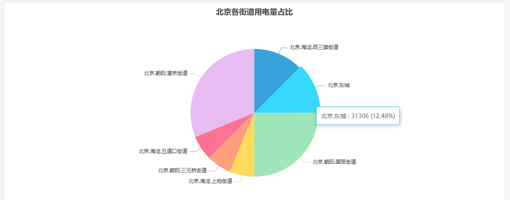

# 4.2.3 饼图

## 概述

饼图将圆按比例分成若干扇形，每个扇形代表其对应类别占总量的比例。每个扇形表示一个类别或指标组，使各部分的相对贡献一目了然。

扇形标签直接显示在图表上。当扇形少于 8 个时，图表最为清晰——超过这个数量，较小的扇形会难以区分，此时柱状图或表格是更好的选择。

## 适用场景

在以下情况下使用饼图：

- 希望展示总量如何分布在少量类别中
- 各部分之间的相对比例比绝对值更重要
- 最多有五到七个类别

当类别数量多、数值大小接近（弧度大小难以判断差异），或需要追踪随时间变化时，应避免使用饼图。比较时使用柱状图，时序数据使用趋势图。

## 配置

### 编辑模式工具栏

除[通用编辑模式控件](../01-panels.md#414-面板编辑模式)外，饼图还增加了以下控件：

| 控件 | 说明 |
|---|---|
| **保存为图片** | 将当前预览下载为 PNG 图片 |
| **全屏** | 将编辑器预览扩展为填满浏览器窗口 |
| **解读面板** | 对当前预览数据运行 AI 分析 |

### 图形设置

| 设置 | 说明 |
|---|---|
| **标题** | 显示在饼图上方的图表标题 |
| **副标题** | 显示在主标题下方的次要标题 |

饼图没有坐标轴、边界值或图例部分。扇形标签和百分比直接显示在图表上。

## 使用示例

**按相位的用电量。** 电气工程师将三个指标——A 相、B 相和 C 相电流——添加到饼图中。图表立即显示负荷是否均匀分布在各相之间，还是集中在某一相上。

**按班次的生产占比。** 工厂管理员按班次（白班、夜班、凌晨班）添加维度分组，以总产量为指标。饼图显示每个班次对当日总产量的贡献。

**按严重程度的事件分布。** 运营团队按报警严重程度类别添加维度分组。饼图显示紧急、警告和信息类事件各占多少比例——适用于班次总结报告。
