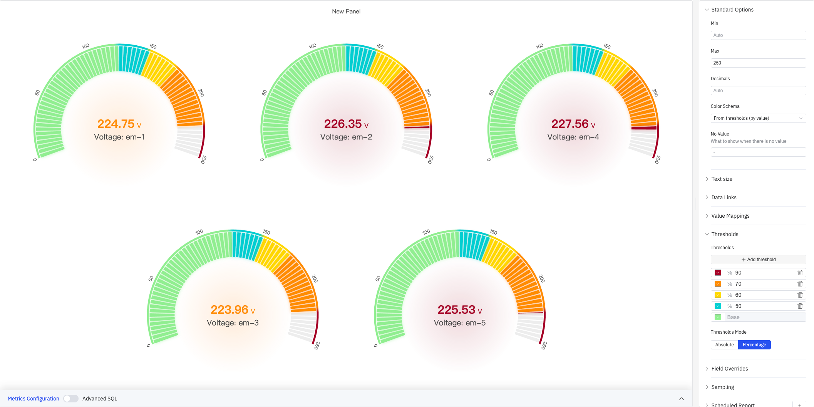

# 4.2.4 仪表盘

## 4.2.4.1 概述

仪表盘将单个当前值显示在弧形或圆形刻度盘上，类似于模拟仪表面板上的仪表。彩色弧段让人一眼就能看出数值在其操作范围内所处的位置。

仪表盘始终显示所选时间范围内的最新数据点。单个面板中可以显示多个仪表盘——每个指标一个——以自动、水平或垂直方式排列。支持分段显示、刻度标签、阈值色带和发光特效等丰富的视觉定制选项。

## 4.2.4.2 适用场景

在以下情况下使用仪表盘：

- 希望以操作员能立即理解的形式显示单个实时测量值
- 需要一眼传达数值是否处于安全、警告或报警区域
- 正在构建操作员显示屏或状态仪表板，空间隐喻（弧段位置）能传达紧迫感
- 需要同时对比多个设备的同类指标（如多台设备的电压）

对于跨时间的多值比较，请使用趋势图。对于无需表盘隐喻的纯数字读数，请使用统计值面板。对于线性进度条视觉，请使用条形仪表盘。

## 4.2.4.3 配置

### 图形配置

图形配置决定仪表盘的形状、分段和视觉效果：

| 设置 | 说明 |
|---|---|
| **Style** | 表盘形状：Arc（半圆弧形）或 Circle（全圆环形） |
| **Orientation** | 多个仪表盘的排列方式：Auto、Horizontal、Vertical |
| **Bar Width Factor** | 弧/环的相对粗细，范围 0.1–1；默认 0.70 |
| **Segments** | 将弧线分成的段数，范围 1–100；默认 1（连续弧线） |
| **Segments Spacing** | 相邻分段之间的间隙大小，范围 0–1（Segments 大于 1 时可用） |
| **Text Mode** | 表盘中显示的文字内容：Value and Name、Value、Name |
| **Display Time** | 是否在表盘下方显示当前数据点的时间戳：On 或 Off |
| **Time Format** | 时间戳的显示格式，如 `YYYY-MM-DD HH:mm:ss`（Display Time 为 On 时可用） |
| **Show Thresholds** | 是否在弧线外侧显示阈值数值标签（开关） |
| **Show Labels** | 是否在表盘周围显示刻度标签（开关） |
| **Effects** | 视觉特效，可多选：Gradient（渐变色）、Bar Glow（柱条发光）、Center Glow（中心发光） |

当 Orientation 为 Horizontal 或 Vertical 时，还可设置仪表尺寸模式（Auto/Manual），Manual 模式下可指定最小高度或最小宽度。

#### 圆形样式

将 Style 设为 Circle 时，仪表盘呈完整的圆环形，适用于需要更紧凑布局或全周视觉效果的场景：

#### 分段显示

将 Segments 设为较大值（如 70）并配合 Segments Spacing（如 0.25）时，弧线被分成多个离散色块，呈现仪表刻度盘效果：

#### 特效

启用所有特效（Gradient + Bar Glow + Center Glow）后，仪表盘呈现渐变色彩和发光效果。配合 Show Labels 可显示刻度数值标签：

### 标准配置

| 设置 | 说明 |
|---|---|
| **Min** | 表盘刻度的最小值（留空则自动计算） |
| **Max** | 表盘刻度的最大值（如 250） |
| **Decimals** | 数值显示的小数位数（留空则自动判断） |
| **Color Schema** | 配色方案：单色、单色深浅映射（按系列）、阈值取色（按值）、经典调色板、经典调色板（按系列名）、自定义调色板 |
| **No Value** | 无数据时显示的文本（默认 `-`） |

### 字体大小

| 设置 | 说明 |
|---|---|
| **Title** | 指标名称标签的字体大小（留空则自动） |
| **Value** | 表盘中心数值的字体大小（留空则自动） |

### 数据链接

数据链接为仪表盘附加可点击的跳转 URL：

| 设置 | 说明 |
|---|---|
| **标题** | 链接的显示名称 |
| **URL** | 跳转目标地址，支持变量插值 |
| **在新标签页打开** | 是否在新浏览器标签页中打开链接 |
| **一键跳转** | 启用后点击仪表盘直接跳转（同时只能有一条链接启用此功能） |

### 值映射

值映射将数据值替换为自定义的显示文本并赋予颜色：

| 映射类型 | 说明 |
|---|---|
| **值** | 精确匹配特定数值或文本 |
| **范围** | 匹配指定数值范围 |
| **正则表达式** | 使用正则表达式匹配并替换 |
| **特殊值** | 匹配 null、NaN、布尔值、空字符串等 |
| **其他值** | 匹配所有未被前面规则覆盖的值 |

### 颜色阈值

颜色阈值定义表盘弧线的颜色分区，直观呈现数值所处的操作区域：

如上图所示，使用 Percentage 模式配置阈值 90%（深红）、70%（橙色）、60%（黄色）、50%（青色）、Base（绿色），弧线从低到高依次呈现绿 → 青 → 黄 → 橙 → 红的色带，当前值所在位置一目了然。

| 设置 | 说明 |
|---|---|
| **Thresholds Mode** | 阈值判断方式：Absolute（绝对值）或 Percentage（最小值–最大值范围的百分比） |
| **+ Add threshold** | 新增一条阈值规则，每条规则包含数值边界和对应颜色 |

颜色阈值生效需在标准配置中将 **Color Schema** 设置为 **From thresholds (by value)**。

### 个性化配置

个性化配置允许对单个指标覆盖全局设置。选定目标指标名称（Fields with name）后，可覆盖的属性包括：系列样式、填充透明度、值映射等。

### 降采样

当查询结果中的数据点过多时，可启用降采样减少计算量：

| 设置 | 说明 |
|---|---|
| **启用降采样** | 开关，默认关闭 |
| **最大数据点数** | 降采样后保留的最大数据点数量 |
| **聚合函数** | 降采样时使用的聚合方式（如 AVG、MAX、MIN 等） |

### 定时报告

定时报告按预设周期自动生成面板快照并推送：

| 设置 | 说明 |
|---|---|
| **频率** | 发送间隔：每周、每天等 |
| **任务开始时间** | 首次执行的日期和时间 |
| **结束日期** | 定时任务终止日期（留空则持续执行） |
| **通知联系人** | 接收报告的通知联系点 |

## 4.2.4.4 使用示例

**多设备电压监控。** 五台设备的电压指标显示在同一仪表盘面板中，使用 Arc 样式 + Auto 布局。每个仪表盘通过经典调色板赋予不同颜色，操作员可并排对比各设备的电压读数。

**百分比阈值色带。** 将 Max 设为 250、Thresholds Mode 设为 Percentage，配置 90%/70%/60%/50%/Base 五个阈值。弧线从绿到红逐级变色，配合 Show Thresholds 和 Show Labels 显示刻度，操作员不仅能看到当前值，还能直观判断距离告警区域有多远。

**工业仪表风格。** 将 Segments 设为 70、Segments Spacing 设为 0.25、Bar Width Factor 设为 0.90，并启用全部特效（Gradient + Bar Glow + Center Glow）。仪表盘呈现精细分段加发光的工业仪表外观，适合控制室大屏展示。
