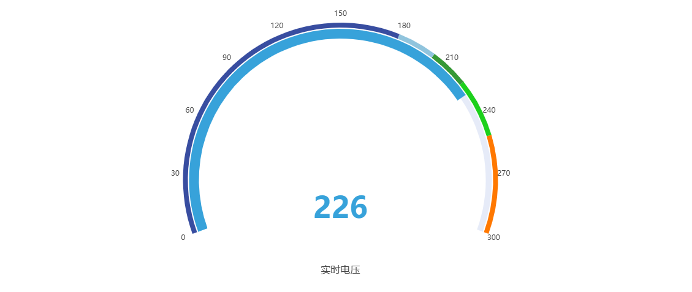
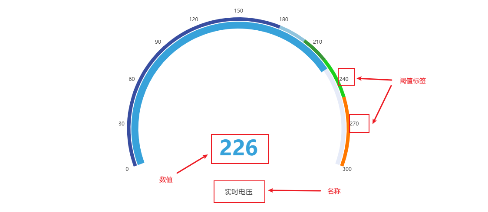
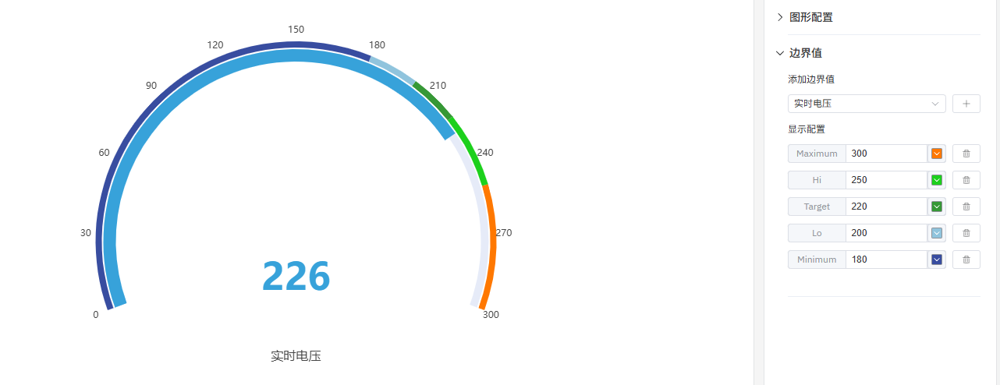

# 4.2.4 仪表盘

## 4.2.4.1 概述

仪表盘将单个当前值显示在半圆形刻度盘上，类似于模拟仪表面板上的仪表。指针和彩色弧段让人一眼就能看出数值在其操作范围内所处的位置。

仪表盘始终显示所选时间范围内的最新数据点。单个面板中可以显示多个仪表盘——每个指标一个——以水平或垂直方式排列。

## 4.2.4.2 适用场景

在以下情况下使用仪表盘：

- 希望以操作员能立即理解的形式显示单个实时测量值
- 需要一眼传达数值是否处于安全、警告或报警区域
- 正在构建操作员显示屏或状态仪表板，空间隐喻（指针位置）能传达紧迫感

对于跨时间的多值比较，请使用趋势图。对于无需表盘隐喻的纯数字读数，请使用统计值面板。

## 4.2.4.3 配置

### 编辑模式工具栏

除[通用编辑模式控件](../01-panels.md#414-面板编辑模式)外，仪表盘还增加了以下控件：

| 控件 | 说明 |
|---|---|
| **保存为图片** | 将当前预览下载为 PNG 图片 |
| **全屏** | 将编辑器预览扩展为填满浏览器窗口 |
| **解读面板** | 对当前预览数据运行 AI 分析 |

### 图形设置

仪表盘支持配置刻度标签、标题显示和字体大小：

| 设置 | 说明 |
|---|---|
| **标题** | 显示在面板上方的图表标题 |
| **布局方向** | 显示多个仪表盘时的布局方向：水平或垂直 |
| **显示阈值标签** | 开关：在表盘弧线周围显示阈值数值 |
| **显示名称** | 开关：在表盘下方显示指标名称 |
| **名称字体大小** | 指标名称标签的字体大小（默认 16） |
| **数值字体大小** | 表盘中心数值的字体大小（默认 48） |

### 边界值设置

属性定义的限值——LoLo、Lo、目标值、Hi、HiHi——以彩色弧段的形式显示在表盘上。这将表盘面直观地划分为安全区域，使指针是否处于警告或报警区域一目了然：

限值从元素的属性配置中自动获取，无需在此重新输入。

## 4.2.4.4 使用示例

**泵出口压力。** 泵的出口压力属性定义了 Lo 和 Hi 限值。仪表盘显示当前压力，弧线划分为绿色（正常）、黄色（警告）和红色（报警）区域。操作员一眼就能看出泵是否在规格范围内运行。

**电机转速监控。** 生产线上三台电机各贡献一个仪表盘到同一面板，水平布局排列。操作员并排看到三个转速，立即发现哪台运行超出正常区域。

**温度监控点。** 炉温显示在仪表盘上，HiHi 限值设为最高安全操作温度。当指针接近红色区域时，操作员知道需要在报警触发前采取行动。
