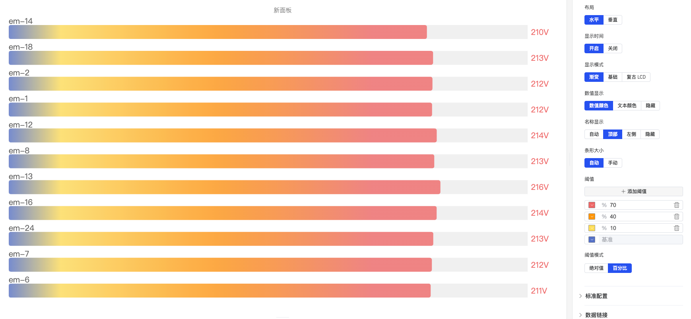
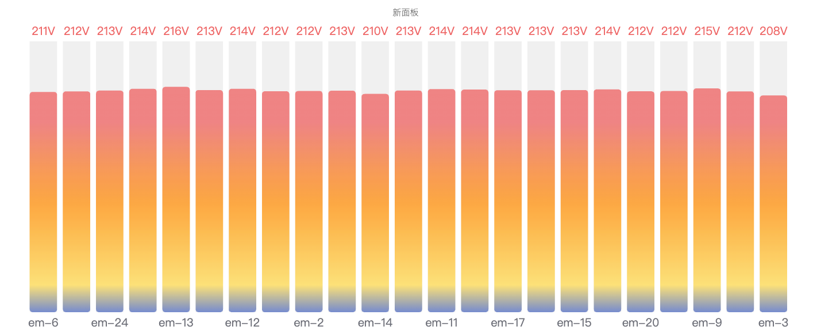

# 4.2.5 条形仪表盘

## 4.2.5.1 概述

条形仪表盘以填充条形的方式显示数值，类似于温度计或进度条，展示该值在可配置刻度范围内的位置。条形上的颜色阈值将刻度直观地划分为不同区域，便于一眼看出数值在范围内进展了多远。

多个指标在面板中渲染为多个堆叠的条形，使条形仪表盘非常适合并排比较多个相似测量值。

## 4.2.5.2 适用场景

在以下情况下使用条形仪表盘：

- 希望使用线性填充隐喻而非圆形表盘
- 显示容量利用率、填充液位或完成百分比
- 需要在紧凑布局中比较多个相似测量值（如多个储罐的液位）
- 对受众来说进度条视觉比指针仪表更直观

对于没有刻度参考的单个大数值，请使用统计值面板。对于表盘式仪表，请使用仪表盘。

## 4.2.5.3 配置

### 编辑模式工具栏

除[通用编辑模式控件](../01-panels.md#414-面板编辑模式)外，条形仪表盘还增加了以下控件：

<table>
<colgroup><col style="width:8em"/><col/></colgroup>
<thead><tr><th>控件</th><th>说明</th></tr></thead>
<tbody>
<tr><td><strong>保存为图片</strong></td><td>将当前预览下载为 PNG 图片</td></tr>
<tr><td><strong>全屏</strong></td><td>将编辑器预览扩展为填满浏览器窗口</td></tr>
<tr><td><strong>解读面板</strong></td><td>对当前预览数据运行 AI 分析</td></tr>
</tbody>
</table>

### 图形设置

<table>
<colgroup><col style="width:7em"/><col/></colgroup>
<thead><tr><th>设置</th><th>说明</th></tr></thead>
<tbody>
<tr><td><strong>标题</strong></td><td>图表标题</td></tr>
<tr><td><strong>副标题</strong></td><td>次要标题</td></tr>
<tr><td><strong>布局方向</strong></td><td><strong>水平</strong>（条形从左向右填充）或<strong>垂直</strong>（条形从底部向上填充）</td></tr>
<tr><td><strong>显示时间</strong></td><td><strong>开启</strong>（在条形上显示时间戳）或<strong>关闭</strong></td></tr>
<tr><td><strong>显示模式</strong></td><td>视觉样式：<strong>渐变</strong>（平滑颜色过渡）、<strong>基础</strong>（纯色填充）、<strong>复古 LCD</strong>（分段显示）</td></tr>
<tr><td><strong>数值显示</strong></td><td>数值颜色样式：<strong>数据颜色</strong>（叠加在条形上，颜色随阈值变化）、<strong>文本颜色</strong>（叠加，纯文本颜色）、<strong>隐藏</strong></td></tr>
<tr><td><strong>名称显示</strong></td><td>指标名称位置：<strong>自动</strong>、<strong>顶部</strong>、<strong>左侧</strong>或<strong>隐藏</strong></td></tr>
<tr><td><strong>条形大小</strong></td><td><strong>自动</strong>（条形填满可用空间）或<strong>手动</strong>（固定像素大小）</td></tr>
<tr><td><strong>最小值</strong></td><td>刻度的最小值（默认 0）</td></tr>
<tr><td><strong>最大值</strong></td><td>刻度的最大值（默认 1）</td></tr>
<tr><td><strong>小数位数</strong></td><td>显示的小数位数</td></tr>
</tbody>
</table>

#### 显示模式

**基础模式** 使用单一纯色填充条形，颜色由当前阈值区间决定，视觉简洁清晰。

**渐变模式** 在条形内呈现从低值到高值的平滑颜色渐变，可同时反映数值大小与阈值位置。

**复古 LCD 模式** 将条形拆分为离散分段，模拟液晶显示屏的外观，适合工业仪表风格的仪表板。

#### 阈值

阈值定义条形上的颜色带。每个阈值指定一个数值和一种颜色；当值越过每个边界时，条形会改变颜色：

<table>
<colgroup><col style="width:7em"/><col/></colgroup>
<thead><tr><th>设置</th><th>说明</th></tr></thead>
<tbody>
<tr><td><strong>阈值</strong></td><td>点击 <strong>+ 添加阈值</strong> 定义边界值及其颜色</td></tr>
<tr><td><strong>阈值模式</strong></td><td><strong>绝对值</strong>（阈值为原始数据值）或<strong>百分比</strong>（阈值为最小值-最大值范围的百分比）</td></tr>
</tbody>
</table>

## 4.2.5.4 使用示例

**储罐液位。** 五个储罐各有一个液位指标。将全部五个添加到单个条形仪表盘面板，水平布局。设置 20%（红色）、50%（黄色）和 80%（绿色）阈值，让操作员立即看到哪些储罐需要关注。

**产能利用率比较。** 三条生产线贡献其每小时产量作为指标。条形仪表盘以 100% 为最大值显示每条线的利用率，渐变显示模式随利用率从绿色到红色的平滑颜色变化。

**电池荷电状态。** 储能系统的荷电状态以垂直条形仪表盘显示，最小值 0%，最大值 100%，百分比阈值设为 20%（红色）和 50%（黄色）。视觉效果直观传达可用储备量。
