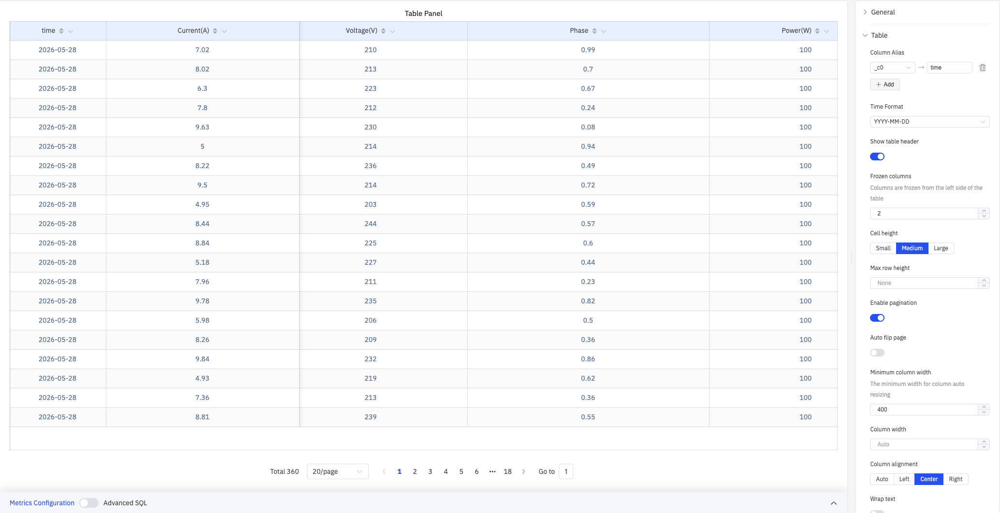
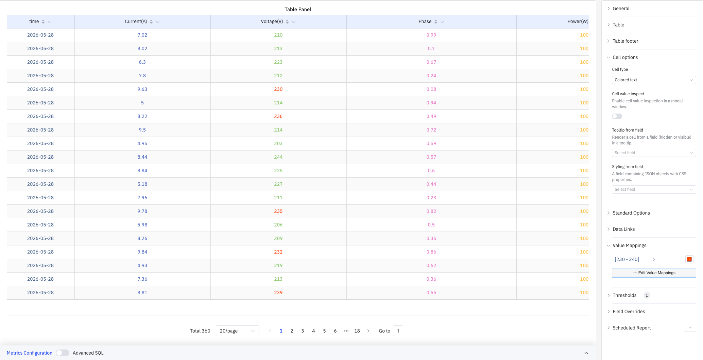
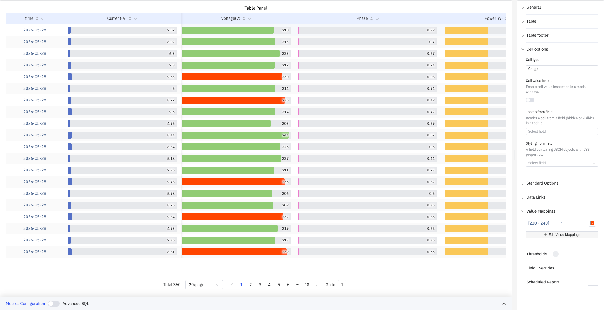

# 4.2.5 表格

## 4.2.5.1 概述

表格面板以结构化网格显示查询结果，每个时间点一行，每个指标一列。这是读取查询返回的精确数值最直接的方式——无聚合、无视觉编码，只有原始数字。

所有配置的指标均显示为列，时间戳列始终包含。面板底部提供分页控件，可在大型结果集中翻页浏览。支持多种单元格渲染类型（彩色文本、彩色背景、进度条等），可在保留精确数值的同时提供视觉提示。

## 4.2.5.2 适用场景

在以下情况下使用表格面板：

- 需要查看精确的数据值而非视觉趋势
- 正在验证数据质量或检查缺失值
- 希望构建带有汇总统计的报告（表尾可显示求和、平均值等）
- 需要通过颜色编码在表格内直观识别异常值

对于视觉趋势分析，请使用趋势图。对于单个汇总数值，请使用统计值面板。

## 4.2.5.3 配置

### 表格配置

表格配置控制列布局、分页和文本显示：

| 设置 | 说明 |
|---|---|
| **Column Alias** | 为列设置显示别名（如将 `_c0` 显示为 `time`），仅影响表头展示 |
| **Time Format** | 时间戳列的显示格式（如 `YYYY-MM-DD`） |
| **Show table header** | 是否显示表格标题行（开关）；默认开启 |
| **Frozen columns** | 从表格左侧冻结的列数；冻结列在水平滚动时保持可见 |
| **Cell height** | 行高规格：Small、Medium、Large；默认 Medium |
| **Max row height** | 单行最大高度（像素）；设为 None 则不限制 |
| **Enable pagination** | 是否将数据分页显示（开关）；默认开启 |
| **Auto flip page** | 启用分页时可开启自动翻页，并设置翻页间隔 |
| **Minimum column width** | 列自动调整的最小宽度（像素），如 400 |
| **Column width** | 所有列的固定宽度（像素）；设为 Auto 则自动 |
| **Column alignment** | 单元格内容的对齐方式：Auto、Left、Center、Right；默认 Auto |
| **Wrap text** | 单元格内容超出宽度时是否换行（开关） |
| **Header wrap text** | 表头文字超出宽度时是否换行（开关） |
| **Column filter** | 启用后每列表头出现筛选图标，可对列值进行过滤 |

#### 列管理

点击列表头的齿轮图标可打开列管理弹窗，支持：

- 勾选/取消勾选列的可见性
- 为每列单独设置 Column Width（像素）
- 拖拽调整列顺序

### 表尾配置

表尾配置在表格底部显示汇总统计行：

| 设置 | 说明 |
|---|---|
| **Calculation** | 在表格底部显示汇总行，可多选：Sum、Mean、Max、Min、Count、First、Last |

如上图所示，选择 Sum、Mean、Max、Min、Count 后，表格底部将为每列显示对应的统计值。

### 单元格配置

单元格配置决定数据的渲染方式：

| 设置 | 说明 |
|---|---|
| **Cell type** | 单元格的渲染类型：Auto、Colored background、Colored text、Gauge、Sparkline、Image、JSON view |
| **Background display mode** | 彩色背景的填充样式：Basic（纯色）或 Gradient；仅 Cell type 为 Colored background 时可用 |
| **Apply to entire row** | 开启后以该列的颜色对整行着色；仅 Cell type 为 Colored background 时可用 |
| **Cell value inspect** | 开启后点击单元格可在弹窗中查看完整值（开关） |
| **Tooltip from field** | 指定一个字段（可见或已隐藏）用于渲染单元格的 tooltip 内容 |
| **Styling from field** | 指定一个包含 JSON 格式 CSS 属性的字段，将其值作为内联样式应用到单元格 |

#### 彩色背景模式

将 Cell type 设为 Colored background 时，单元格根据阈值和值映射规则着色背景，适合快速识别异常值：

#### 进度条模式

将 Cell type 设为 Gauge 时，每个单元格内渲染水平进度条，条长和颜色由当前值与阈值决定：

### 标准配置

| 设置 | 说明 |
|---|---|
| **小数位数** | 数值的小数显示位数（留空则自动判断） |
| **配色方案** | 颜色分配策略：单色、单色深浅映射（按系列）、阈值取色（按值）、经典调色板、经典调色板（按系列名）、自定义调色板 |
| **无数据** | 无数据时显示的文本（默认 `-`） |

### 数据链接

数据链接为单元格附加可点击的跳转 URL：

| 设置 | 说明 |
|---|---|
| **标题** | 链接的显示名称 |
| **URL** | 跳转目标地址，支持变量插值 |
| **在新标签页打开** | 是否在新浏览器标签页中打开链接 |
| **一键跳转** | 启用后点击单元格直接跳转（同时只能有一条链接启用此功能） |

### 值映射

值映射将数据值替换为自定义显示文本并赋予颜色。如上图所示，配置范围映射 [230–240] 后，落入该区间的电压值会以橙红色高亮显示：

| 映射类型 | 说明 |
|---|---|
| **值** | 精确匹配特定数值或文本 |
| **范围** | 匹配指定数值范围 |
| **正则表达式** | 使用正则表达式匹配并替换 |
| **特殊值** | 匹配 null、NaN、布尔值、空字符串等 |
| **其他值** | 匹配所有未被前面规则覆盖的值 |

### 颜色阈值

颜色阈值定义数值区间与颜色的对应关系，配合 Cell type（Colored background、Colored text 或 Gauge）生效：

| 设置 | 说明 |
|---|---|
| **Thresholds Mode** | 阈值判断方式：Absolute（绝对值）或 Percentage（最小值–最大值范围的百分比） |
| **+ Add threshold** | 新增一条阈值规则，每条包含数值边界和对应颜色 |

颜色阈值生效需在标准配置中将**配色方案**设置为**阈值取色（按值）**。

### 个性化配置

个性化配置允许对单个列覆盖全局设置。选定目标列名（Fields with name）后，可覆盖的属性包括：系列样式、填充透明度、值映射等。

### 定时报告

定时报告按预设周期自动生成面板快照并推送：

| 设置 | 说明 |
|---|---|
| **频率** | 发送间隔：每周、每天等 |
| **任务开始时间** | 首次执行的日期和时间 |
| **结束日期** | 定时任务终止日期（留空则持续执行） |
| **通知联系人** | 接收报告的通知联系点 |

## 4.2.5.4 使用示例

**数据质量检查。** 数据工程师将电表的所有属性添加到表格面板，设置时间范围为过去 3 小时。每 10 分钟一条数据、每页 20 条，共 360 条记录。逐行检查原始读数是否按预期间隔到达，是否有值缺失或超出范围。

**汇总统计报告。** 运营经理在表尾配置中选择 Sum、Mean、Max、Min、Count，表格底部自动显示电流总和 2692.82 A、电压均值 225.33 V 等统计值。该汇总可直接用于班次交接报告。

**异常值可视化。** 将 Cell type 设为 Colored background，配置值映射 [230–240] 为橙红色。当电压值进入该区间时，对应单元格背景自动变色，运维人员在大量数据中一眼定位异常时段。
