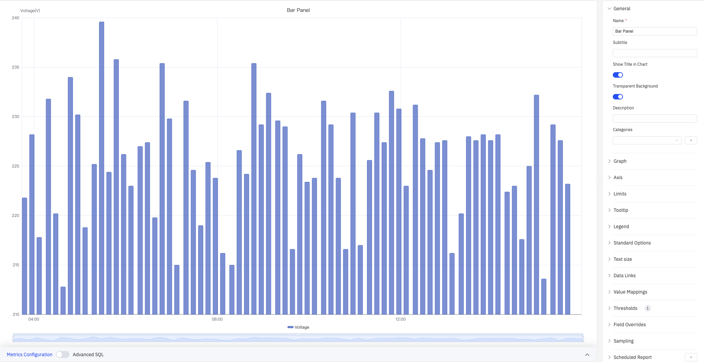
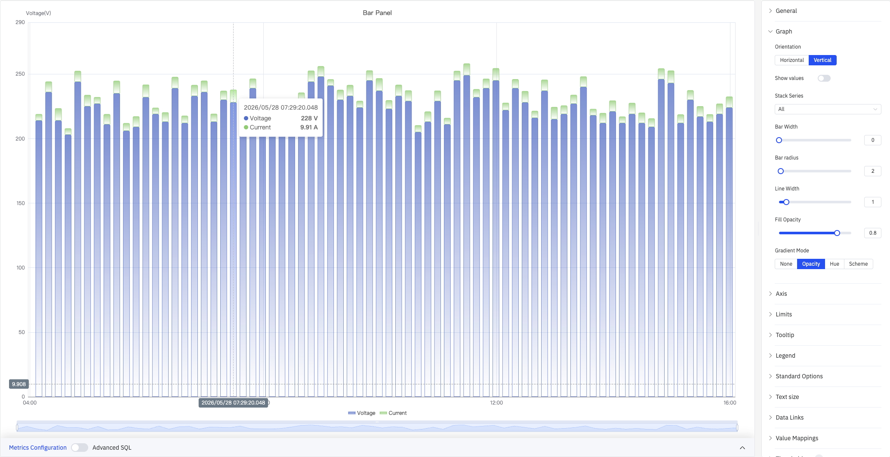
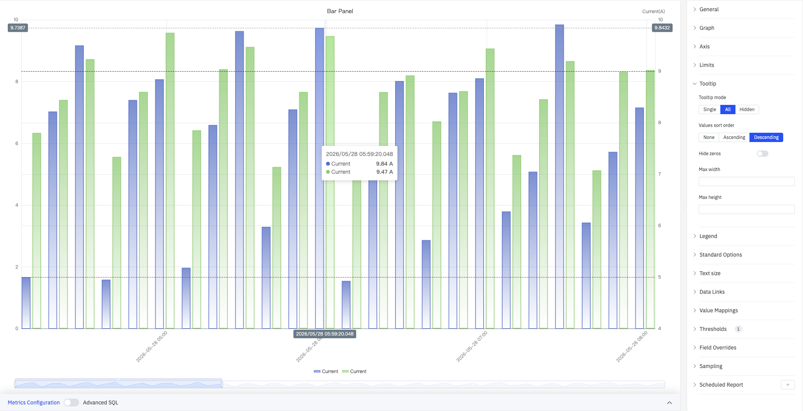

# 4.2.6 柱状图

## 4.2.6.1 概述

柱状图通过柱体的高度（横向布局时为宽度）来表示数值大小，适用于按时间桶或分类维度分组的聚合数据，是跨时期、跨分组比较的首选图表类型。

每个柱体对应一个聚合值：时间窗口内的总和、平均值或计数（如每小时能耗），或某一分类维度的值（如各生产线产量）。多个指标可以分组或堆叠展示。

## 4.2.6.2 适用场景

在以下情况下使用柱状图：

- 比较不同时间段（每小时、每天、每月）的离散数量
- 比较同一指标在多个分类或站点间的差异
- 使用堆叠柱体可视化各部分对整体的贡献
- 数据本质上是聚合的，而非连续时序数据

对于连续时序数据的趋势分析，请使用趋势图。对于单一汇总值（如今日总消耗），请使用统计值面板。

## 4.2.6.3 配置

### 图形配置

#### 布局方向与堆叠

柱状图支持**垂直**（默认）和**水平**两种布局。当分类标签较长或需要并排比较多个组时，水平布局更易读：

启用**堆叠系列**后，多个指标将叠加在同一根柱体中，便于观察各组成部分对总量的贡献：

#### 柱体样式

| 设置 | 说明 |
|---|---|
| **布局方向** | 垂直（柱体向上延伸）或水平（柱体向右延伸） |
| **线点交叉** | 柱体在时间桶内的对齐位置：开始、中间、结尾 |
| **显示数值** | 是否在柱体上显示数据值标签（开关） |
| **堆叠系列** | 堆叠模式：不堆叠、相同正负号、堆叠所有、只堆叠正值、只堆叠负值 |
| **柱体宽度** | 柱体占可用宽度的百分比，范围 0–100（0 = 自动） |
| **柱体圆角** | 柱体顶部圆角半径，范围 0–100 |
| **线条宽度** | 柱体边框描边粗细，范围 0–10（0 = 无边框） |
| **填充透明度** | 柱体填充颜色的不透明度，范围 0–1 |
| **渐变模式** | 柱体颜色渐变方式：无、透明度、色调、配色方案 |

**渐变模式**可为柱体添加渐变填充效果，提升图表的视觉层次感：

#### 标签

当分类标签较长或数量较多时，可能在坐标轴上重叠。以下设置可改善可读性：

| 设置 | 说明 |
|---|---|
| **标签旋转** | 坐标轴标签的旋转角度，–90° 至 +90°（步进 45°） |
| **标签间隔** | 标签密度：自动、小、中、大 |

### 坐标轴设置

Y 轴支持配置显示名称，并可手动设定数值范围。当同时绘制量程差异较大的多个指标时，可启用**右坐标轴**为不同指标分配独立刻度：

| 设置 | 说明 |
|---|---|
| **X 轴** | 显示或隐藏 X 轴 |
| **X 轴时间格式** | X 轴时间戳的显示格式（留空则自动选择） |
| **标签旋转** | X 轴标签的旋转角度，–90° 至 +90° |
| **标签间隔** | 标签密度：自动、小、中、大 |
| **显示网格线** | 网格线显示策略：自动、显示、隐藏 |
| **左坐标轴标题** | 左 Y 轴的标签文字 |
| **数值范围** | 左 Y 轴的最小值和最大值（留空则自动缩放） |
| **右坐标轴** | 启用右侧辅助 Y 轴 |
| **右坐标轴标题** | 右 Y 轴的标签文字（右坐标轴开启后可用） |
| **右坐标轴系列** | 选择绑定到右 Y 轴的系列（右坐标轴开启后可用） |
| **数值范围（右）** | 右 Y 轴的最小值和最大值（右坐标轴开启后可用） |

### 边界值

来自属性配置的限值——LoLo、Lo、Target（目标值）、Hi、HiHi——可作为水平参考线叠加在柱体上，标记安全和警戒区域：

| 设置 | 说明 |
|---|---|
| **添加边界值** | 选择指标来源，然后从下拉菜单中选择限值类型（可多次添加） |
| **显示为** | 限值展示方式：线、区域、线和区域 |

### 提示框

悬停柱体时弹出的提示框显示该数据点的详细数值。当模式设为"全部"时，提示框同时显示所有系列在该时间点的值：

| 设置 | 说明 |
|---|---|
| **提示框模式** | 悬停显示方式：单个、全部、隐藏 |
| **值排序** | 提示框内数值排序：无、升序、降序（全部模式下可用） |
| **隐藏零值** | 是否在提示框中隐藏数值为 0 的项（全部模式下可用） |
| **最大宽度** | 提示框最大宽度（像素） |
| **最大高度** | 提示框最大高度（像素） |

### 图例

在表格模式下，图例可以在每个系列旁边显示汇总统计数据（最大值、最小值、平均值、总和等）：

| 设置 | 说明 |
|---|---|
| **显示** | 显示模式：列表、表格、隐藏 |
| **位置** | 放置位置：底部、右侧 |
| **宽度** | 图例区域宽度（像素，仅右侧布局时可用） |
| **图例值** | 在表格模式下显示的统计数据，可多选：最大值、最小值、平均值、总和、计数、第一个值、最后一个值等 |

### 标准配置

| 设置 | 说明 |
|---|---|
| **最小值** | 数据渲染的参考最小值（留空则从数据自动计算） |
| **最大值** | 数据渲染的参考最大值（留空则从数据自动计算） |
| **小数位数** | 数值显示的小数位数（留空则自动判断） |
| **配色方案** | 系列颜色分配策略：单色、单色深浅映射（按系列）、阈值取色（按值）、经典调色板、经典调色板（按系列名）、自定义调色板 |

### 数据链接

数据链接为图表上的数据点附加可点击的跳转 URL：

| 设置 | 说明 |
|---|---|
| **标题** | 链接的显示名称 |
| **URL** | 跳转目标地址，支持变量插值 |
| **在新标签页打开** | 是否在新浏览器标签页中打开链接 |
| **一键跳转** | 启用后点击数据点直接跳转（同时只能有一条链接启用此功能） |

### 值映射

值映射将数据值替换为自定义的显示文本并赋予颜色：

| 映射类型 | 说明 |
|---|---|
| **值** | 精确匹配特定数值或文本 |
| **范围** | 匹配指定数值范围 |
| **正则表达式** | 使用正则表达式匹配并替换 |
| **特殊值** | 匹配 null、NaN、布尔值、空字符串等 |
| **其他值** | 匹配所有未被前面规则覆盖的值 |

### 颜色阈值

颜色阈值根据数据值动态改变柱体颜色，用于高亮显示超出正常范围的数据：

| 设置 | 说明 |
|---|---|
| **阈值模式** | 阈值判断方式：绝对值、百分比 |
| **添加阈值** | 新增一条阈值规则，每条规则包含数值边界和对应颜色 |

颜色阈值生效需在标准配置中将**配色方案**设置为**阈值取色（按值）**。

### 个性化配置

个性化配置允许对单个指标覆盖全局图形设置。选定目标指标名称后，可添加以下属性进行覆盖：系列样式、线宽、填充透明度、线条透明度、线条颜色、点大小、显示点、连接空值、堆叠、渐变模式、显示值。

### 降采样

当查询结果中的数据点过多时，可启用降采样减少渲染数量以提升显示性能：

| 设置 | 说明 |
|---|---|
| **启用降采样** | 开关，默认关闭 |
| **最大数据点数** | 降采样后保留的最大数据点数量 |
| **聚合函数** | 降采样时使用的聚合方式（如 AVG、MAX、MIN 等） |

### 定时报告

柱状图面板支持定时报告功能，可将图表以图片形式定期发送到指定邮箱或飞书群。配置入口位于面板右上角菜单中。

## 4.2.6.4 使用示例

**每日能耗对比。** 能源分析师需要比较过去一个月每天的用电量。使用 1 天滑动窗口的柱状图每天显示一个柱体，配合 Hi 限值线高亮超过目标消耗的天数。

**站点间产量对比。** 运营经理按站点名称添加维度分组，每个柱体代表所选时间段内一个站点的总产量。当站点名称较长时，切换到水平布局可提高可读性。

**居民与工业负荷堆叠。** 将居民用电量和工业用电量两个指标添加到同一柱状图中，启用堆叠系列。每个柱体显示总负荷，两个组成部分用颜色分隔，便于观察各时间桶中哪个部分占主导地位。
