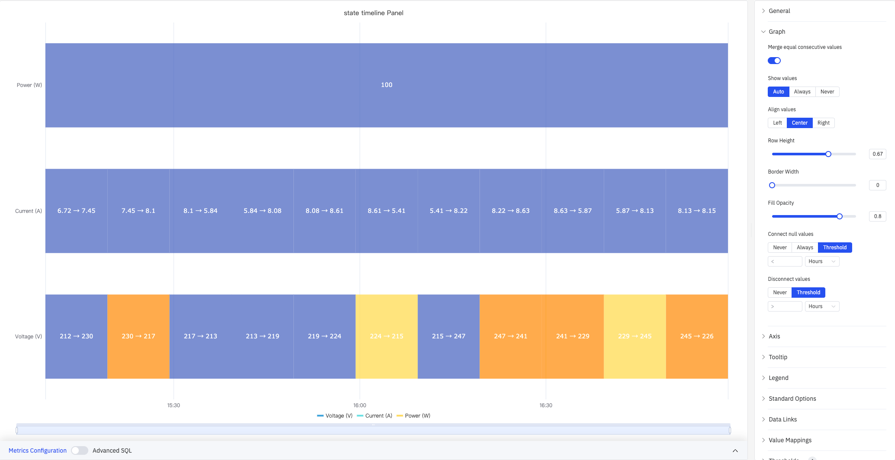
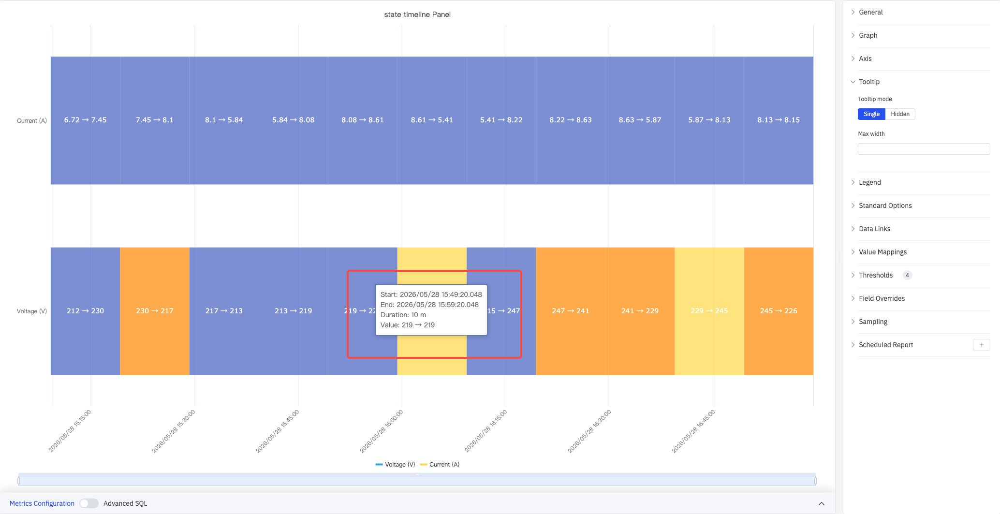
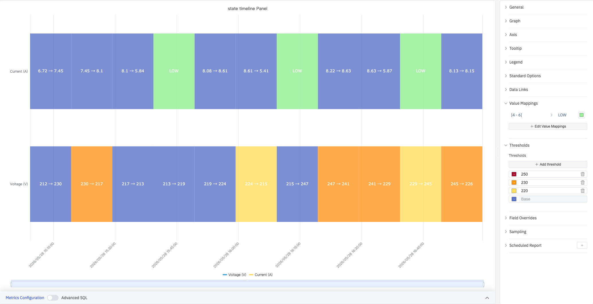

# 4.2.7 状态时间线图

## 4.2.7.1 概述

状态时间线图以水平彩色色带的形式展示数值随时间的变化。色带的每个分段根据其代表的值进行着色和标注，让您一眼就能看出某个过程在各个状态下停留了多久，以及何时发生了状态转换。

每个分段显示该时间段内的起止值（如 212→230），颜色由阈值或值映射规则决定。多个指标以多条堆叠的水平色带渲染，可对不同信号的状态历史进行并排比较。

## 4.2.7.2 适用场景

在以下情况下使用状态时间线图：

- 数据代表离散状态而非连续测量值（开/关、运行/空闲/故障、打开/关闭）
- 需要查看某个过程在各状态下停留了多长时间及何时发生转换
- 需要在同一时间轴上比较多个信号或设备的状态历史

对于连续数值信号，请使用趋势图。对于按时间间隔分桶的多指标状态紧凑网格视图，请使用状态历史图。

## 4.2.7.3 配置

### 图形配置

图形配置控制色带的外观和数据处理行为：

上图展示了三个指标的堆叠显示效果：Power(W) 因数值恒定被合并为单一色带，Current(A) 和 Voltage(V) 各自显示独立分段。

| 设置 | 说明 |
|---|---|
| **合并连续相同值** | 开启后，相邻且值相同的分段自动合并为一段；默认开启 |
| **显示数值** | 是否在色带内显示每个分段的数值标签：自动、始终、从不 |
| **数值对齐** | 分段内标签的水平对齐：左对齐、居中、右对齐；默认居中 |
| **行高** | 每条色带的相对高度（取值 0–1） |
| **边框宽度** | 分段边框的宽度（像素），0 则无边框；取值 0–10 |
| **填充透明度** | 状态颜色填充的透明度，取值 0–1 |
| **连接空值** | 如何处理空/缺失数据：从不（保留间隔）、始终、阈值（间隔小于指定时长则连接）；默认从不 |
| **断开值** | 当相邻数据点的时间间隔超过指定时长时自动断开色带：从不或阈值；默认从不 |

### 坐标轴

状态时间线图仅配置 X 轴：

| 设置 | 说明 |
|---|---|
| **X 轴** | 显示或隐藏 X 轴 |
| **X 轴时间格式** | X 轴时间戳的显示格式（X 轴显示时可用） |
| **标签旋转** | X 轴时间标签的旋转角度（-90°–+90°） |
| **标签间隔** | X 轴标签的密度：自动、小、中、大 |
| **显示网格线** | 是否展示 X 轴网格线：自动、显示、隐藏 |

### 提示框

悬停在色带分段上时，提示框显示该分段的开始时间、结束时间、持续时长和数值：

| 设置 | 说明 |
|---|---|
| **提示框模式** | 鼠标悬停时显示的指标范围：单个（仅悬停指标）、隐藏 |
| **最大宽度** | 提示框的最大宽度（像素） |

### 图例

| 设置 | 说明 |
|---|---|
| **显示** | 显示模式：列表、表格、隐藏 |
| **位置** | 放置位置：底部、右侧 |
| **宽度** | 图例区域宽度（像素，仅右侧布局时可用） |
| **图例值** | 在表格模式下显示的统计数据，可多选：最大值、最小值、平均值、总和、计数等 |

### 标准配置

| 设置 | 说明 |
|---|---|
| **最小值** | 数值的下限（留空则从数据自动计算） |
| **最大值** | 数值的上限（留空则从数据自动计算） |
| **小数位数** | 数值显示的小数位数（留空则自动判断） |
| **配色方案** | 系列颜色分配策略：单色、单色深浅映射（按系列）、阈值取色（按值）、经典调色板、经典调色板（按系列名）、自定义调色板 |

### 数据链接

数据链接为状态色带附加可点击的跳转 URL：

| 设置 | 说明 |
|---|---|
| **标题** | 链接的显示名称 |
| **URL** | 跳转目标地址，支持变量插值 |
| **在新标签页打开** | 是否在新浏览器标签页中打开链接 |
| **一键跳转** | 启用后点击色带直接跳转（同时只能有一条链接启用此功能） |

### 值映射与颜色阈值

值映射定义每种状态的显示颜色和文字标签，颜色阈值定义数值区间与颜色的对应关系。两者配合使用可为色带分配直观的颜色和标注：

上图中，值映射将 Current(A) 在 [4, 6] 范围内的值标注为绿色"LOW"；阈值配置将 Voltage(V) 按 220、230、250 三个边界划分为蓝、黄、橙、红四个颜色段。

**值映射类型：**

| 映射类型 | 说明 |
|---|---|
| **值** | 精确匹配特定数值或文本 |
| **范围** | 匹配指定数值范围 |
| **正则表达式** | 使用正则表达式匹配并替换 |
| **特殊值** | 匹配 null、NaN、布尔值、空字符串等 |
| **其他值** | 匹配所有未被前面规则覆盖的值 |

**颜色阈值设置：**

| 设置 | 说明 |
|---|---|
| **阈值模式** | 阈值判断方式：绝对值（原始数据值）或百分比（最小值–最大值范围的百分比） |
| **添加阈值** | 新增一条阈值规则，每条包含数值边界和对应颜色 |

颜色阈值生效需在标准配置中将**配色方案**设置为**阈值取色（按值）**。

### 个性化配置

个性化配置允许对单个指标覆盖全局图形设置。选定目标指标名称后，可添加以下属性进行覆盖：系列样式、线宽、填充透明度、线条透明度、线条颜色、点大小、显示点、连接空值、堆叠、渐变模式、显示值。

### 降采样

当查询结果中的数据点过多时，可启用降采样减少渲染数量以提升显示性能：

| 设置 | 说明 |
|---|---|
| **启用降采样** | 开关，默认关闭 |
| **最大数据点数** | 降采样后保留的最大数据点数量 |
| **聚合函数** | 降采样时使用的聚合方式（如 AVG、MAX、MIN 等） |

### 定时报告

状态时间线面板支持定时报告功能，可将图表以图片形式定期发送到指定邮箱或飞书群。配置入口位于面板右上角菜单中。

## 4.2.7.4 使用示例

**设备开关历史。** 将水泵的运行状态（0 = 停止，1 = 运行）分别映射为灰色和绿色。24 小时的状态时间线精确显示水泵何时运行及每次运行持续了多长时间。

**多模式工艺时间线。** 批次反应器有四种运行模式：加热、反应、冷却、空闲。每种模式映射为不同颜色。时间线展示从开始到结束的完整批次周期，并能直观地看出是否有任何阶段运行时间超出预期。

**报警活跃/非活跃历史。** 多个报警信号作为独立色带堆叠显示。维护工程师查看一周的历史记录，以识别哪些报警最频繁活跃，以及它们在时间上是否存在关联。
