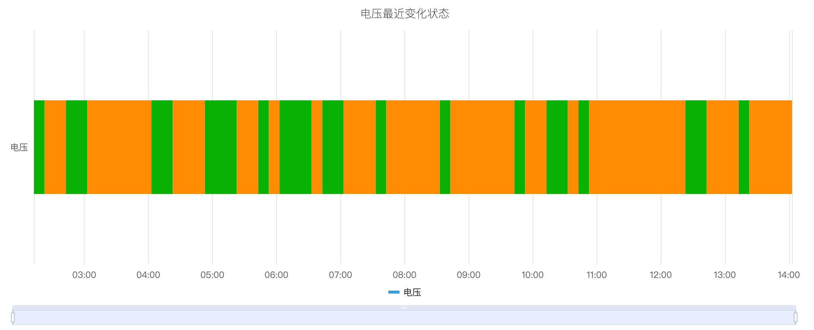
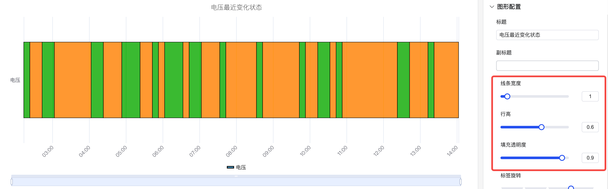
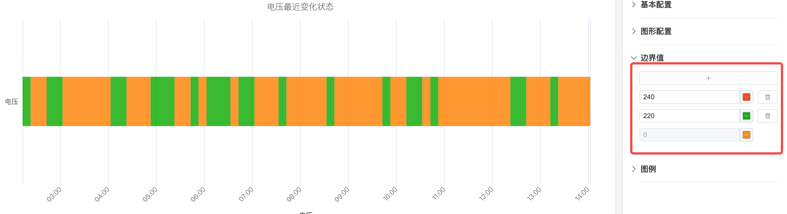
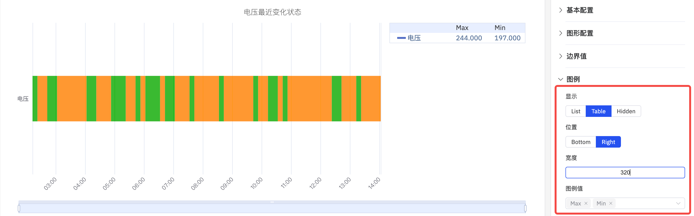

# 4.2.8 状态时间线图

## 概述

状态时间线图以水平彩色色带的形式展示数值随时间的变化。色带的每个分段根据其代表的值进行着色和标注，让您一眼就能看出某个过程在各个状态下停留了多久，以及何时发生了状态转换。

多个指标以多条堆叠的水平色带渲染，可对不同信号的状态历史进行并排比较。

## 适用场景

在以下情况下使用状态时间线图：

- 数据代表离散状态而非连续测量值（开/关、运行/空闲/故障、打开/关闭）
- 需要查看某个过程在各状态下停留了多长时间及何时发生转换
- 需要在同一时间轴上比较多个信号或设备的状态历史

对于连续数值信号，请使用趋势图。对于按时间间隔分桶的多指标状态紧凑网格视图，请使用状态历史图。

## 配置

### 编辑模式工具栏

除[通用编辑模式控件](../01-panels.md#414-面板编辑模式)外，状态时间线图还增加了以下控件：

| 控件 | 说明 |
|---|---|
| **保存为图片** | 将当前预览下载为 PNG 图片 |
| **全屏** | 将编辑器预览扩展为填满浏览器窗口 |
| **解读面板** | 对当前预览数据运行 AI 分析 |

### 图形设置

每条状态色带的外观由以下设置控制：

| 设置 | 说明 |
|---|---|
| **标题** | 图表标题 |
| **副标题** | 次级标题 |
| **线条宽度** | 每个状态分段周围边框的宽度（0 = 无边框） |
| **行高** | 每条色带的相对高度（默认 0.3） |
| **填充透明度** | 状态颜色填充的透明度，取值 0–1 |
| **标签旋转** | X 轴时间标签的旋转角度 |
| **标签间隔** | X 轴标签的密度 |

状态颜色和标签由**值映射**配置决定，您可以将每个值（如 0、1、"运行中"）映射到对应的显示颜色和文字标签。

### 边界值设置

可在时间线上叠加边界线以标记阈值：

### 图例设置

图例标识每种状态的颜色。在表格模式下，还可显示汇总统计值：

| 设置 | 说明 |
|---|---|
| **显示** | 显示模式：列表、表格或隐藏 |
| **位置** | 位置：底部或右侧 |
| **图例值** | 表格模式下显示的统计值 |

## 使用示例

**设备开关历史。** 将水泵的运行状态（0 = 停止，1 = 运行）分别映射为灰色和绿色。24 小时的状态时间线精确显示水泵何时运行及每次运行持续了多长时间。

**多模式工艺时间线。** 批次反应器有四种运行模式：加热、反应、冷却、空闲。每种模式映射为不同颜色。时间线展示从开始到结束的完整批次周期，并能直观地看出是否有任何阶段运行时间超出预期。

**报警活跃/非活跃历史。** 多个报警信号作为独立色带堆叠显示。维护工程师查看一周的历史记录，以识别哪些报警最频繁活跃，以及它们在时间上是否存在关联。
