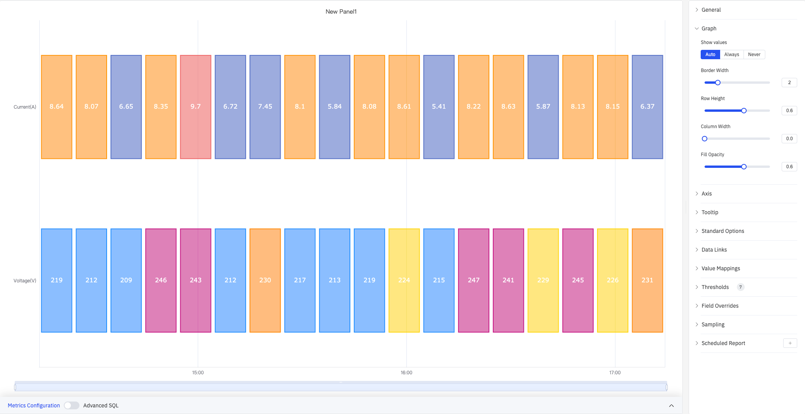
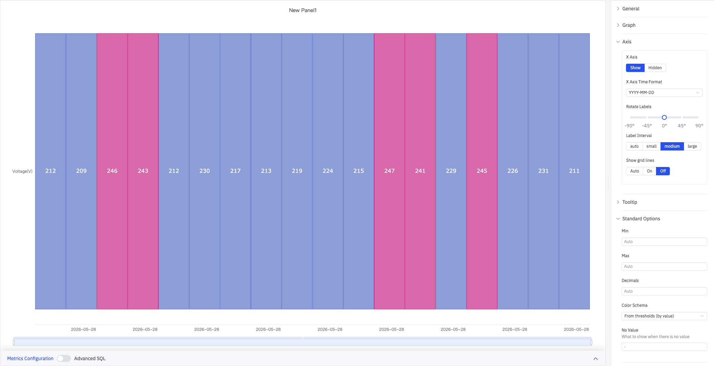
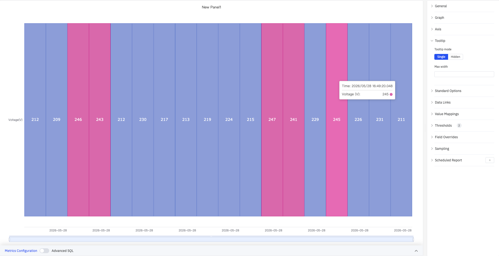
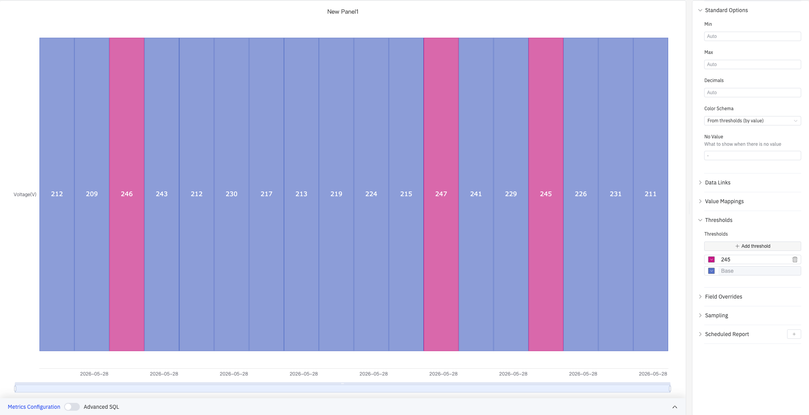

# 4.2.8 状态历史图

## 4.2.8.1 概述

状态历史图以密集网格的形式展示指标历史状态分布，每列代表一个时间桶，每行代表一个指标。它提供日历风格的紧凑视图，适合同时展示多个维度的状态规律——非常适合在较长时间范围内发现周期性规律、班次差异或异常行为时段。

上图展示了 Current(A) 和 Voltage(V) 两个指标并排显示，每列对应一个时间桶，颜色由配色方案或阈值规则决定。

## 4.2.8.2 适用场景

在以下情况下使用状态历史图：

- 需要对多个时间桶（小时、天、班次）的状态进行日历风格的高层概览
- 正在对多个指标或设备在同一时间段的状态规律进行比较
- 需要回答"本周哪些小时出现了超限情况？"或"周一哪些设备处于报警状态？"之类的问题

如需详细展示每次状态转换的连续色带，请使用状态时间线图。

## 4.2.8.3 配置

### 图形配置

图形配置控制网格单元格的外观：

| 设置 | 说明 |
|---|---|
| **显示数值** | 是否在单元格内显示数值标签：自动、始终、从不 |
| **边框宽度** | 单元格之间边框的宽度（0–10） |
| **行高** | 每行的相对高度（0–1） |
| **列宽** | 每个时间桶列的相对宽度（0–1） |
| **填充透明度** | 单元格填充颜色的透明度（0–1） |

时间桶的大小由数据配置中的**滑动窗口**设置控制。例如，1 小时的滑动窗口每小时生成一列。

### 坐标轴

状态历史图仅配置 X 轴：

| 设置 | 说明 |
|---|---|
| **X 轴** | 显示或隐藏 X 轴 |
| **X 轴时间格式** | X 轴时间戳的显示格式（X 轴显示时可用） |
| **标签旋转** | X 轴时间标签的旋转角度（-90°–+90°） |
| **标签间隔** | X 轴标签的密度：自动、小、中、大 |
| **显示网格线** | 是否展示 X 轴网格线：自动、显示、隐藏 |

### 提示框

悬停在单元格上时，提示框显示该时间桶的时间戳和数值：

| 设置 | 说明 |
|---|---|
| **提示框模式** | 鼠标悬停时的显示方式：单个（仅悬停指标）、隐藏 |
| **最大宽度** | 提示框的最大宽度（像素） |

### 标准配置

| 设置 | 说明 |
|---|---|
| **最小值** | 数值的下限（留空则从数据自动计算） |
| **最大值** | 数值的上限（留空则从数据自动计算） |
| **小数位数** | 数值显示的小数位数（留空则自动判断） |
| **配色方案** | 系列颜色分配策略：单色、单色深浅映射（按系列）、阈值取色（按值）、经典调色板、经典调色板（按系列名）、自定义调色板 |

### 数据链接

数据链接为单元格附加可点击的跳转 URL：

| 设置 | 说明 |
|---|---|
| **标题** | 链接的显示名称 |
| **URL** | 跳转目标地址，支持变量插值 |
| **在新标签页打开** | 是否在新浏览器标签页中打开链接 |
| **一键跳转** | 启用后点击单元格直接跳转（同时只能有一条链接启用此功能） |

### 值映射

值映射将数值替换为自定义显示文本并赋予颜色，是配置状态历史图外观的主要方式。下图中，范围 [246–250] 被映射为橙红色"HIGH"标签：

点击**编辑值映射**打开映射编辑对话框，可选择映射类型并配置条件、显示文本和颜色：

| 映射类型 | 说明 |
|---|---|
| **值** | 精确匹配特定数值或文本 |
| **范围** | 匹配指定数值范围 |
| **正则表达式** | 使用正则表达式匹配并替换 |
| **特殊值** | 匹配 null、NaN、布尔值、空字符串等 |
| **其他值** | 匹配所有未被前面规则覆盖的值 |

### 颜色阈值

颜色阈值定义数值区间与颜色的对应关系，适合为连续数值（如温度、电压）设定多色段显示。配色方案需设置为**阈值取色（按值）**方可生效：

上图设置了阈值 245（粉色）和 Base（蓝色），电压超过 245 V 的时间桶显示为粉色，其余显示为蓝色。

| 设置 | 说明 |
|---|---|
| **添加阈值** | 新增一条阈值规则，每条包含数值边界和对应颜色 |

### 个性化配置

个性化配置允许对单个指标覆盖全局图形设置。选定目标指标名称后，可添加以下属性进行覆盖：系列样式、线宽、填充透明度、线条透明度、线条颜色、点大小、显示点、连接空值、堆叠、渐变模式、显示值。

### 降采样

当查询结果中的数据点过多时，可启用降采样减少渲染数量以提升显示性能：

| 设置 | 说明 |
|---|---|
| **启用降采样** | 开关，默认关闭 |
| **最大数据点数** | 降采样后保留的最大数据点数量 |
| **聚合函数** | 降采样时使用的聚合方式（如 AVG、MAX、MIN 等） |

### 定时报告

状态历史图面板支持定时报告功能，可将图表以图片形式定期发送到指定邮箱或飞书群。配置入口位于面板右上角菜单中。

## 4.2.8.4 使用示例

**周报警热力图。** 添加十个报警信号作为行，1 小时滑动窗口生成 168 列（7 天每小时一列）。值映射设置 0 → 灰色，1 → 红色。生成的网格一眼即可看出哪些设备在哪些小时处于报警状态。

**逐班次运行模式回顾。** 8 小时滑动窗口跨越一个月，每个班次生成一列。每行代表一条生产线的运行模式。运营经理可以立即看出哪些班次按预期模式运行，哪些出现了计划外停产。

**超限情况日历。** 质量工程师添加 12 个过程变量作为行，设置 1 天滑动窗口。值映射将单元格颜色设为绿色（在限内）或红色（超限）。生成的日历视图突出显示了过程中哪些天存在质量问题。
