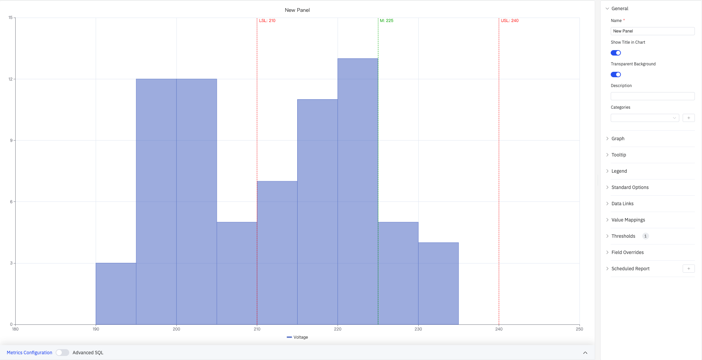
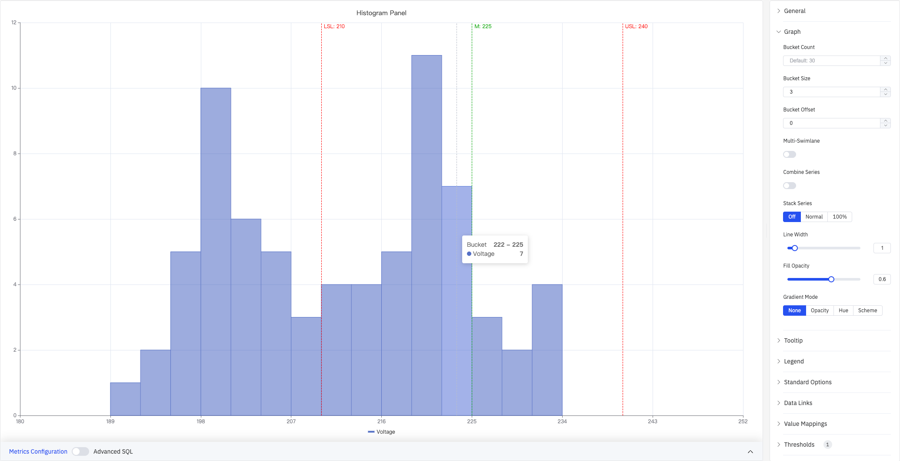
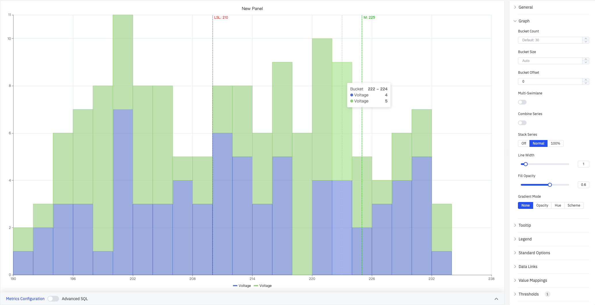
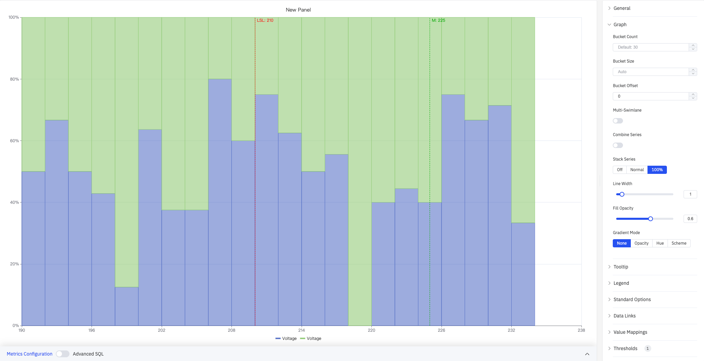
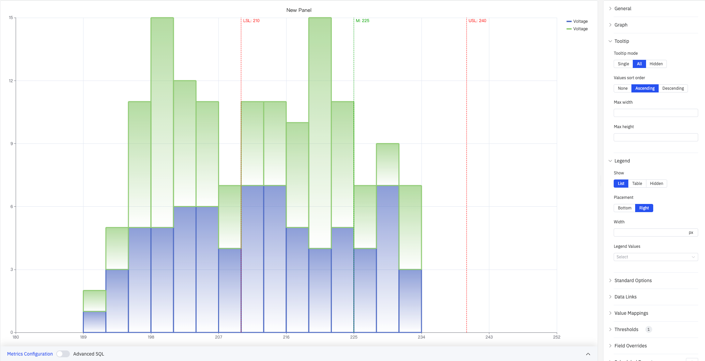
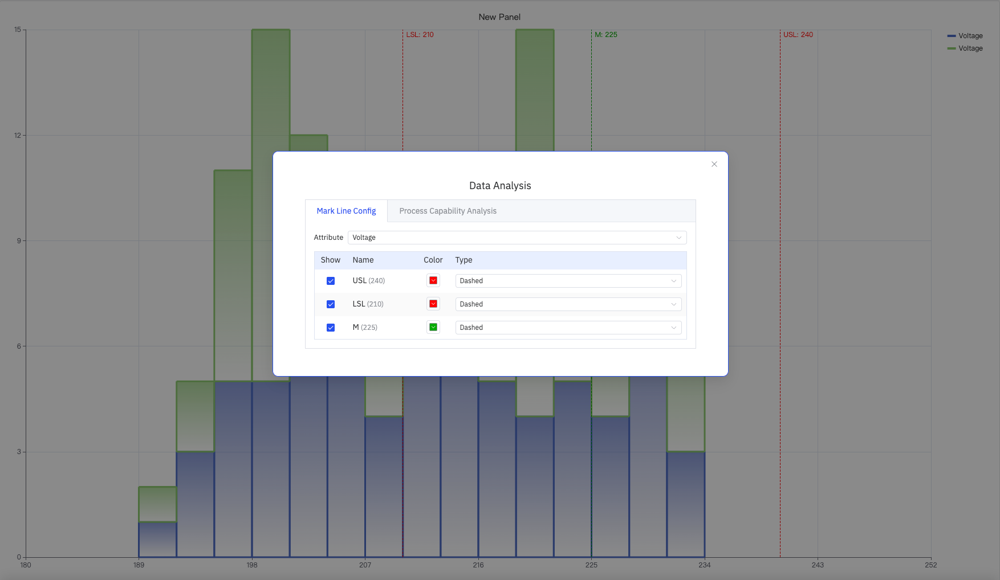
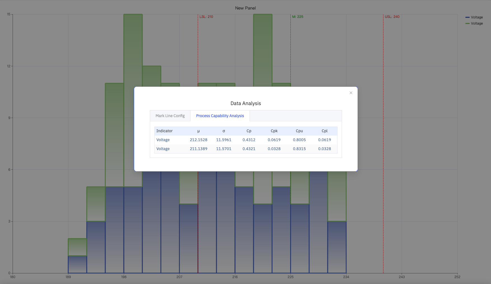

# 4.2.9 直方图

## 4.2.9.1 概述

直方图将连续数值分组为等宽的区间（分桶），以柱形高度表示每个区间内数据点的数量（频率）。它是分析单一变量分布形状、集中趋势和离散程度的标准工具。

上图展示了 Voltage 指标的直方图（X 轴 180–250 V，Y 轴为频率计数 0–15）。图上叠加了三条参考线：LSL:210（红色虚线，下规格限）、M:225（绿色虚线，均值/目标值）、USL:240（红色虚线，上规格限）。右侧面板显示全部配置区域：General、Graph、Tooltip、Legend、Standard Options、Data Links、Value Mappings、Thresholds(1)、Field Overrides、Scheduled Report。

## 4.2.9.2 适用场景

在以下情况下使用直方图：

- 需要了解某个过程变量的分布形状（正态、偏斜、双峰等）
- 需要评估过程能力，判断数据是否在规格限值内集中
- 需要对比多个指标或时间段的分布差异
- 希望在分布图上叠加 USL/LSL 参考线并查看过程能力指数

## 4.2.9.3 配置

### 图形配置

图形配置控制分桶方式、多系列展示模式和柱形外观：

上图展开了 Graph 配置面板，Bucket Size 设为 3（每个区间宽度为 3 V），Gradient Mode 为 None，Stack Series 为 Off。提示框显示鼠标悬停的分桶范围 222–225 和该区间计数（Voltage: 7）。

| 设置               | 说明                                                                                                         |
| ------------------ | ------------------------------------------------------------------------------------------------------------ |
| **Bucket Count**   | 将数据范围划分为多少个等宽区间（1–1000）；留空则默认 30                                                      |
| **Bucket Size**    | 每个区间的固定宽度；留空则根据数据范围和 Bucket Count 自动计算                                               |
| **Bucket Offset**  | 区间起点的偏移量，用于对齐分桶边界（默认 0）                                                                 |
| **Multi-Swimlane** | 开启后每个指标以独立泳道显示，关闭则所有指标共享同一坐标轴                                                   |
| **Combine Series** | 开启后将所有指标合并为单一分布；Multi-Swimlane 开启时不可用                                                  |
| **Stack Series**   | 多指标的柱形叠加方式：Off（各自显示）、Normal（绝对值叠加）、100%（百分比叠加）；Multi-Swimlane 开启时不可用 |
| **Line Width**     | 柱形边框的宽度（0–10）                                                                                       |
| **Fill Opacity**   | 柱形填充颜色的透明度（0–1）                                                                                  |
| **Gradient Mode**  | 柱形填充的渐变效果：None、Opacity、Hue、Scheme                                                               |

**Stack Series: Normal** 模式（下图）将多个指标的柱形叠加显示，每个分桶的高度为所有指标的计数之和：

**Stack Series: 100%** 模式（下图）将每个分桶归一化为 100%，Y 轴显示各指标的相对比例而非绝对计数：

**Multi-Swimlane** 模式（下图）将每个指标显示在独立的泳道中，各泳道有独立的 Y 轴，便于单独观察每个指标的分布形状：

**Combine Series** 模式（下图）将多个指标的数据合并为一个分布，适合将多台设备的同类测量数据汇总后分析整体分布：

上图同时展开了 Standard Options 面板，Min 设为 180，Max 设为 250，用于固定 X 轴显示范围。

### 提示框与图例

提示框和图例配合使用，为分桶数据提供补充信息：

上图展开了 Tooltip 和 Legend 配置面板。Tooltip mode 为 **All**，Values sort order 为 Ascending。Legend 显示模式为 List，放置位置为 Right，右侧显示蓝色和绿色 Voltage 系列的图例条目。

**提示框设置：**

| 设置                  | 说明                                                            |
| --------------------- | --------------------------------------------------------------- |
| **Tooltip mode**      | 悬停显示方式：Single（仅悬停分桶）、All（显示所有指标）、Hidden |
| **Values sort order** | 提示框内多个指标的排序：None、Ascending、Descending             |
| **Max width**         | 提示框最大宽度（像素）                                          |
| **Max height**        | 提示框最大高度（像素）                                          |

**图例设置：**

| 设置              | 说明                                      |
| ----------------- | ----------------------------------------- |
| **Show**          | 显示模式：List、Table、Hidden             |
| **Placement**     | 放置位置：Bottom、Right                   |
| **Width**         | 图例区域宽度（像素，仅 Right 布局时可用） |
| **Legend Values** | 在表格模式下显示的统计数据，可多选        |

### 标准配置

| 设置         | 说明                                                                                                               |
| ------------ | ------------------------------------------------------------------------------------------------------------------ |
| **Min**      | X 轴（数值范围）的下限（留空则从数据自动计算）                                                                     |
| **Max**      | X 轴（数值范围）的上限（留空则从数据自动计算）                                                                     |
| **小数位数** | 数值显示的小数位数（留空则自动判断）                                                                               |
| **配色方案** | 系列颜色分配策略：单色、单色深浅映射（按系列）、阈值取色（按值）、经典调色板、经典调色板（按系列名）、自定义调色板 |

### 数据链接

数据链接为柱形附加可点击的跳转 URL：

| 设置               | 说明                                                   |
| ------------------ | ------------------------------------------------------ |
| **标题**           | 链接的显示名称                                         |
| **URL**            | 跳转目标地址，支持变量插值                             |
| **在新标签页打开** | 是否在新浏览器标签页中打开链接                         |
| **一键跳转**       | 启用后点击柱形直接跳转（同时只能有一条链接启用此功能） |

### 值映射

值映射将原始数据值转换为显示文本和颜色：

| 映射类型       | 说明                               |
| -------------- | ---------------------------------- |
| **值**         | 精确匹配特定数值或文本             |
| **范围**       | 匹配指定数值范围                   |
| **正则表达式** | 使用正则表达式匹配并替换           |
| **特殊值**     | 匹配 null、NaN、布尔值、空字符串等 |
| **其他值**     | 匹配所有未被前面规则覆盖的值       |

### 颜色阈值

颜色阈值定义数值区间与颜色的对应关系：

| 设置         | 说明                                         |
| ------------ | -------------------------------------------- |
| **添加阈值** | 新增一条阈值规则，每条包含数值边界和对应颜色 |

颜色阈值生效需在标准配置中将**配色方案**设置为**阈值取色（按值）**。

### 个性化配置

个性化配置允许对单个指标覆盖全局图形设置。选定目标指标名称后，可添加以下属性进行覆盖：系列样式、线宽、填充透明度、线条透明度、线条颜色、点大小、显示点、连接空值、堆叠、渐变模式、显示值。

### 定时报告

直方图面板支持定时报告功能，可将图表以图片形式定期发送到指定邮箱或飞书群。配置入口位于面板右上角菜单中。

## 4.2.9.4 数据分析

在编辑模式下，可通过**数据分析**按钮打开分析对话框，在分布柱形图上叠加参考线，并查看过程能力指数。对话框包含两个标签页。

### 4.2.9.4.1 标识线配置

在 Attribute 下拉框中选择目标指标，表格中列出所有已配置的限值。每条参考线可独立设置是否显示（Show）、名称（Name）、颜色（Color）和线型（Type）：

| 设置          | 说明                                                        |
| ------------- | ----------------------------------------------------------- |
| **Attribute** | 要应用参考线的目标指标                                      |
| **Show**      | 是否在图上显示该参考线                                      |
| **Name**      | 参考线的名称（如 USL、LSL、M）及对应限值                    |
| **Color**     | 参考线的颜色                                                |
| **Type**      | 参考线的线型：Dashed（虚线）、Solid（实线）、Dotted（点线） |

### 4.2.9.4.2 过程能力分析

当 USL 和 LSL 均已配置时，系统自动为每个指标计算并展示以下过程能力指标：

| 指标            | 说明                                                  |
| --------------- | ----------------------------------------------------- |
| **μ（均值）**   | 数据集的算术平均值                                    |
| **σ（标准差）** | 数据集的标准差，反映离散程度                          |
| **Cp**          | 过程能力指数，Cp = (USL − LSL) / (6σ)，仅反映数据散布 |
| **Cpk**         | 考虑均值偏移的过程能力指数，Cpk = min(Cpu, Cpl)       |
| **Cpu**         | 上限能力指数，Cpu = (USL − μ) / (3σ)                  |
| **Cpl**         | 下限能力指数，Cpl = (μ − LSL) / (3σ)                  |

## 4.2.9.5 使用示例

**过程能力分析。** 质量工程师将某生产线三个月内的关键电压测量值添加为指标，设置 Bucket Size 为 3。分布集中在 212 V 左右。在数据分析对话框中配置 USL=240、LSL=210 后，Process Capability Analysis 标签页显示 Cpk 约为 0.06，提示过程均值偏向下限，需重新调整工艺中心。

**多设备分布对比。** 运维工程师将两台设备的电压数据分别添加为两个指标，切换至 Multi-Swimlane 模式。两条泳道分别展示各自的分布形状——一台分布集中在 220–226 V，另一台明显偏向低值区，提示设备状态存在差异。

**全厂汇总分布。** 数据工程师将多个站点的同类测量数据作为多个指标添加，启用 Combine Series 将所有数据合并为单一分布。结合 USL/LSL 参考线，快速评估整体合格率。
