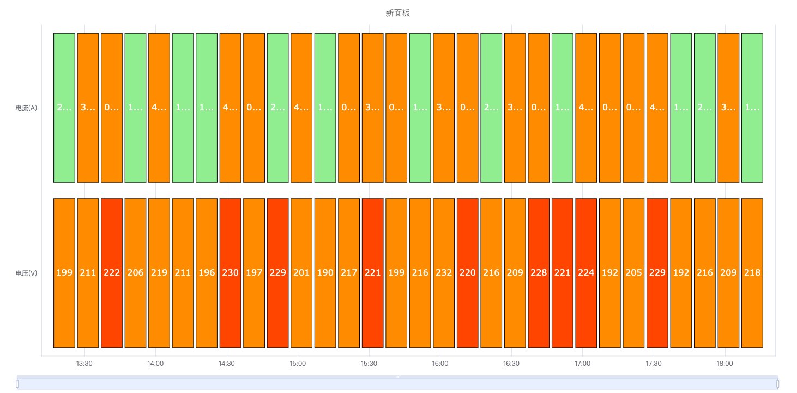
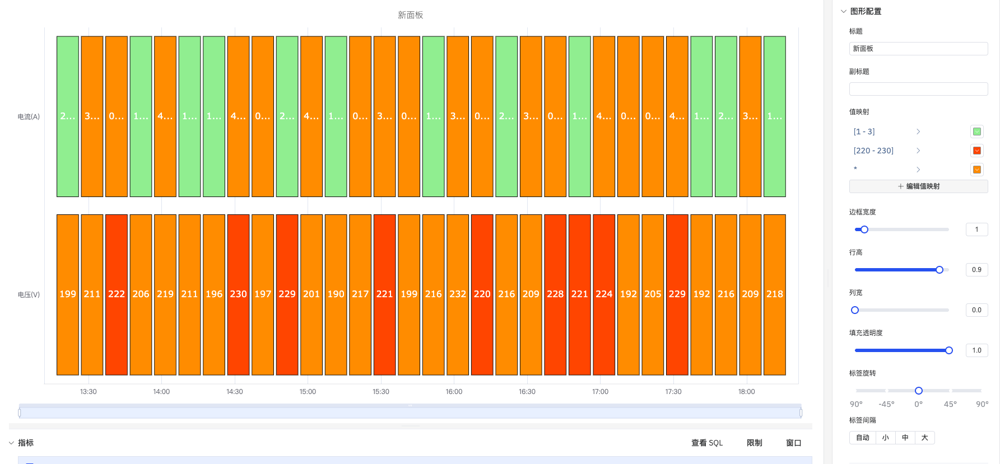
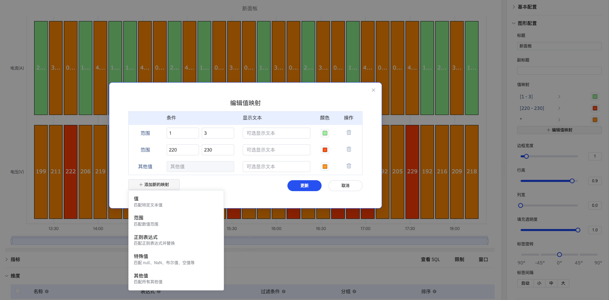

# 4.2.9 状态历史图

## 4.2.9.1 概述

状态历史图以密集网格的形式展示指标历史状态分布，每列代表一个时间桶，每行代表一个指标。它提供日历风格的紧凑视图，适合同时展示多个维度的状态规律——非常适合在较长时间范围内发现周期性规律、班次差异或异常行为时段。

## 4.2.9.2 适用场景

在以下情况下使用状态历史图：

- 需要对多个时间桶（小时、天、班次）的状态进行日历风格的高层概览
- 正在对多个指标或设备在同一时间段的状态规律进行比较
- 需要回答"本周哪些小时出现了超限情况？"或"周一哪些设备处于报警状态？"之类的问题

如需详细展示每次状态转换的连续色带，请使用状态时间线图。

## 4.2.9.3 配置

### 编辑模式工具栏

除[通用编辑模式控件](../01-panels.md#414-面板编辑模式)外，状态历史图还增加了以下控件：

<table>
<colgroup><col style="width:8em"/><col/></colgroup>
<thead><tr><th>控件</th><th>说明</th></tr></thead>
<tbody>
<tr><td><strong>保存为图片</strong></td><td>将当前预览下载为 PNG 图片</td></tr>
<tr><td><strong>全屏</strong></td><td>将编辑器预览扩展为填满浏览器窗口</td></tr>
<tr><td><strong>解读面板</strong></td><td>对当前预览数据运行 AI 分析</td></tr>
</tbody>
</table>

### 图形设置

<table>
<colgroup><col style="width:8em"/><col/></colgroup>
<thead><tr><th>设置</th><th>说明</th></tr></thead>
<tbody>
<tr><td><strong>标题</strong></td><td>图表标题</td></tr>
<tr><td><strong>副标题</strong></td><td>次级标题</td></tr>
<tr><td><strong>值映射</strong></td><td>定义数据值与显示颜色和标签的对应关系，详见下节</td></tr>
<tr><td><strong>边框宽度</strong></td><td>单元格之间边框的宽度（滑块）</td></tr>
<tr><td><strong>行高</strong></td><td>每行的相对高度（滑块）</td></tr>
<tr><td><strong>列宽</strong></td><td>每个时间桶列的宽度（滑块）</td></tr>
<tr><td><strong>填充透明度</strong></td><td>单元格填充颜色的透明度，取值 0–1</td></tr>
<tr><td><strong>标签旋转</strong></td><td>X 轴时间标签的旋转角度，可选 -90°、-45°、0°、45°、90°</td></tr>
<tr><td><strong>标签间隔</strong></td><td>X 轴时间标签的显示密度：<strong>自动</strong>、<strong>小</strong>、<strong>中</strong>、<strong>大</strong></td></tr>
</tbody>
</table>

时间桶的大小由数据配置中的**滑动窗口**设置控制。例如，1 小时的滑动窗口每小时生成一列。

#### 值映射

值映射将原始数据值转换为显示文本和单元格颜色。点击**+ 编辑值映射**打开编辑弹窗，支持以下五种条件类型：

<table>
<colgroup><col style="width:8em"/><col/></colgroup>
<thead><tr><th>条件类型</th><th>说明</th></tr></thead>
<tbody>
<tr><td><strong>值</strong></td><td>匹配特定文本值</td></tr>
<tr><td><strong>范围</strong></td><td>匹配数值范围，指定上下界</td></tr>
<tr><td><strong>正则表达式</strong></td><td>匹配正则表达式并替换显示文本</td></tr>
<tr><td><strong>特殊值</strong></td><td>匹配 null、NaN、布尔值、空值等特殊状态</td></tr>
<tr><td><strong>其他值</strong></td><td>兜底规则，匹配所有未被前面规则覆盖的值</td></tr>
</tbody>
</table>

每条映射规则可指定**显示文本**（可选）和**颜色**。规则按从上到下的顺序匹配，第一个命中的规则生效。

## 4.2.9.4 使用示例

**周报警热力图。** 添加十个报警信号作为行，1 小时滑动窗口生成 168 列（7 天每小时一列）。值映射设置 0 → 灰色，1 → 红色。生成的网格一眼即可看出哪些设备在哪些小时处于报警状态。

**逐班次运行模式回顾。** 8 小时滑动窗口跨越一个月，每个班次生成一列。每行代表一条生产线的运行模式。运营经理可以立即看出哪些班次按预期模式运行，哪些出现了计划外停产。

**超限情况日历。** 质量工程师添加 12 个过程变量作为行，设置 1 天滑动窗口。值映射将单元格颜色设为绿色（在限内）或红色（超限）。生成的日历视图突出显示了过程中哪些天存在质量问题。
