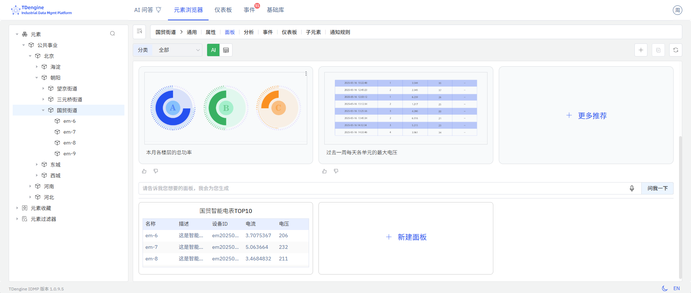
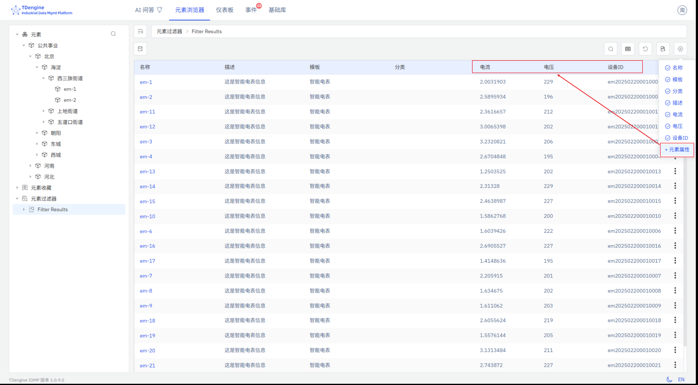
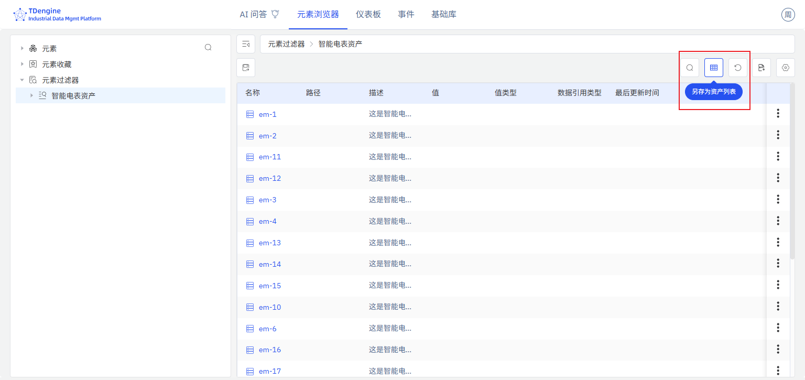
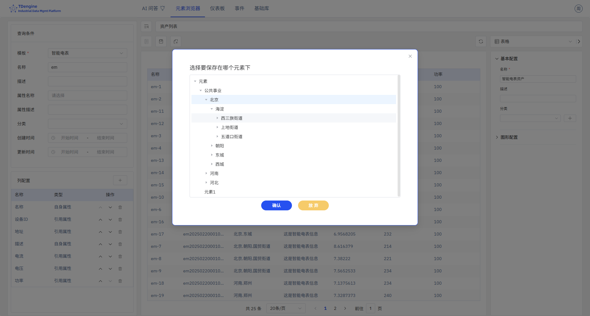
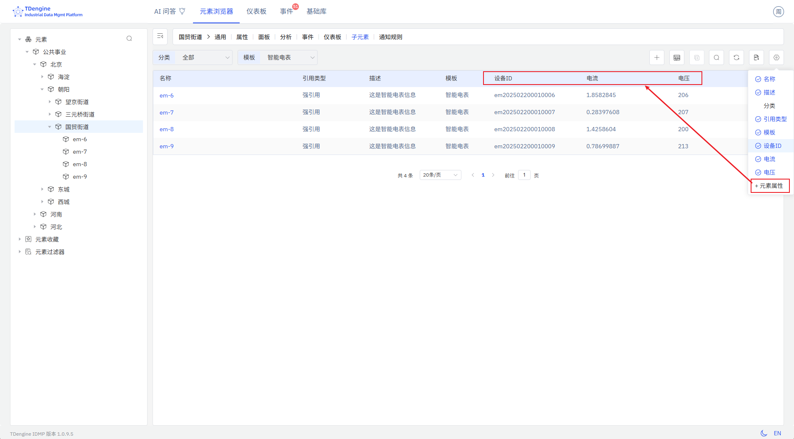
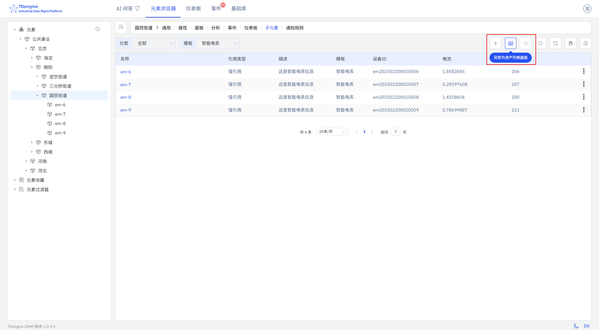
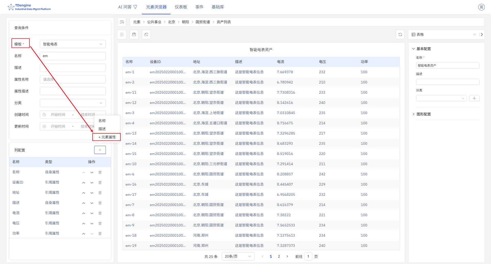

# 4.2.10 资产列表

## 概述

资产列表面板以表格形式展示元素信息，包括管理属性和每个元素的最新采集值。可从元素查询结果或父元素的子元素列表中创建，可放置在元素面板列表中，也可加入仪表板。

## 适用场景

在以下情况下使用资产列表面板：

- 需要在仪表板上实时汇总一批经过过滤的资产及其关键属性
- 希望并排监控同一模板下多个元素的当前采集值
- 需要为一批设备、仪表或机器建立紧凑的库存或状态看板

## 配置

### 保存资产列表面板

**从元素查询结果保存：** 进入元素查询页面，配置过滤条件。如果查询结果来自同一模板，可添加属性列；点击列名可取消不需要的列。点击**另存为面板**按钮，在弹出的对话框中选择保存位置。

**从子元素列表保存：** 在资产树中选择某个父元素，点击**子元素列表**操作入口。如果所有子元素来自同一模板，可添加属性列。点击**另存为面板**，将当前子元素列表保存为该父元素下的资产列表面板。切换到**面板**标签页可确认新面板已创建。

### 修改资产列表面板

进入面板编辑器进行配置：

| 设置 | 说明 |
|---|---|
| **资产类型（模板）** | 必填。将列表过滤为所选模板的元素。仅当选择模板后，才能添加该模板的属性列。 |
| **显示字段** | 可配置的列集合及其显示顺序。包括 IDMP 管理属性（名称、路径、描述、模板、类别）和引用属性（TDengine Tags 和 TDengine Metrics）。 |

## 使用示例

**设备状态看板。** 站点管理员保存一个显示站点内所有泵的资产列表面板，包含运行状态、流量和上次维护日期等列，并将其加入站点仪表板。管理员无需逐个打开元素页面，即可在仪表板上实时了解整个泵站的运行状态。

**新设备接入验证。** 数据工程师保存一个过滤为上月新增仪表（使用仪表模板）的资产列表面板，包含名称、安装日期和最新读数等列，方便快速确认所有新仪表是否正常上报数据。

**子设备汇总视图。** 运营经理进入某生产线元素，将其子元素列表——即该生产线的所有设备——保存为资产列表面板，包含当前运行模式和产量等列，并固定在生产线仪表板上用于班次监控。
