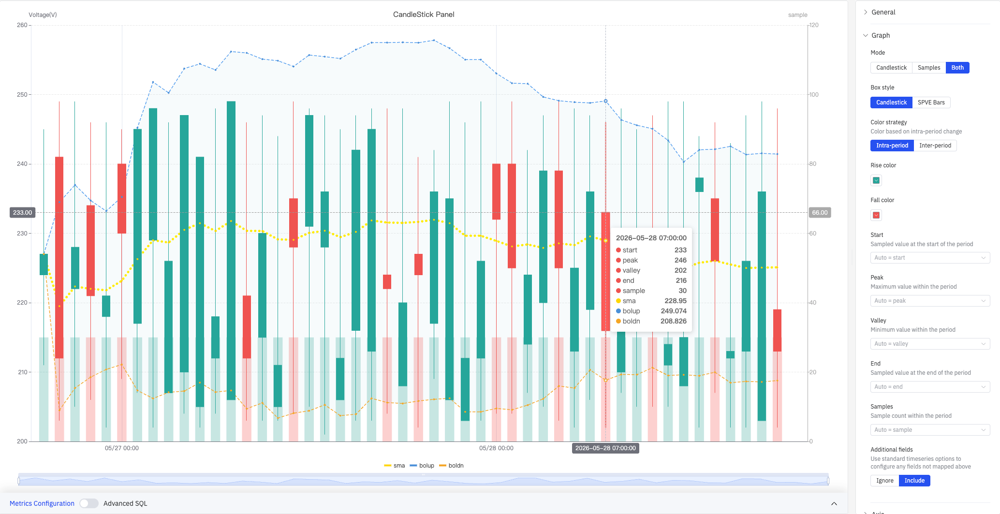
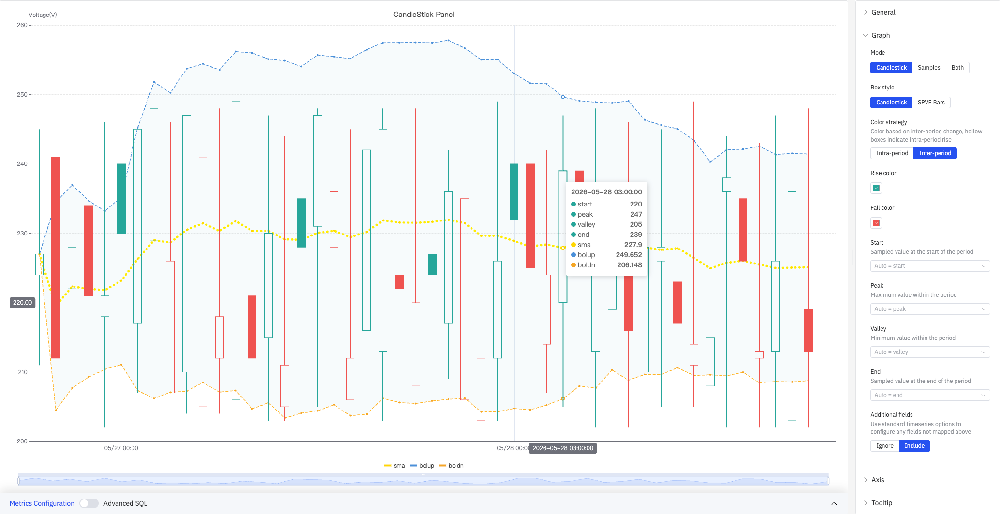
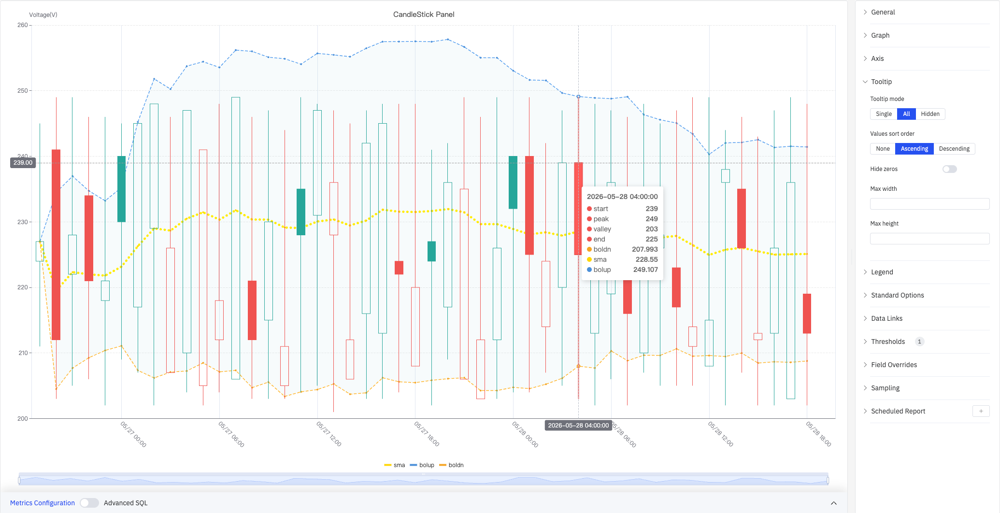

# 4.2.10 蜡烛图

## 4.2.10.1 概述

蜡烛图以聚合周期（时间窗口）为单位展示数值的统计特征，每根蜡烛代表一个时间窗口内的起始值、峰值、谷值和终止值（OHLC）。它来源于金融市场分析，在工业场景中可用于分析设备参数在班次或批次级别的波动特征。蜡烛图仅支持单个指标。

上图展示了 Both 模式下的 CandleStick Panel：左侧 Y 轴为 Voltage(V)（200–260），右侧 Y 轴为 sample 采样数（0–120）。绿色蜡烛代表当周期内终止值高于起始值（上涨），红色蜡烛代表终止值低于起始值（下跌）。图上叠加了 SMA 移动平均线（黄色点线）和布林带（蓝色上轨面积图 + 橙色下轨点线）。悬停提示框显示该蜡烛的完整统计数据：start 233、peak 246、valley 202、end 216、sample 30、sma 228.95、bolup 249.074、boldn 208.826。

## 4.2.10.2 适用场景

在以下情况下使用蜡烛图：

- 需要观察传感器值在固定时间窗口内的统计分布（起始、峰值、谷值、终止）
- 需要快速识别每个时间周期内的极值和波动幅度
- 需要在蜡烛图上叠加移动平均线（SMA）或布林带，辅助趋势和波动分析

## 4.2.10.3 配置

### 图形配置

图形配置控制蜡烛图的展示内容、样式和着色策略。

**SPVE Bars 样式**（下图）将每根蜡烛渲染为细竖线加短横标记的形式，视觉上更简洁，适合在时间跨度较长时显示更多蜡烛：

**跨周期着色策略**（下图）根据当前周期终止值与上一周期终止值的比较结果着色，并使用空心蜡烛体表示周期内上涨（终止值高于起始值）：

**模式设置：**

| 设置 | 说明 |
|---|---|
| **模式** | 展示内容：Candlestick（仅蜡烛图）、Samples（仅采样数柱）、Both（蜡烛图与采样数柱并列） |
| **箱线样式** | 蜡烛的呈现形式：Candlestick（传统 K 线）或 SPVE Bars；仅模式非 Samples 时可用 |
| **颜色策略** | 蜡烛着色依据：Intra-period（当周期内终止值与起始值比较）或 Inter-period（当周期终止值与上一周期终止值比较）；仅模式非 Samples 时可用 |
| **上涨色** | 数值上涨时蜡烛的颜色（默认绿色）；仅模式非 Samples 时可用 |
| **下跌色** | 数值下跌时蜡烛的颜色（默认红色）；仅模式非 Samples 时可用 |

**字段映射**将数据源中的字段分配给对应的蜡烛属性，留空则系统自动按名称关键字匹配：

| 字段 | 说明 |
|---|---|
| **Start** | 时间窗口开始时的采样值（起始值，自动匹配含 first / start 的字段名） |
| **Peak** | 时间窗口内的最大值（自动匹配含 max / peak 的字段名） |
| **Valley** | 时间窗口内的最小值（自动匹配含 min / valley 的字段名） |
| **End** | 时间窗口结束时的采样值（终止值，自动匹配含 last / end 的字段名） |
| **Samples** | 时间窗口内的样本数量；仅模式非 Candlestick 时可用 |
| **Additional fields** | 未映射字段的处理方式：Ignore（忽略）或 Include（使用标准时序配置包含） |

### 坐标轴

蜡烛图仅支持配置 X 轴：

上图展开了 Axis 配置面板，标签间隔设置为 medium，网格线设置为自动。右侧面板同时可见全部配置区域：Tooltip、Legend、Standard Options、Data Links、Thresholds(1)、Field Overrides、Sampling、Scheduled Report。

| 设置 | 说明 |
|---|---|
| **X Axis** | 显示或隐藏 X 轴 |
| **X Axis Time Format** | X 轴时间戳的显示格式（X 轴显示时可用） |
| **Rotate Labels** | X 轴时间标签的旋转角度（-90°–+90°） |
| **Label Interval** | X 轴标签的密度：auto、small、medium、large |
| **Show grid lines** | X 轴网格线：Auto、On、Off |

### 提示框

上图提示框模式设置为 **All**，值排序为升序。悬停时提示框显示该蜡烛的全部字段及分析指标：start 239、peak 249、valley 203、end 225、boldn 207.993、sma 228.55、bolup 249.107。

| 设置 | 说明 |
|---|---|
| **Tooltip mode** | 悬停显示方式：Single（仅悬停蜡烛）、All（显示全部字段）、Hidden |
| **Values sort order** | 提示框内数值排序：None、Ascending、Descending |
| **Hide zeros** | 开启后在提示框中隐藏值为 0 的项 |
| **Max width** | 提示框最大宽度（像素） |
| **Max height** | 提示框最大高度（像素） |

### 图例

| 设置 | 说明 |
|---|---|
| **显示** | 显示模式：列表、表格、隐藏 |
| **位置** | 放置位置：底部、右侧 |
| **宽度** | 图例区域宽度（像素，仅右侧布局时可用） |
| **图例值** | 在表格模式下显示的统计数据，可多选：最大值、最小值、平均值、总和等 |

### 标准配置

| 设置 | 说明 |
|---|---|
| **最小值** | 数值的下限（留空则从数据自动计算） |
| **最大值** | 数值的上限（留空则从数据自动计算） |
| **小数位数** | 数值显示的小数位数（留空则自动判断） |
| **配色方案** | 系列颜色分配策略：单色、单色深浅映射（按系列）、阈值取色（按值）、经典调色板、经典调色板（按系列名）、自定义调色板 |

### 数据链接

数据链接为蜡烛附加可点击的跳转 URL：

| 设置 | 说明 |
|---|---|
| **标题** | 链接的显示名称 |
| **URL** | 跳转目标地址，支持变量插值 |
| **在新标签页打开** | 是否在新浏览器标签页中打开链接 |
| **一键跳转** | 启用后点击蜡烛直接跳转（同时只能有一条链接启用此功能） |

### 颜色阈值

颜色阈值定义数值区间与颜色的对应关系：

| 设置 | 说明 |
|---|---|
| **添加阈值** | 新增一条阈值规则，每条包含数值边界和对应颜色 |

颜色阈值生效需在标准配置中将**配色方案**设置为**阈值取色（按值）**。

### 个性化配置

个性化配置允许对单个指标覆盖全局图形设置。选定目标指标名称后，可添加以下属性进行覆盖：系列样式、线宽、填充透明度、线条透明度、线条颜色、点大小、显示点、连接空值、堆叠、渐变模式、显示值。

### 降采样

当查询结果中的数据点过多时，可启用降采样减少渲染数量以提升显示性能：

| 设置 | 说明 |
|---|---|
| **启用降采样** | 开关，默认关闭 |
| **最大数据点数** | 降采样后保留的最大数据点数量 |
| **聚合函数** | 降采样时使用的聚合方式（如 AVG、MAX、MIN 等） |

### 定时报告

蜡烛图面板支持定时报告功能，可将图表以图片形式定期发送到指定邮箱或飞书群。配置入口位于面板右上角菜单中。

## 4.2.10.4 数据分析

在编辑模式下，可通过**数据分析**按钮打开分析配置对话框，在蜡烛图上叠加统计分析指标：

对话框顶部显示当前数据集的 **σ（标准差）** 计算值，可配置 **N（SMA 周期）** 和 **K（布林带倍数）**，并为每个指标独立控制是否在图表上显示。

| 指标 | 公式 | 说明 |
|---|---|---|
| **sma（Simple Moving Average）** | AVG(N) | 过去 N 个周期终止值的算术平均值，用于平滑波动、识别趋势 |
| **bolup（Bollinger Band Upper）** | SMA + K × σ | 布林带上轨；数值超出上轨可能存在异常波动 |
| **boldn（Bollinger Band Lower）** | SMA − K × σ | 布林带下轨；数值低于下轨可能存在异常波动 |

## 4.2.10.5 使用示例

**班次级别设备电压分析。** 工艺工程师以 8 小时为时间窗口，对变电站电压生成蜡烛图，Mode 设置为 Both，同时展示蜡烛体和各班次采样数量柱。叠加 SMA 曲线和布林带后可清楚看出电压趋势——近两天 SMA 持续下降并接近布林带下轨，提示可能存在异常。

**批次产品质量波动追踪。** 质量工程师以批次为时间窗口（每批次一根蜡烛），对关键质量参数绘图。蜡烛体高度（start 到 end 的跨度）代表批内初末测量值变化，上下影线代表批内极值。异常宽的蜡烛体表明该批次过程控制不稳定。

**跨班次趋势比较。** 运营主管切换为 Inter-period 着色策略，按跨周期比较对蜡烛上色：终止值低于上一周期终止值的蜡烛显示为红色实心，周期内上涨但跨期下跌的蜡烛显示为红色空心，快速识别连续下降的班次序列。

