## 4.12.1 概述

散点图将各个数据点绘制为二维空间中的点。默认模式下，每个点的 X 位置为时间戳，Y 位置为指标值——即时间散点视图。在相关性分析中，将两个属性相互绘制（Y 对 X），揭示两个变量之间的关系。

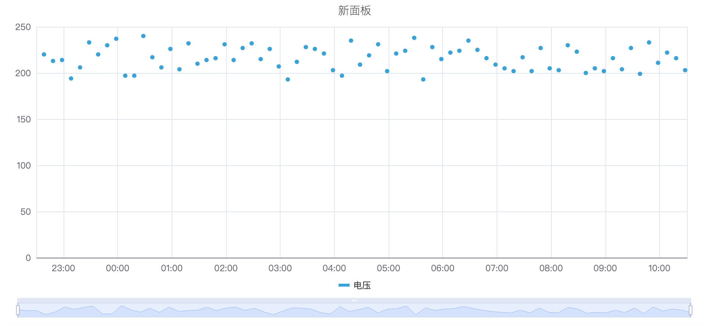

除基础绘图外，散点图还支持数据聚合和回归分析，是 TDengine IDMP 中进行统计和相关性分析的主要面板类型。

## 4.12.2 适用场景

在以下情况下使用散点图：

- 需要探索两个过程变量之间的关系（如功率与温度、流量与压降）
- 需要识别数据集中的聚类或异常值
- 希望拟合回归曲线以量化某种关系
- 希望绘制未经聚合的原始数据点

对于基于连续折线的趋势分析，请使用趋势图。对于离散状态规律，请使用状态时间线图。

## 4.12.3 配置

### 查看模式工具栏

除[通用查看模式控件](../01-panels.md#423-面板查看模式)外，散点图还增加了以下控件：

| 控件 | 说明 |
|---|---|
| **禁用采样** | 获取原始数据而不进行降采样，确保所有数据点均被绘制 |

### 编辑模式工具栏

除[通用编辑模式控件](../01-panels.md#424-面板编辑模式)外，散点图还增加了以下控件：

| 控件 | 说明 |
|---|---|
| **禁用采样** | 在预览中切换原始数据模式 |
| **保存为图片** | 将当前预览下载为 PNG 图片 |
| **全屏** | 将编辑器预览扩展为填满浏览器窗口 |
| **解读面板** | 对当前预览数据运行 AI 分析 |

### 图形设置

#### 点样式

每个数据点的符号形状、大小和透明度均可配置：

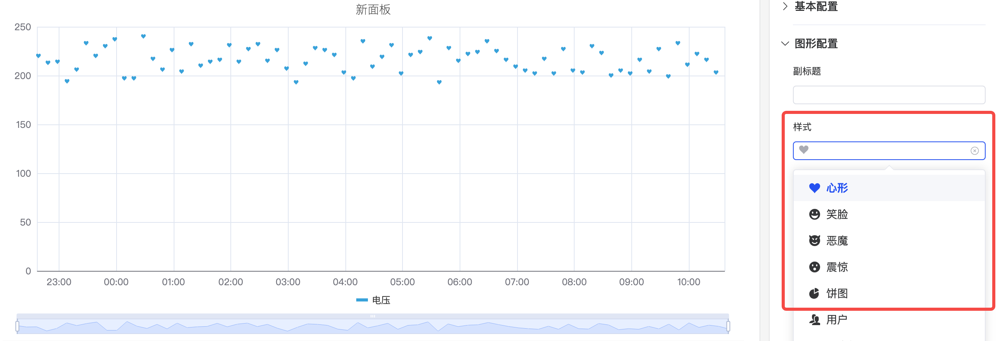

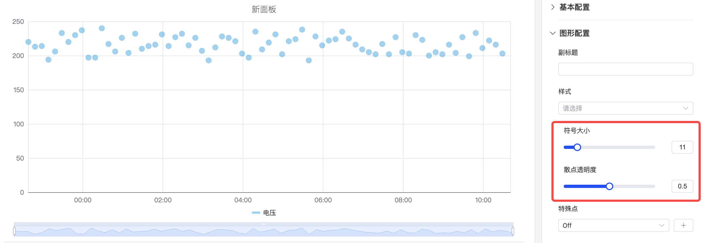

#### 特殊点位

**特殊点位**设置可突出显示特定数据点（如最大值或最小值），使用独特标记和自定义颜色进行标识：

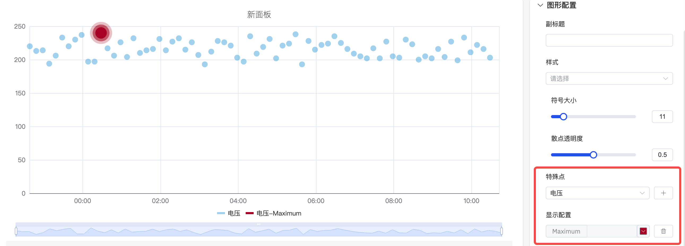

#### 标签

当数据密集时，坐标轴标签可能相互重叠。使用**标签旋转**和**标签间隔**来改善可读性：

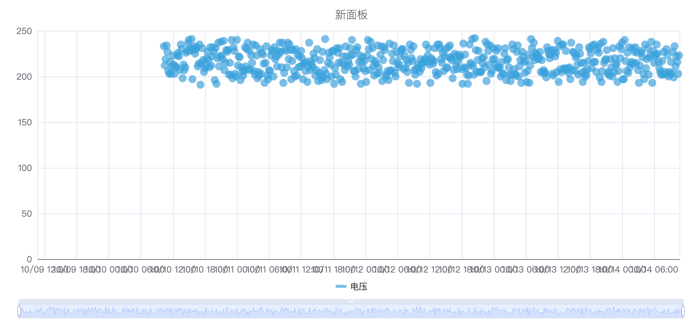

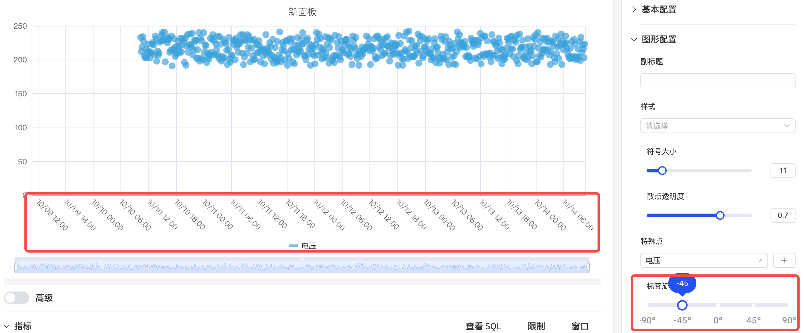

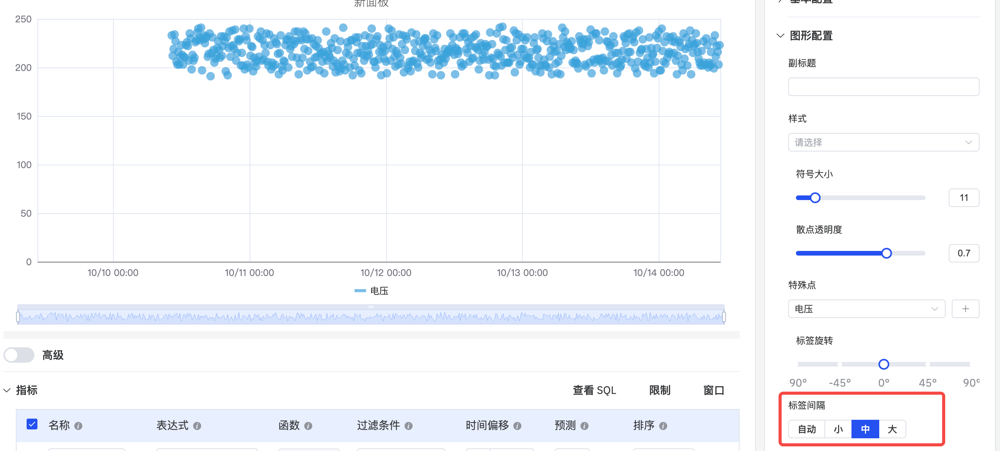

| 设置 | 说明 |
|---|---|
| **样式** | 数据点的符号形状（圆形、心形、笑脸等） |
| **点大小** | 每个点的大小（滑块，默认 6） |
| **散点透明度** | 点的透明度，取值 0–1 |
| **特殊点位** | 用独特标记突出显示最大值/最小值或其他特定点 |
| **标签旋转** | X 轴标签的旋转角度 |
| **标签间隔** | X 轴标签的密度 |

### 数据转换设置

散点图具有独特的数据转换部分，用于分析功能：

**数据聚合**将点分组为聚类，以不同颜色显示，从而实现可视化聚类分析：

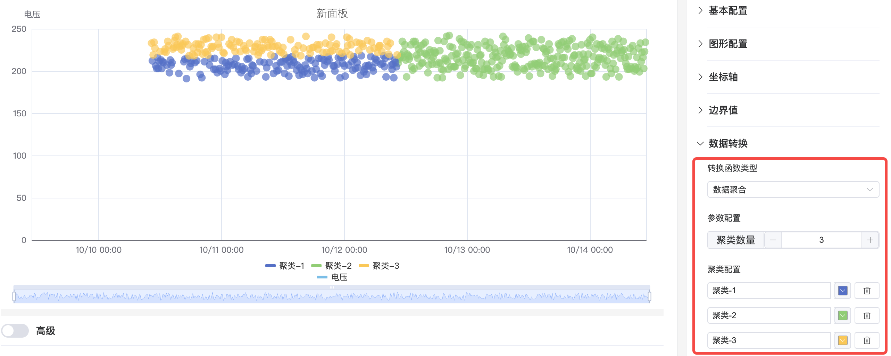

**回归分析**对数据拟合曲线并叠加在散点图上。支持的函数包括线性回归、指数回归和多项式回归（可配置阶数）：

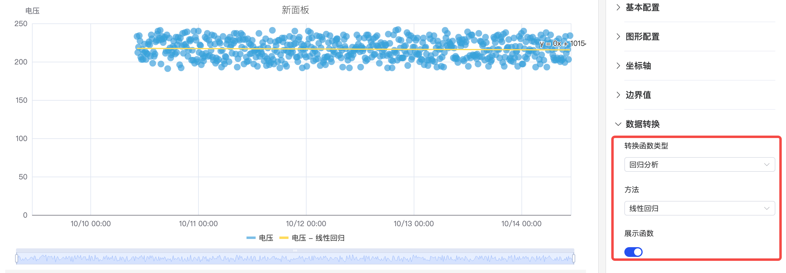

| 数据转换类型 | 说明 |
|---|---|
| **关闭** | 不进行转换，直接绘制原始数据点 |
| **数据聚合** | 对数据点进行分组并显示聚合聚类 |
| **回归分析** | 对数据拟合回归曲线（线性、指数或多项式） |

### 坐标轴设置

#### 坐标轴标题

配置 Y 轴标签名称和单位：

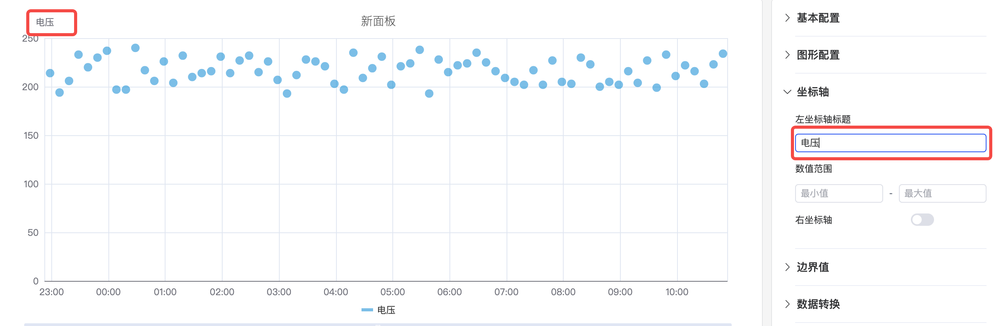

#### 双 Y 轴

当两个指标的量程差异较大时，共享 Y 轴会压缩较小信号。启用**右坐标轴**可将各指标分配到独立的刻度：

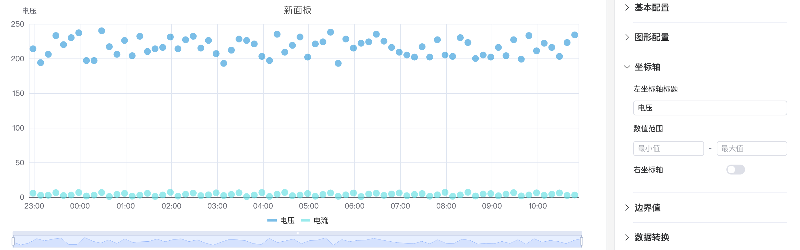

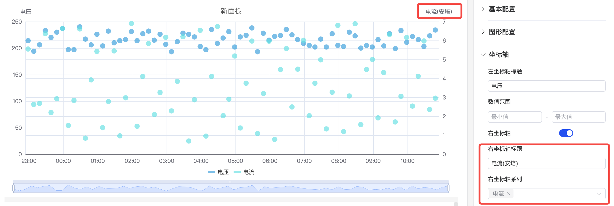

### 边界值设置

可在散点图上叠加边界线以标记运行范围：

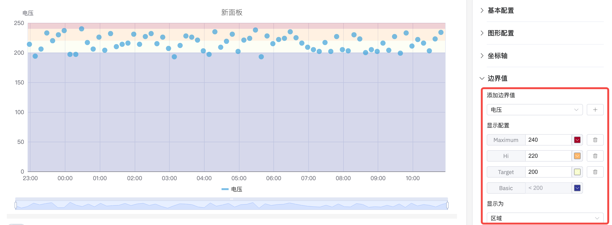

### 图例设置

在表格模式下，图例显示汇总统计值。当图例位于右侧且为表格模式时，还可调整表格宽度：

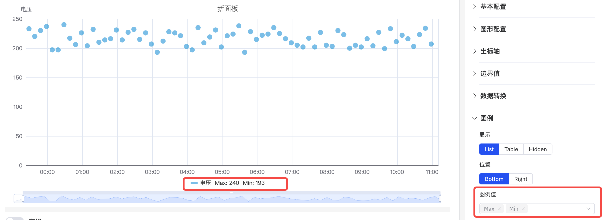

| 设置 | 说明 |
|---|---|
| **显示** | 显示模式：列表、表格或隐藏 |
| **位置** | 位置：底部或右侧 |
| **图例值** | 表格模式下显示的统计值：最新值、最小值、最大值、均值、求和等 |

## 4.12.4 使用示例

**功率与温度相关性。** 工艺工程师将一个月的有功功率（X 维度）与电机温度（Y 指标）绘制成散点图。散点图显示出明显的正相关关系——回归曲线量化了这种关系，R² 值表明其强度。

**质量聚类。** 质量工程师将一个季度所有批次的两个过程变量（压力和温度）绘制成散点图。数据聚合功能对聚类进行着色——大多数批次紧密聚集在绿色区域，但少数异常值在独立的聚类中，与不合格批次相关联。

**异常值检测。** 数据工程师启用禁用采样，绘制某传感器的所有原始读数。特殊点位设置用红色标记突出显示最大值。一个明显高于聚类的异常点被识别出来，有待进一步调查。
