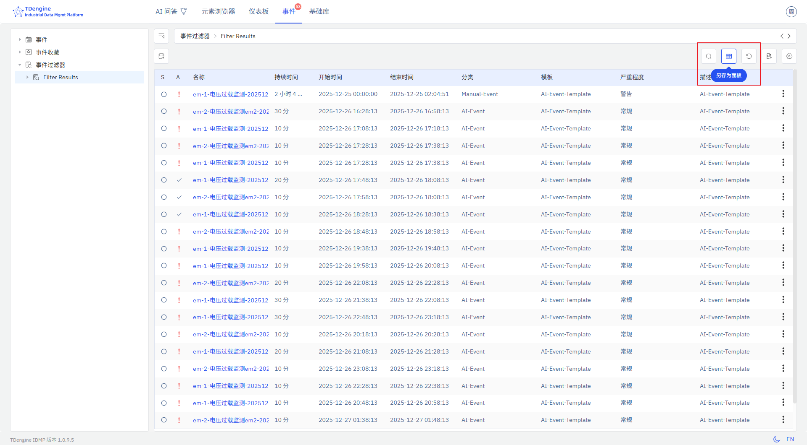

# 4.2.11 事件列表

## 4.2.11.1 概述

事件列表面板以表格形式展示事件信息，包括严重级别、确认状态、名称、持续时间、开始/结束时间及其他事件元数据。可从事件视图中保存创建，可放置在元素面板列表中，也可加入仪表板。

## 4.2.11.2 适用场景

在以下情况下使用事件列表面板：

- 希望将过滤后的事件视图（如特定区域的活跃告警）直接显示在仪表板上
- 需要在其他运营面板旁边同步监控一组资产的事件
- 希望运营或维护团队无需进入事件视图，即可在上下文中查看相关事件

## 4.2.11.3 配置

### 保存事件列表面板

点击**事件**主菜单，点击左侧的**事件过滤器**，进入事件查询页面。配置过滤条件，缩小所需追踪的事件范围。点击**另存为面板**按钮，将当前过滤后的事件列表保存为事件列表面板。

保存成功后，面板预览会自动打开。也可进入目标元素的**面板**标签页查看新创建的事件列表面板。

## 4.2.11.4 使用示例

**区域事件监控。** 维护团队负责人保存一个过滤为生产区域 B 告警的事件列表面板，并放置在该区域仪表板上。操作人员无需切换到事件视图，即可在趋势面板旁边实时查看当前告警列表。

**交班事件回顾。** 运营经理保存一个过滤为某生产线过去 24 小时事件的事件列表面板，并固定在交班仪表板上。交接班的双方在每次交班时都能看到相同的过滤事件历史记录。

**关键告警监控。** 厂级管理员保存一个过滤为全厂紧急级别事件的事件列表面板，并加入厂级总览仪表板。无论告警发生在哪个区域，该面板均能第一时间提供可见性。
