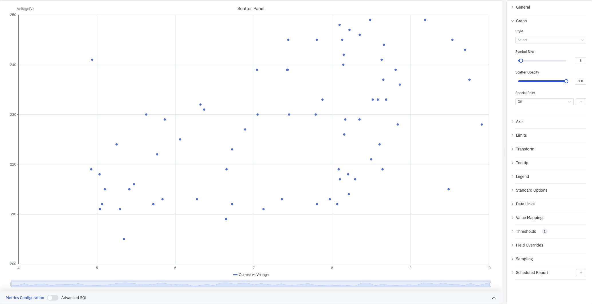
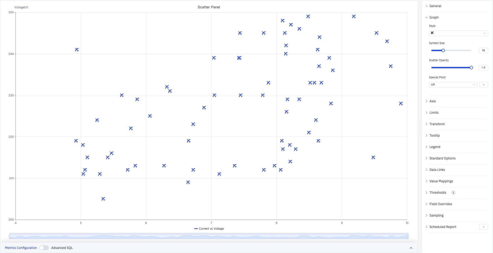
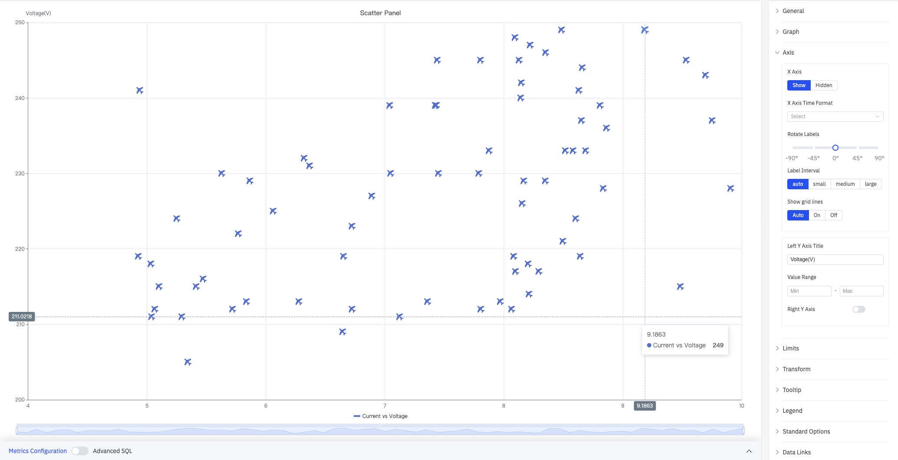
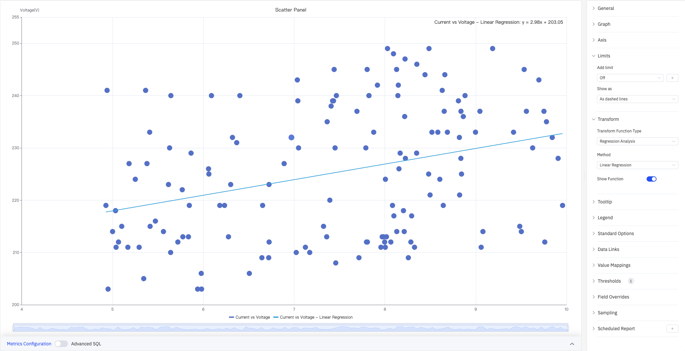
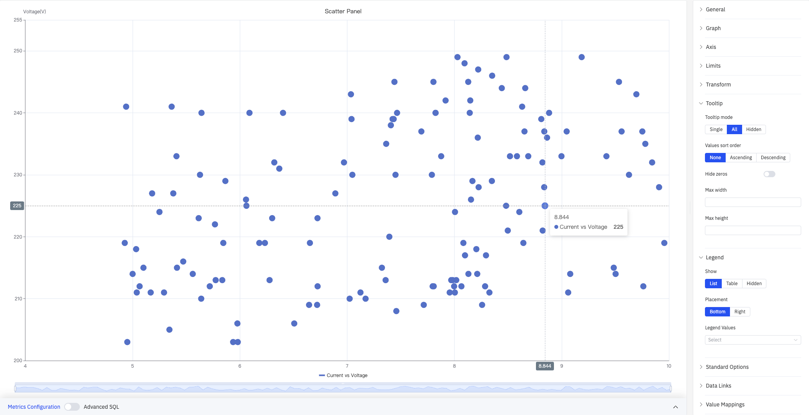

# 4.2.11 散点图

## 4.2.11.1 概述

散点图将各个数据点绘制为二维空间中的点。X 轴代表一个变量（如电流），Y 轴代表另一个变量（如电压），每个点反映一次采样的组合值。通过观察点的分布形态，可以直观判断两个变量之间是否存在关联。

上图展示了"Current vs Voltage"散点图：X 轴为电流（4–10 A），Y 轴为电压（200–250 V）。右侧配置面板可见完整的配置区域：Graph（图形）、Axis（坐标轴）、Limits（边界值）、Transform（数据转换）、Tooltip（提示框）、Legend（图例）、Standard Options（标准配置）、Data Links（数据链接）、Value Mappings（值映射）、Thresholds（颜色阈值）、Field Overrides（个性化配置）、Sampling（降采样）、Scheduled Report（定时报告）。

## 4.2.11.2 适用场景

在以下情况下使用散点图：

- 探索两个过程变量之间的关系（如电流与电压、功率与温度）
- 识别数据集中的聚类或异常值
- 拟合回归曲线以量化某种关系
- 绘制原始数据点的分布形态

对于基于连续折线的趋势分析，请使用趋势图。对于离散状态规律，请使用状态时间线图。

## 4.2.11.3 配置

### 图形配置

图形配置控制数据点的外观样式：

上图将符号样式设置为 **×** 形，符号大小调大至 16，可更清晰地区分密集区域的数据点分布。

| 设置 | 说明 |
|---|---|
| **样式** | 数据点的符号形状，可选圆形、×、星形等多种样式 |
| **符号大小** | 每个点的大小，默认 8 |
| **散点透明度** | 点的填充透明度，取值 0–1，默认 1.0 |
| **特殊点** | 将指定指标的最大值或最小值用独特标记和自定义颜色突出显示；默认关闭 |

### 坐标轴

坐标轴配置控制 X 轴和 Y 轴的显示方式：

上图展开了坐标轴配置面板，左侧 Y 轴标题设置为"Voltage(V)"，X 轴标签间隔为自动，网格线显示为自动。悬停时提示框显示数据点坐标（Current 9.1863，Voltage 249）。

**X 轴设置：**

| 设置 | 说明 |
|---|---|
| **X 轴** | 显示或隐藏 X 轴 |
| **X 轴时间格式** | X 轴时间戳的显示格式（X 轴显示时可用） |
| **标签旋转** | X 轴标签的旋转角度（-90°–+90°） |
| **标签间隔** | X 轴标签的密度：自动、小、中、大 |
| **显示网格线** | X 轴网格线：自动、显示、隐藏 |

**Y 轴设置：**

| 设置 | 说明 |
|---|---|
| **左坐标轴标题** | 左侧 Y 轴的显示名称和单位 |
| **数值范围** | 左侧 Y 轴的最小值和最大值（留空则自动计算） |
| **右坐标轴** | 开启后启用右侧独立 Y 轴，适用于两个指标量程差异较大的场景 |

### 边界值与数据转换

边界值在散点图上叠加参考线，标记运行边界。数据转换对散点数据应用统计分析。

**聚类分析**将数据点自动归组并按颜色区分——下图将"Current vs Voltage"数据划分为两个聚类：

Transform 配置面板显示：转换函数类型选择 **Data Aggregation**，参数配置中 Cluster Count（聚类数量）设为 2，Cluster Configuration 为每个聚类分别指定名称和颜色。

**回归分析**在散点图上拟合并叠加趋势线——下图展示了线性回归结果，图表右上角显示回归公式：

同时，图中还展开了 Limits（边界值）配置面板，可见 Add limit（添加边界值）选项和 Show as（显示为）选项。

**边界值设置：**

| 设置 | 说明 |
|---|---|
| **添加边界值** | 添加一条参考线，默认关闭；可选 Maximum、HiHi、Hi、Target、Lo、LoLo、Minimum 等类型 |
| **显示为** | 边界的呈现形式：虚线、区域、虚线和区域 |

**数据转换设置：**

| 设置 | 说明 |
|---|---|
| **转换函数类型** | 关闭（不转换）、Data Aggregation（聚类分析）、Regression Analysis（回归分析） |
| **参数配置** | 聚类分析时设置 Cluster Count（聚类数量） |
| **聚类配置** | 为每个聚类设置名称和颜色（仅聚类分析时） |
| **方法** | 回归方法（仅回归分析时）：Linear Regression（线性回归）、指数回归、多项式回归 |
| **展示函数** | 是否在图上显示回归公式标签（仅回归分析时），默认关闭 |

### 提示框与图例

提示框和图例配合使用，为散点提供补充信息：

上图提示框模式设置为 **All**，悬停时显示十字准线和数据点坐标（8.844，Voltage 225）。图例显示为列表模式，位于底部。

**提示框设置：**

| 设置 | 说明 |
|---|---|
| **提示框模式** | 悬停显示方式：单个、全部、隐藏 |
| **值排序** | 提示框内多个指标的排序：无、升序、降序 |
| **隐藏零值** | 开启后在提示框中隐藏值为 0 的项 |
| **最大宽度** | 提示框最大宽度（像素） |
| **最大高度** | 提示框最大高度（像素） |

**图例设置：**

| 设置 | 说明 |
|---|---|
| **显示** | 显示模式：列表、表格、隐藏 |
| **位置** | 放置位置：底部、右侧 |
| **图例值** | 在表格模式下显示的统计数据，可多选：最大值、最小值、平均值、总和等 |

### 标准配置

| 设置 | 说明 |
|---|---|
| **最小值** | 数值的下限（留空则从数据自动计算） |
| **最大值** | 数值的上限（留空则从数据自动计算） |
| **小数位数** | 数值显示的小数位数（留空则自动判断） |
| **配色方案** | 系列颜色分配策略：单色、单色深浅映射（按系列）、阈值取色（按值）、经典调色板、经典调色板（按系列名）、自定义调色板 |

### 数据链接

数据链接为数据点附加可点击的跳转 URL：

| 设置 | 说明 |
|---|---|
| **标题** | 链接的显示名称 |
| **URL** | 跳转目标地址，支持变量插值 |
| **在新标签页打开** | 是否在新浏览器标签页中打开链接 |
| **一键跳转** | 启用后点击数据点直接跳转（同时只能有一条链接启用此功能） |

### 值映射

值映射将原始数据值转换为显示文本和颜色：

| 映射类型 | 说明 |
|---|---|
| **值** | 精确匹配特定数值或文本 |
| **范围** | 匹配指定数值范围 |
| **正则表达式** | 使用正则表达式匹配并替换 |
| **特殊值** | 匹配 null、NaN、布尔值、空字符串等 |
| **其他值** | 匹配所有未被前面规则覆盖的值 |

### 颜色阈值

颜色阈值定义数值区间与颜色的对应关系：

| 设置 | 说明 |
|---|---|
| **添加阈值** | 新增一条阈值规则，每条包含数值边界和对应颜色 |

颜色阈值生效需在标准配置中将**配色方案**设置为**阈值取色（按值）**。

### 个性化配置

个性化配置允许对单个指标覆盖全局图形设置。选定目标指标名称后，可添加以下属性进行覆盖：系列样式、线宽、填充透明度、线条透明度、线条颜色、点大小、显示点、连接空值、堆叠、渐变模式、显示值。

### 降采样

当查询结果中的数据点过多时，可启用降采样减少渲染数量以提升显示性能：

| 设置 | 说明 |
|---|---|
| **启用降采样** | 开关，默认关闭 |
| **最大数据点数** | 降采样后保留的最大数据点数量 |
| **聚合函数** | 降采样时使用的聚合方式（如 AVG、MAX、MIN 等） |

### 定时报告

散点图面板支持定时报告功能，可将图表以图片形式定期发送到指定邮箱或飞书群。配置入口位于面板右上角菜单中。

## 4.2.11.4 使用示例

**电流与电压相关性。** 工艺工程师将多台设备的电流（X 轴）与电压（Y 轴）绘制成散点图，并启用线性回归分析。回归直线和公式直接显示在图上，揭示两个变量之间的正相关关系及其斜率。

**运行状态聚类。** 质量工程师将设备的两个过程变量绘制成散点图，启用聚类分析并设置 2 个聚类。散点按聚类着色后，正常运行点（绿色聚类）和异常运行点（蓝色聚类）的分布模式一目了然。

**异常值检测。** 数据工程师绘制某传感器的原始采样点，启用特殊点标注最大值和最小值。明显偏离主体分布的异常点被独特颜色标记，便于快速定位和进一步排查。
