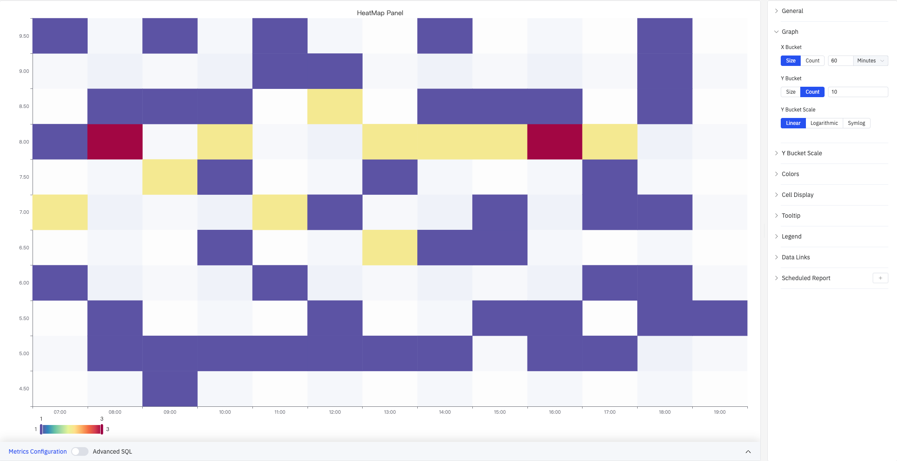
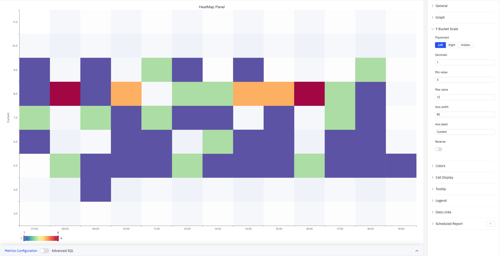
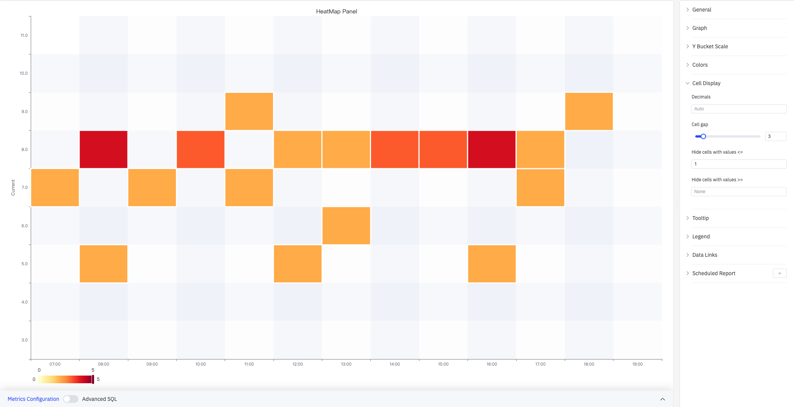
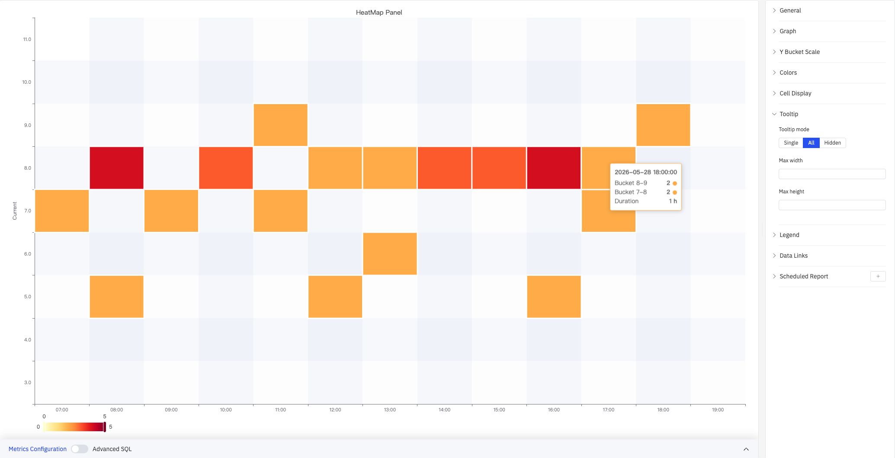

# 4.2.12 热力图

## 4.2.12.1 概述

热力图将时间序列数据聚合为二维网格，X 轴为时间，Y 轴为数值区间，每个单元格的颜色深浅表示落在该区间的数据点密度（计数）。它是分析数值分布随时间演变的有效工具，能直观揭示集中趋势的漂移、周期性模式和异常波动时段。热力图仅支持单个指标。

上图展示了 HeatMap Panel：X 轴时间范围 07:00–19:00，Y 轴数值范围 4.5–9.5。颜色从蓝色（低密度）到红色（高密度）渐变，色阶范围为 1–3。右侧面板展开了 Graph 配置区域，显示 X Bucket（Size 模式，60 分钟）、Y Bucket（Count 模式，10）和 Y Bucket Scale（Linear）。其余配置区域以折叠形式排列：Y Bucket Scale、Colors、Cell Display、Tooltip、Legend、Data Links、Scheduled Report。

## 4.2.12.2 适用场景

在以下情况下使用热力图：

- 需要观察某个过程变量的数值分布如何随时间变化（分布漂移）
- 需要发现周期性规律，例如在特定班次或时段中数值集中的区域
- 希望同时看到大量数据点的整体分布，而不是被单个点的细节淹没

## 4.2.12.3 配置

### 图形配置

图形配置（Graph）控制热力图的分桶方式和 Y 轴刻度类型。

**X Bucket** 和 **Y Bucket** 的分桶模式均可在两种方式之间切换：

| 设置                     | 说明                                                                          |
| ------------------------ | ----------------------------------------------------------------------------- |
| **X Bucket 模式**        | Size（按固定时间宽度分桶）或 Count（将时间范围等分为指定列数）                |
| **X Bucket 大小 / 数量** | Size 模式时输入时间宽度和单位（如 60 Minutes）；Count 模式时输入列数（1–500） |
| **Y Bucket 模式**        | Size（按固定数值宽度分桶）或 Count（将数值范围等分为指定行数）                |
| **Y Bucket 大小 / 数量** | Size 模式时输入数值宽度；Count 模式时输入行数（1–500）                        |

**Y Bucket Scale** 控制 Y 轴的刻度类型：

| 选项            | 说明                                                                 |
| --------------- | -------------------------------------------------------------------- |
| **Linear**      | 线性均匀刻度（默认），适合数值范围不跨量级的场景                     |
| **Logarithmic** | 对数刻度，下图展示 Log base=2 时 Y 轴的非均匀间距（4.00–13.9）       |
| **Symlog**      | 对称对数刻度，在 Linear threshold 范围内保持线性，超出后转为对数刻度 |

Symlog 在线性阈值内保持均匀间距，适合同时包含小值密集区和大值稀疏区的数据集。选择 Logarithmic 或 Symlog 时，额外显示以下参数：

| 设置                 | 说明                             |
| -------------------- | -------------------------------- |
| **Log base**         | 对数底数：2 或 10                |
| **Linear threshold** | 线性区间范围（仅 Symlog 时可用） |

### Y 轴显示

Y Bucket Scale 配置区域控制 Y 轴的显示外观：

上图展开了 Y Bucket Scale 配置面板，Y 轴标签设置为"Current"，最小值 3，最大值 12，轴宽度 60。图表左侧显示"Current"轴标签。

| 设置           | 说明                                      |
| -------------- | ----------------------------------------- |
| **Placement**  | Y 轴的显示位置：Left、Right、Hidden       |
| **Decimals**   | Y 轴刻度标签的小数位数（留空则自动判断）  |
| **Min value**  | Y 轴显示范围的下限（留空则自动计算）      |
| **Max value**  | Y 轴显示范围的上限（留空则自动计算）      |
| **Axis width** | Y 轴区域的像素宽度（留空则自动）          |
| **Axis label** | Y 轴的自定义标签文字                      |
| **Reverse**    | 是否将 Y 轴方向反转（大值在下），默认关闭 |

### 颜色

颜色配置（Colors）控制单元格的颜色映射方式：

上图将配色方案设置为 **Yellow-Orange-Red**，Steps 为 59，颜色映射范围固定在 0–5。图表底部图例显示从黄色（0）到红色（5）的渐变色阶。

| 设置                             | 说明                                                                  |
| -------------------------------- | --------------------------------------------------------------------- |
| **Mode**                         | 颜色映射方式：Scheme（使用预设渐变色方案）或 Opacity（单色深浅变化）  |
| **Color Scheme**                 | 内置配色方案，如 Yellow-Orange-Red、Spectral 等；仅 Scheme 模式时可用 |
| **Steps**                        | 颜色渐变的离散步数（2–128）                                           |
| **Reverse**                      | 是否将颜色渐变方向反转（低值颜色与高值颜色对调）                      |
| **Start color scale from value** | 颜色映射范围的最小值（留空则从数据自动计算）                          |
| **End color scale at value**     | 颜色映射范围的最大值（留空则从数据自动计算）                          |

### 单元格显示

单元格显示（Cell Display）控制单元格的间距和可见性过滤：

上图将 Cell gap 设置为 3（单元格间有细小间隙），Hide cells with values ≤ 设置为 1，计数为 1 的单元格不显示颜色（呈现为空白）。与不过滤相比，图中只保留了计数 ≥2 的单元格，使高密度区域更加突出。

| 设置                         | 说明                                               |
| ---------------------------- | -------------------------------------------------- |
| **Decimals**                 | 提示框中单元格计数值的小数位数（留空则自动）       |
| **Cell gap**                 | 相邻单元格之间的间距像素数（0–25）                 |
| **Hide cells with values ≤** | 计数小于等于该值的单元格不显示颜色，默认过滤近零值 |
| **Hide cells with values ≥** | 计数大于等于该值的单元格不显示颜色（留空则不过滤） |

### 提示框

上图提示框模式设置为 **All**，悬停 2026-05-28 18:00:00 时显示：Bucket 8-9 计数 2、Bucket 7-8 计数 2、Duration 1 h。

| 设置             | 说明                                                                            |
| ---------------- | ------------------------------------------------------------------------------- |
| **Tooltip mode** | 悬停显示方式：Single（仅悬停单元格所在行）、All（显示该时间列所有分桶）、Hidden |
| **Max width**    | 提示框最大宽度（像素）                                                          |
| **Max height**   | 提示框最大高度（像素）                                                          |

### 图例

| 设置       | 说明                                                               |
| ---------- | ------------------------------------------------------------------ |
| **显示**   | 显示模式：列表、表格、隐藏                                         |
| **位置**   | 放置位置：底部、右侧                                               |
| **宽度**   | 图例区域宽度（像素，仅右侧布局时可用）                             |
| **图例值** | 在表格模式下显示的统计数据，可多选：最大值、最小值、平均值、总和等 |

### 数据链接

数据链接为单元格附加可点击的跳转 URL：

| 设置               | 说明                                                     |
| ------------------ | -------------------------------------------------------- |
| **标题**           | 链接的显示名称                                           |
| **URL**            | 跳转目标地址，支持变量插值                               |
| **在新标签页打开** | 是否在新浏览器标签页中打开链接                           |
| **一键跳转**       | 启用后点击单元格直接跳转（同时只能有一条链接启用此功能） |

### 定时报告

热力图面板支持定时报告功能，可将图表以图片形式定期发送到指定邮箱或飞书群。配置入口位于面板右上角菜单中。

## 4.2.12.4 使用示例

**传感器值分布漂移检测。** 工艺工程师查看一个季度内某压力传感器的热力图（X 轴按天分桶，Y 轴 Count=20 行）。前两个月颜色集中在中间偏低的行；进入第三个月后分布明显上移，提示该压力回路可能存在漂移，需要重新校准。

**电流日波动规律。** 运营分析师查看连续 30 天的电流热力图（X 轴按小时分桶，Y 轴 Size 模式）。热力图显示每天凌晨 2–4 时电流集中于较低区间，正午 11–13 时集中于较高区间，揭示出与生产负荷相关的周期性规律。

**宽量级数据分析。** 维护工程师对某传感器的数值范围跨越多个量级，将 Y Bucket Scale 切换为 Logarithmic（Log base=2），使高频小值区间和低频大值区间的分桶分辨率更加均衡，辅助识别异常值分布区域。
