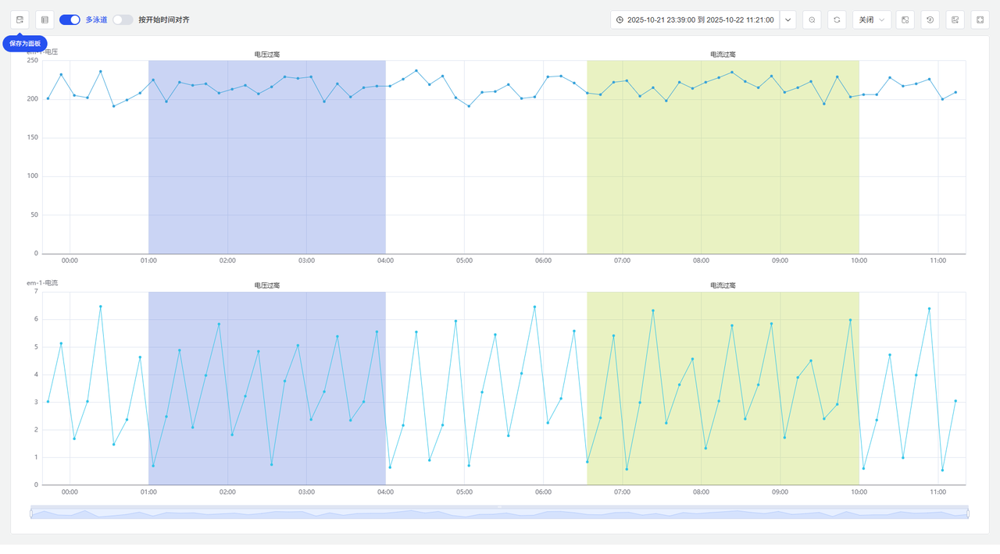
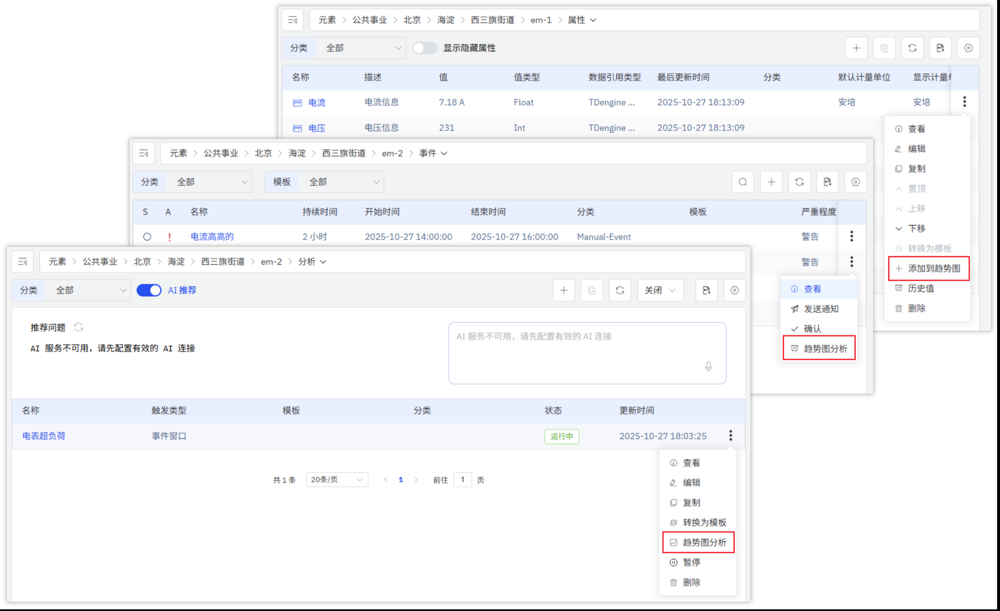
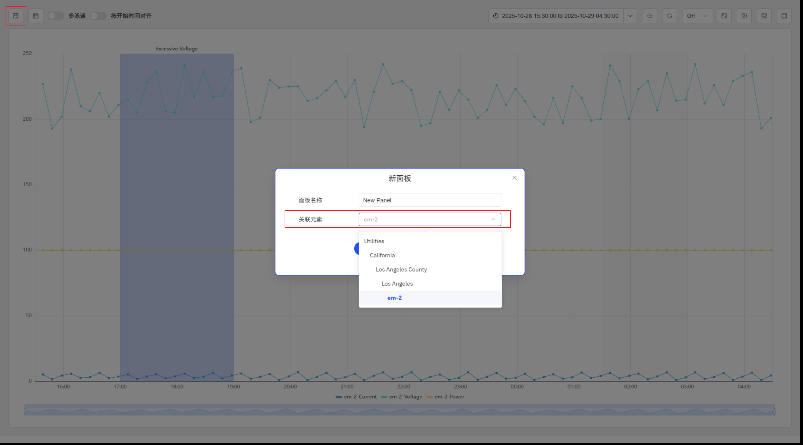

# 4.2.13 事件趋势图

## 概述

事件趋势图在时序指标上叠加高亮显示的事件时间范围，将数据信号与该时段发生的事件关联起来，使事件前后及事件期间的指标变化一目了然。

可向面板中添加任意组合的元素属性、事件和分析。添加**事件**时，该事件触发条件相关的属性会自动加入图中，事件的持续时间范围在时间轴上高亮显示。添加**分析**时，分析引用的所有属性以及该分析生成的事件均会被加入图中。

## 适用场景

在以下情况下使用事件趋势图：

- 需要将过程变量与事件发生情况相关联——例如查看告警窗口期间温度或压力的变化
- 希望通过查看事件发生前后的相关指标，调查事件的根本原因
- 需要将同一类型事件的多次发生情况对齐到统一时间轴进行横向对比
- 需要在单个面板上同时呈现指标趋势和事件上下文，构建调查视图

如需进行无事件叠加的纯时序分析，请使用趋势图。如需分析两个过程变量之间的相关性而非各自随时间的变化，请使用散点图。

## 配置

### 数据来源

点击**添加**，为事件趋势图加入数据。支持三种数据源类型：

| 数据源类型 | 效果 |
|---|---|
| **属性** | 为所选元素属性添加一条时序折线 |
| **事件** | 添加事件触发条件相关的所有属性，并在图表上高亮显示事件的活跃时间范围 |
| **分析** | 添加分析监控的所有属性，并叠加显示该分析生成的所有事件 |

### 分析工具

#### 多泳道

默认开启多泳道模式。在此模式下，每个指标占据独立的水平泳道，量程差异较大的信号在视觉上相互分离，保持清晰可读。

#### 按开始时间对齐

默认关闭。开启后，所有事件发生实例将被移动到统一的起始时间点并叠加在同一时间轴上，便于对比多次事件期间相关指标的演变规律。

#### 高亮显示事件相关指标

当鼠标悬停在图表上的某个事件时间范围时，与该事件触发条件相关的属性会被高亮显示，其他指标和事件时间范围则置灰，便于聚焦分析特定事件实例的相关信号。

#### 事件列表

点击左上角的**事件列表**按钮，打开事件列表弹窗。弹窗显示当前图表中所有事件的名称、开始时间、结束时间和持续时间，弹窗可自由拖动。

列表中的事件默认处于勾选状态。已勾选的事件在图表上高亮显示，未勾选的事件则置灰。也可从列表中删除事件。

### 保存为面板

点击左上角的**保存**按钮，可将当前分析视图永久保存为面板。在保存对话框中，选择将面板保存至哪个元素下。可选择当前视图中已有数据的相关元素及其祖先节点。

## 使用示例

**告警根因调查。** 维护工程师为某电机添加温度和振动属性，并加入该电机的超温告警事件。事件趋势图高亮显示 90 分钟的告警窗口，并展示告警触发前数小时内的完整温升过程以及同步的振动信号。信号之间的相关性使根本原因一目了然。

**批次横向对比。** 质量工程师为某反应釜启用**按开始时间对齐**，对 30 次批次事件进行叠加分析。叠加视图显示，产品不合格的批次在周期约 45 分钟时均出现明显的压力下降，而其他批次均遵循预期曲线。工程师将该分析结果保存为反应釜的面板，用于持续监控。

**基于分析的调查。** 工艺工程师将一个异常检测分析加入面板，分析监控的所有属性自动加入图中，分析标记的每次异常事件均以高亮时间范围叠加显示。工程师通过事件列表逐一查看各次异常实例，每次只保留相关信号，从而归纳出哪些工况组合最能可靠地预测异常。
