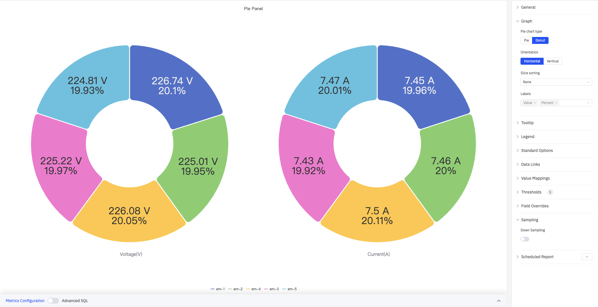
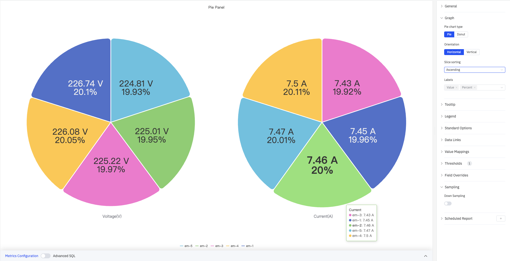
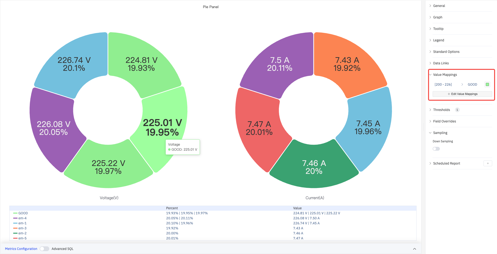
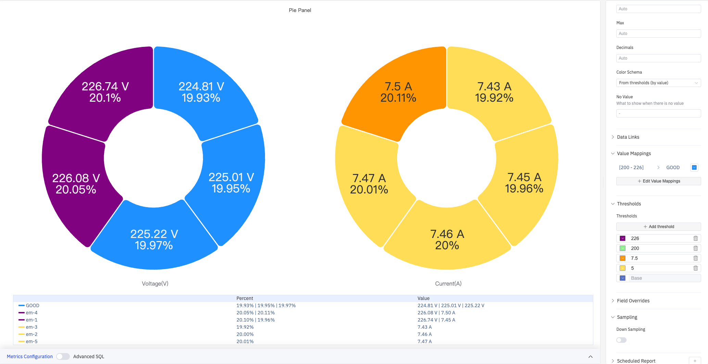

# 4.2.13 饼图

## 4.2.13.1 概述

饼图将圆形按比例分为若干扇形，每个扇形代表其对应类别占总量的百分比。适合展示总体如何分配在少量离散类别中，使各部分的相对贡献一目了然。

饼图支持以**饼图**（实心圆）和**环形图**（中心镂空）两种样式渲染，并排显示多个指标（如电压和电流）时各自独立呈现为一个环形。扇形标签直接在图形上显示数值和百分比。

## 4.2.13.2 适用场景

在以下情况下使用饼图：

- 展示总量如何分布在少量类别（不超过七八个）中
- 各部分的相对比例比绝对数值更重要
- 需要一个直观、简洁的构成分析图表用于报告或仪表盘

在以下情况下应避免使用饼图：

- 类别较多或各类别数值接近（圆弧大小差异难以判断）
- 需要追踪随时间变化的趋势——使用趋势图
- 需要跨多个类别进行精确比较——使用柱状图

## 4.2.13.3 配置

### 图形配置

图形配置控制饼图的类型、排列方式和标签内容：

上图展示了**饼图**（实心圆）类型，**扇区排序**设置为升序——最小扇形位于起始位置，最大扇形位于末尾。悬停时提示框显示全部系列数值。

| 设置 | 说明 |
|---|---|
| **饼图类型** | 渲染样式：饼图（实心圆）或环形图（中心镂空），默认环形图 |
| **布局** | 整体排列方向：水平或垂直 |
| **扇区排序** | 扇形的排列顺序：降序（最大扇形在前）、升序（最小扇形在前）、无（保持数据原始顺序） |
| **标签内容** | 直接显示在扇形上的信息，可多选：名称、数值、百分比；默认显示数值和百分比 |

### 提示框与图例

提示框和图例配合使用，为扇形数据提供补充信息：

上图启用了**表格模式**图例，底部显示各系列的百分比和数值列。悬停时提示框显示指定系列（em-2）在 Voltage 指标中的具体数值。

**提示框设置：**

| 设置 | 说明 |
|---|---|
| **提示框模式** | 悬停显示方式：单个、全部、隐藏 |
| **最大宽度** | 提示框最大宽度（像素） |

**图例设置：**

| 设置 | 说明 |
|---|---|
| **显示** | 显示模式：列表、表格、隐藏 |
| **位置** | 放置位置：底部、右侧 |
| **宽度** | 图例区域宽度（像素，仅右侧布局时可用） |
| **图例值** | 在表格模式下显示的统计数据，可多选：最大值、最小值、平均值、总和、百分比等 |

### 值映射

值映射将数据值替换为自定义的显示文本并赋予颜色。下图中，[200–226] 范围内的电压值被映射为绿色"GOOD"标签：

点击**编辑值映射**可添加多条映射规则。

| 映射类型 | 说明 |
|---|---|
| **值** | 精确匹配特定数值或文本 |
| **范围** | 匹配指定数值范围 |
| **正则表达式** | 使用正则表达式匹配并替换 |
| **特殊值** | 匹配 null、NaN、布尔值、空字符串等 |
| **其他值** | 匹配所有未被前面规则覆盖的值 |

### 标准配置与颜色阈值

颜色阈值根据数据值动态改变扇形颜色。下图中，电压按 200、226 两个边界被划分为三色段；电流按 5、7.5 两个边界分为黄色和橙色段：

**标准配置：**

| 设置 | 说明 |
|---|---|
| **最小值** | 数据渲染的参考最小值（留空则从数据自动计算） |
| **最大值** | 数据渲染的参考最大值（留空则从数据自动计算） |
| **小数位数** | 数值显示的小数位数（留空则自动判断） |
| **配色方案** | 系列颜色分配策略：单色、单色深浅映射（按系列）、阈值取色（按值）、经典调色板、经典调色板（按系列名）、自定义调色板 |

**颜色阈值设置：**

| 设置 | 说明 |
|---|---|
| **添加阈值** | 新增一条阈值规则，每条规则包含数值边界和对应颜色 |

颜色阈值生效需在标准配置中将**配色方案**设置为**阈值取色（按值）**。

### 数据链接

数据链接为图表上的数据点附加可点击的跳转 URL：

| 设置 | 说明 |
|---|---|
| **标题** | 链接的显示名称 |
| **URL** | 跳转目标地址，支持变量插值 |
| **在新标签页打开** | 是否在新浏览器标签页中打开链接 |
| **一键跳转** | 启用后点击数据点直接跳转（同时只能有一条链接启用此功能） |

### 个性化配置

个性化配置允许对单个指标覆盖全局图形设置。选定目标指标名称后，可添加以下属性进行覆盖：系列样式、线宽、填充透明度、线条透明度、线条颜色、点大小、显示点、连接空值、堆叠、渐变模式、显示值。

### 降采样

当查询结果中的数据点过多时，可启用降采样减少渲染数量以提升显示性能：

| 设置 | 说明 |
|---|---|
| **启用降采样** | 开关，默认关闭 |
| **最大数据点数** | 降采样后保留的最大数据点数量 |
| **聚合函数** | 降采样时使用的聚合方式（如 AVG、MAX、MIN 等） |

### 定时报告

饼图面板支持定时报告功能，可将图表以图片形式定期发送到指定邮箱或飞书群。配置入口位于面板右上角菜单中。

## 4.2.13.4 使用示例

**按设备的电压分布。** 将五台设备（em-1 至 em-5）的电压和电流分别显示为两个并排的环形图，各扇形大小反映各设备的数值占比。启用阈值取色后，超出正常范围的设备扇形将突出显示。

**按站点的产量占比。** 运营经理按站点名称添加维度分组，以总产量为指标。环形图显示每个站点对整体产量的贡献，图例表格同时列出各站点的具体数值和百分比。

**按严重程度的事件分布。** 运营团队按报警严重程度类别添加维度分组。饼图显示紧急、警告和信息类事件各占多少比例——适用于班次总结报告。
