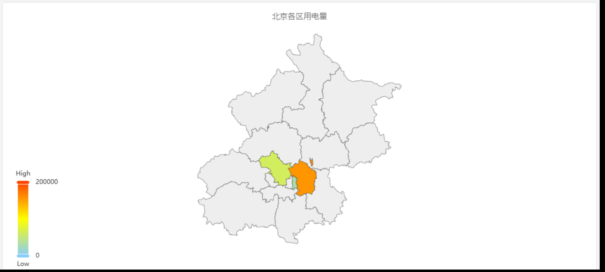
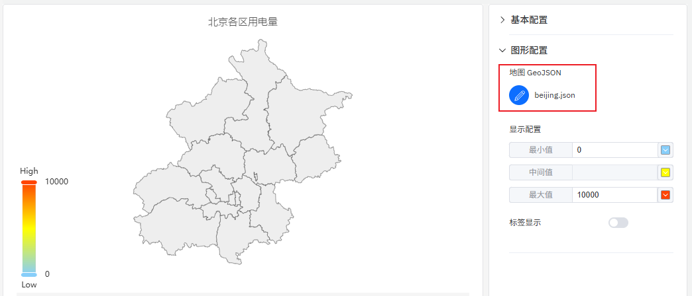
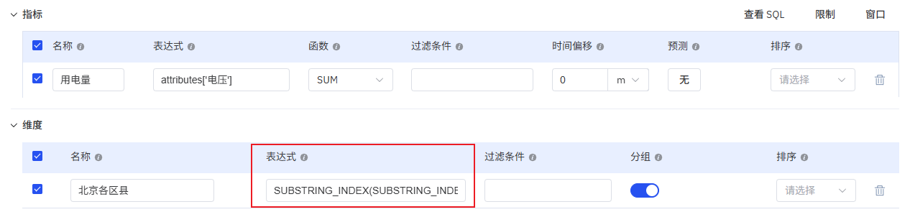

# 4.2.14 地图

## 4.2.14.1 概述

地图以分级统计地图的形式展示地理数据——根据各区域的关联指标值用不同深浅的颜色进行填充。它适用于数据按地理区域组织时的空间分析：国家、省份、城市、区县，或由 GeoJSON 文件定义的自定义区域。

每个区域的颜色深浅反映指标值——颜色越深或越饱和表示数值越高。色阶图例显示颜色与数值的对应关系。

## 4.2.14.2 适用场景

在以下情况下使用地图：

- 元素按地理区域组织，需要在这些区域上可视化某个指标
- 需要回答"哪个区域的能耗最高？"或"哪些站点表现不佳？"之类的问题
- 拥有与运营区域匹配的自定义地理边界定义（GeoJSON）

对于时间序列趋势分析，请使用趋势图。对于跨类别的非地理比较，请使用柱状图。

## 4.2.14.3 配置

### 编辑模式工具栏

除[通用编辑模式控件](../01-panels.md#414-面板编辑模式)外，地图还增加了以下控件：

| 控件 | 说明 |
|---|---|
| **保存为图片** | 将当前预览下载为 PNG 图片 |
| **全屏** | 将编辑器预览扩展为填满浏览器窗口 |
| **解读面板** | 对当前预览数据运行 AI 分析 |

### 图形设置

#### 地图文件

地图需要 GeoJSON 文件来定义地理区域边界。使用**地图文件**设置上传您的 GeoJSON 文件：

GeoJSON 中每个要素的 `properties` 必须包含一个与元素上地理标识属性相匹配的键。这是地图将每个区域多边形与其对应数据值关联的方式。

#### 显示配置

分级统计地图的颜色渐变通过**显示配置**进行配置，定义三个锚点：

| 设置 | 说明 |
|---|---|
| **地图文件** | 上传或编辑定义区域边界的 GeoJSON 文件 |
| **显示配置** | 颜色刻度：**最小值**（低端的数值和颜色）、**中间值**（中点处的颜色）、**最大值**（高端的数值和颜色）。点击颜色色块进行更改。 |
| **标签显示** | 开关：在地图上显示区域名称标签 |

## 4.2.14.4 使用示例

**按省份统计能耗。** 某能源公司的元素按省份组织。使用省级 GeoJSON 文件的地图展示每个省份的月度总能耗。颜色越深的省份消耗越多，颜色越浅的越少。运营团队可立即识别出哪些省份超出预测。

**按国家统计站点绩效。** 某跨国公司在 20 个国家拥有站点。使用绿色到红色色阶的国家级 GeoJSON 展示每个国家的设备综合效率（OEE）。地图突出显示了需要管理层关注的表现不佳区域。

**城市级传感器覆盖率。** 某智能计量公司在城市各区县部署了电表。区县级 GeoJSON 展示每个区县的活跃电表数量，揭示上报数据电表较少的覆盖空白区域。
