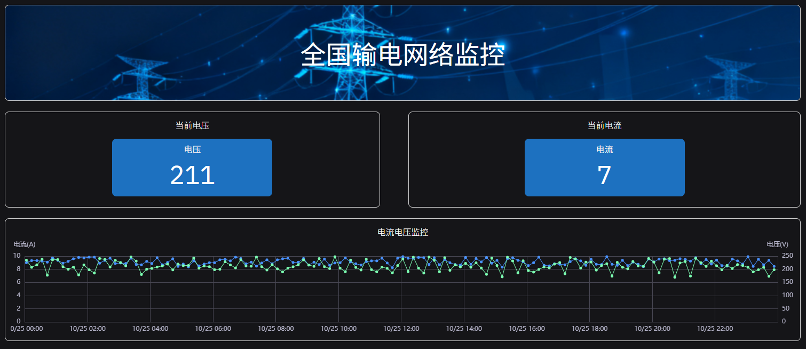
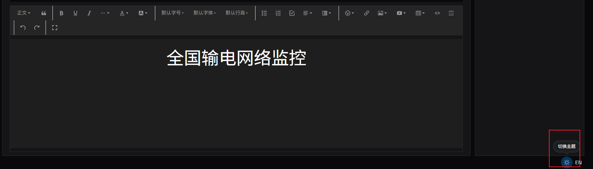
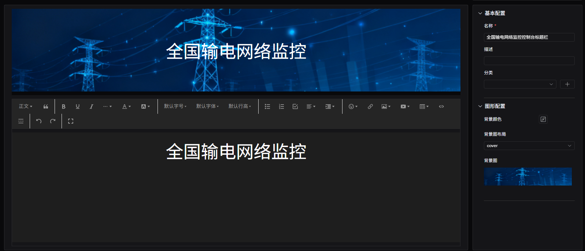

# 4.2.15 富文本

## 概述

富文本面板将图表区域替换为完整的所见即所得（WYSIWYG）文本编辑器。它不显示数据，而是提供一个自由编辑区域，用于嵌入您希望与数据面板并排显示的说明文档、操作指南、参考资料或标注图表。

富文本面板没有数据配置、指标表、维度表、坐标轴、边界值或图例部分。由于不包含图表数据，它不支持解读面板功能。

## 适用场景

在以下情况下使用富文本面板：

- 希望在元素的面板列表中直接嵌入标准操作规程（SOP）文本
- 需要在仪表板的数据面板旁添加背景说明、操作指南或解释性内容
- 希望嵌入参考图片、标注的管道仪表图（P&ID）或外部文档链接
- 正在构建与实时数据并排显示的操作员指南

## 配置

### 编辑模式工具栏

除[通用编辑模式控件](../01-panels.md#414-面板编辑模式)外，富文本面板还增加了以下控件：

| 控件 | 说明 |
|---|---|
| **保存为图片** | 将当前面板内容下载为 PNG 图片 |
| **全屏** | 将编辑器扩展为填满浏览器窗口 |

### 内容编辑器

中间面板变为完整的所见即所得编辑器：

编辑器支持：

- 文字格式：加粗、斜体、下划线、删除线
- 标题（H1–H6）
- 字体大小和字体族
- 文字颜色和背景颜色
- 有序列表和无序列表
- 表格
- 超链接
- 行内图片（上传或通过 URL）
- 视频嵌入

### 图形设置

| 设置 | 说明 |
|---|---|
| **背景颜色** | 面板的背景颜色 |
| **背景图布局** | 背景图的定位方式：无、覆盖、适应或平铺 |
| **背景图** | 上传图片文件作为面板背景 |

## 使用示例

**元素面板上的操作规程。** 水泵元素的面板列表中包含一个富文本面板，内含启动和停机规程。操作员导航到水泵面板时，可以在趋势图旁边直接看到操作规程，无需切换到独立的文档系统。

**仪表板上的标注 P&ID 图。** 工艺仪表板包含一个富文本面板，内含上传的 P&ID 图纸，并标注了关键测量点。操作员可以获取数据面板旁的空间背景信息。

**班次交接记录模板。** 生产线仪表板上的富文本面板提供班次交接记录的结构化模板——安全观察、设备状态、待处理问题——直接嵌入在两个班次共用的操作视图中。
