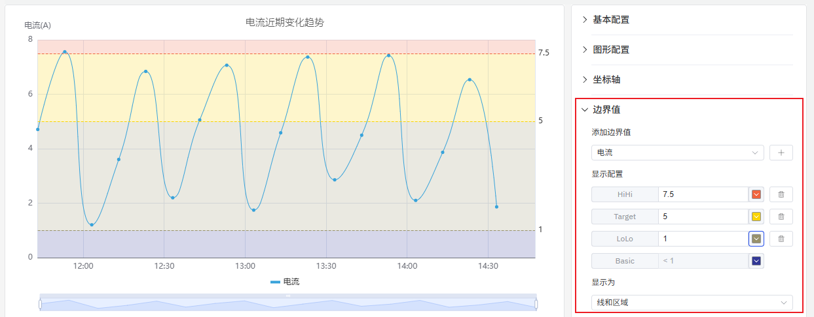

# 趋势图

趋势图是用折线将各个数据点标志连接起来的图表，用于展现数据的变化趋势，尤其适合于时序数据的趋势分析。

## 配置项

### 图形配置

#### 样式

折线的样式，支持`折线`、`平滑曲线`、`阶梯` 等折线样式。其中阶梯线图适合**数据变化具有阶段性、非连续性**的业务场景，比如监测价格变化。

#### 线条样式

如下图，可以调整趋势图的线条样式、线条宽度、透明度和填充。其中线条样式支持`实线`、`虚线`和`点线`，默认为`实线`。累积量的变化趋势适合使用填充，通过填充区域更能反映累积效果。

#### 数据堆叠

多系列指标时，可以堆叠数据来分析一些累加量 (此时开启线条样式里的填充，效果更加)，如下例中对用电量的分析，有两个系列值，分别是居民用电量和工业用电量，开启堆叠后可以观察到总用电的变化趋势。

#### 标签

如下图所示，如果标签过于密集相互重叠则有碍观感，此时可以通过**标签旋转**或**标签间隔**来解决这类问题。

1. 配置标签旋转角度，避免标签重叠

2. 调整标签间隔，降低标签密度

### 坐标轴

坐标轴可配置显示坐标轴名称及其计量单位

在一个图中显示两个指标，如果两个指标的量程具有数量级的差别，会影响其中一个指标的分析效果，如下图所示，当加入电压和电流两个指标，由于电流指标值过小，则无法观测出电流的明显变化趋势。

此时可以启用`右坐标轴`，使用双 Y 轴模式来显示指标。

### 边界值

可以配置边界值，将指标中的安全区域和警戒区域标识出来，更利于分析和观察。

### 图例

可开启在图例中显示最大值、最小值等统计值。

## 配置项增强 roadmap

为了持续提升您的使用体验，我们将在后续的产品更新中，不断增加实用配置，让您能够享受到更丰富、更贴心的分析功能。

| 项目       | 说明                                                         |
|------------|--------------------------------------------------------------|
| 坐标轴比例  | 坐标轴可以设置指数级别，可以线性观察指数增长的指标               |
| 坐标轴单位  | 选择显示单位，以便统一单位来显示指标，比如使用“毫安”来显示电流     |
| 最大值/最小值 | 设置坐标轴显示的最大值和最小值     |
| 指标配色方案  | 目前每个指标的颜色是固定的；后续可提供配色方案，由您决定用什么颜色显示 |
| 图例位置  | 目前图例固定显示在图的正下方，后续可配置显示位置 |
