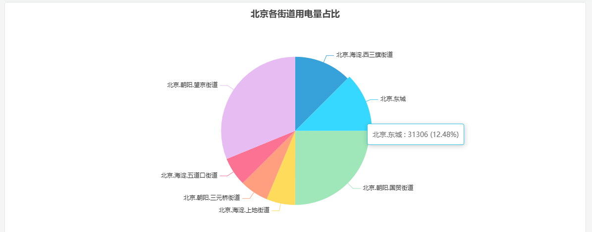

# 饼图

饼图主要用于表现不同类目的数据在总和中的占比，每个弧度表示数据数量的比例。

## 配置项增强 roadmap

为了持续提升您的使用体验，我们将在后续的产品更新中，不断增加实用配置，让您能够享受到更丰富、更贴心的分析功能。

| 项目       | 说明                                                         |
|------------|--------------------------------------------------------------|
| 标签格式化  | 目前标签仅显示聚合的类别名称，可以配置显示更加丰富的内容，比如数值、占比等               |
| 图例位置  | 目前未显示图例，后续可配置是否显示及显示位置 |
| 饼图样式  | 可配置更加丰富的样式，比如显示为圆环或圆饼 |
