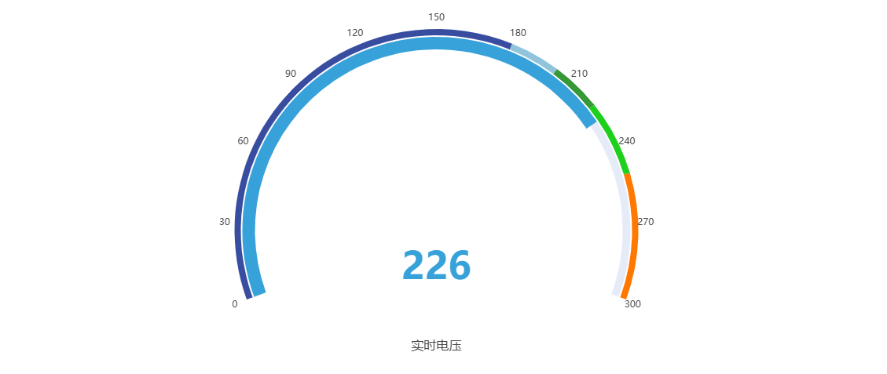
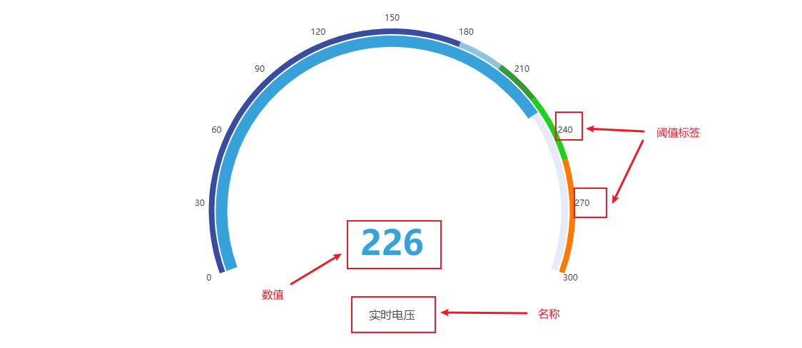
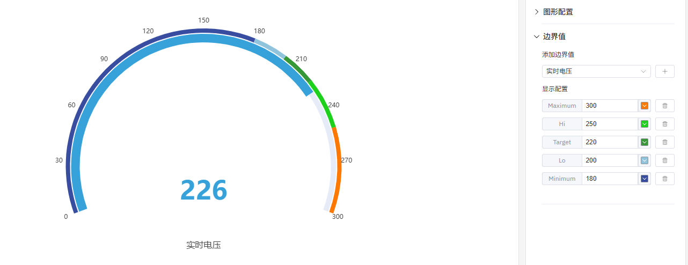

# 仪表盘

仪表盘用于实时数据监控，可以在表盘上展示出不同的警示区域，方便快速判断当前状态。

## 配置项

### 图形配置

#### 布局

当一个面板中有多个仪表盘时，仪表盘优先按照哪个方向排序显示，可支持`垂直`和`水平`方向排序显示，默认为`水平`方向。

#### 阈值标签

可配置是否显示阈值标签，默认不显示。

#### 显示名称和字体大小

可配置是否显示名称，以及名称字体大小。

#### 数值大小

可调整数值字体大小。

### 边界值

通过边界值的配置，可以在仪表盘上划分不同的区域，视觉上可以快速分辨出当前监测状态。

## 配置项增强 roadmap

为了持续提升您的使用体验，我们将在后续的产品更新中，不断增加实用配置，让您能够享受到更丰富、更贴心的分析功能。

| 项目       | 说明                                                         |
|------------|--------------------------------------------------------------|
| 表盘主题  | 更加丰富的表盘样式，比如指针类盘，速度盘，气温盘等               |
| 最小值/最大值  | 可控制显示仪表盘的数值范围 |
