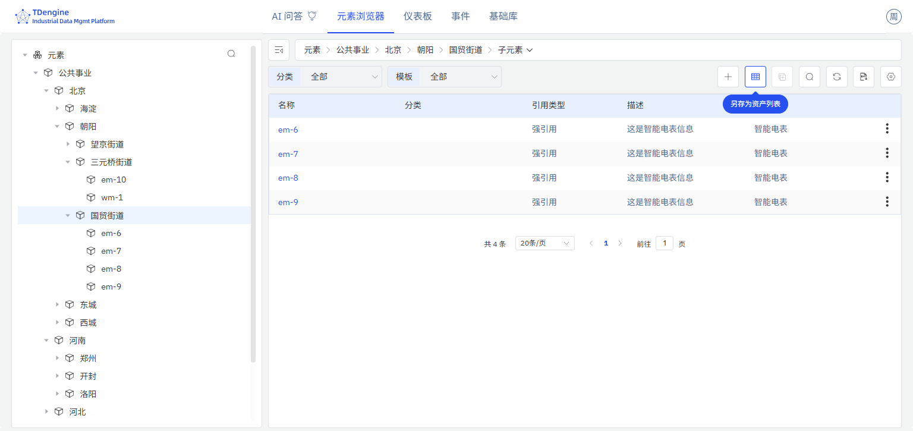
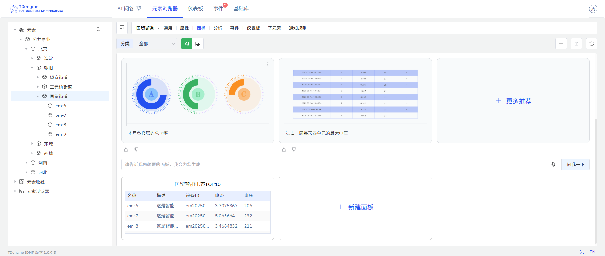

# 资产列表

资产列表使用表格用来展示企业的资产信息及其最新状态和采集值。

## 配置项

### 配置入口

1.将“元素查询结果”转换为资产列表

2.子元素列表转换为资产列表

### 资产列表配置

如图，可以配置资产列表的查询条件、显示的字段及其顺序，字段包括 IDMP 资产自身管理属性，也包括引用属性(TDengine Tags 和 TDengine Metrics)。查询条件中，必须指定资产类型(模版)，才能选择对应的属性字段。

如果通过`子元素列表`转换为资产列表，保存时则直接保存为当前元素下的面板，在当前元素面板下可以查询到。如果通过`元素查询结果`转换为资产列表，则需要指定保存位置,指定后保存为指定元素下的面板。

### 资产列表面板

资产列表保存成功，在面板中可以看到资产列表的展示效果，如图所示：

资产列表面板支持修改、删除等，也支持添加到仪表板中。
