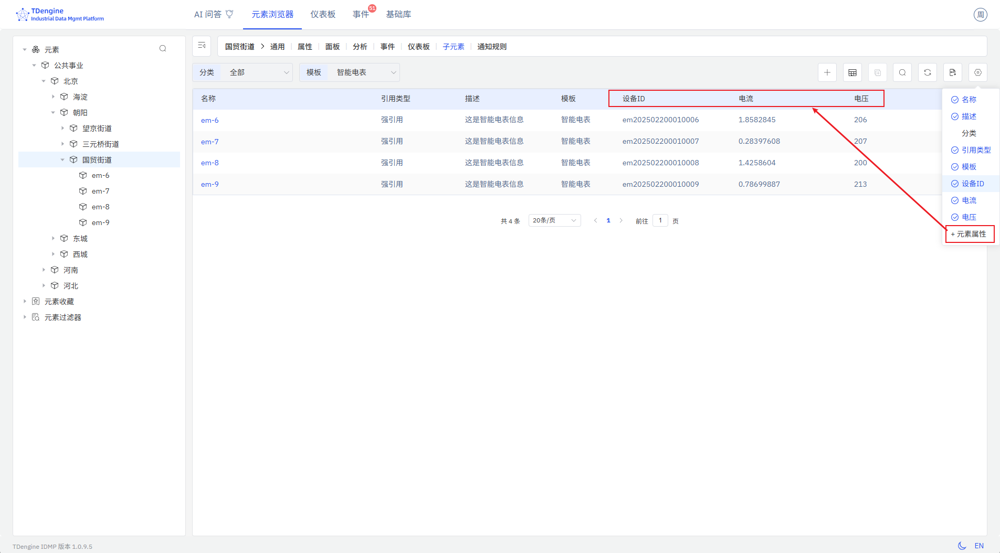

# 资产列表

资产列表使用表格用来展示企业的资产信息及其最新状态和采集值。资产列表作为面板的一种类型，可以单独保存为某个元素下的资产列表面板，也可以添加到仪表板中。

## 保存资产列表面板

### 元素查询结果保存为资产列表

如果检索出的元素来自同一个元素模板，则可以添加元素属性到列表中；也可以点击现有的列名，去除不需要的列。

配置好查询条件，选择要显示的列后，可以点击“另存为资产列表”按钮，将当前的查询结果保存为资产列表面板。

点击后，弹出保存资产列表的对话框，可以选择保存位置。

### 子元素列表保存为资产列表

在左侧选择某个元素后，点击动作区的“子元素列表”图标，进入子元素列表页面。如果所有子元素都来自同一个元素模板，则可以添加元素属性到列表中；也可以点击现有的列名，去除不需要的列。

选择要显示的列后，可以点击“另存为资产列表”按钮，将当前的子元素列表保存为当前元素的资产列表面板。切换到“面板”标签页，可以看到新保存的资产列表面板。

## 修改资产列表面板

如图，可以对资产列表进行如下修改：

* **查询条件**：其中的资产类型（模版）必填，只有指定了资产类型，才能选择对应的属性字段。
* **显示字段**：可配置要显示的字段及其顺序。字段包括 IDMP 资产自身管理属性，也包括引用属性（TDengine Tags 和 TDengine Metrics）。

## 资产列表面板

资产列表保存成功，在面板中可以看到资产列表的展示效果，如图所示：

