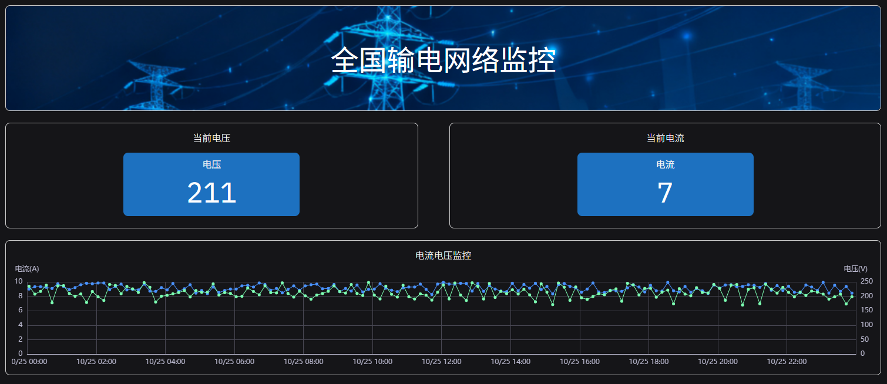
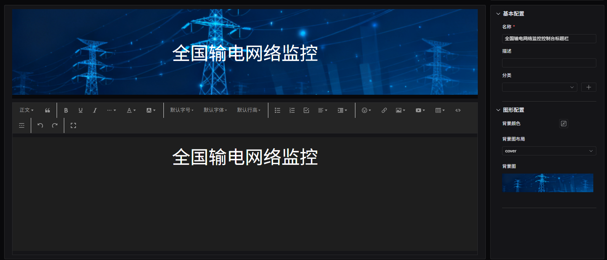
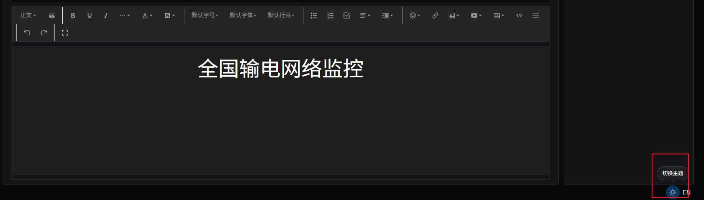

# 富文本

富文本可以自定义文字和背景等，往往用来装饰 Dashboard 的标题。如图所示，多文本在 dashboard 中的标题示例。

## 配置项

### 图形配置

#### 背景颜色

配置富文本面板的背景色。

#### 背景图及其布局

可上传背景图，布局可设置背景图通过缩放或者重复平铺来适应面板大小。

#### 文本编辑技巧

如果背景色或者背景图片为暗色系，在编辑文本时必须特殊设置文字颜色，否则默认的黑色字体颜色在深色背景上识别度很低。如果设置字体为白色，此时在系统主题为亮色系时，编辑区域内的文字不可见，可将系统主题切换至暗色系进行编辑。

