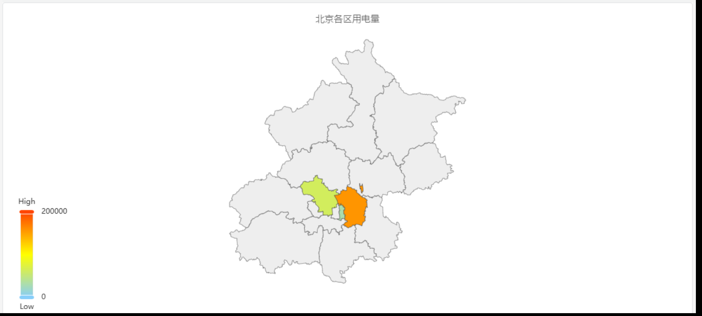

# 地图

地图主要用于地理区域数据的可视化，展示不同区域的统计数据，比如用电量。

## 配置项

### 图形配置

#### 地图文件

上传地图文件，地图文件需要 GeoJSON 格式。

#### 显示配置

可以配置最小值及其对应的颜色，最大值及其对应的颜色，以及过度颜色。在地图上每个地区的颜色，会根据其统计值在这个色带中位置所对应的颜色来渲染。

#### 标签显示

开启后，则直接在地图上显示地名和统计值。

## 配置项增强 roadmap

为了持续提升您的使用体验，我们将在后续的产品更新中，不断增加实用配置，让您能够享受到更丰富、更贴心的分析功能。

| 项目       | 说明                                                         |
|------------|-------------------------------------------------------------|
| 地图控制 | 可缩放地图、移动地图等        |
| 地图多图层  | 可多图层显示地图          |
| 在线地图  | 可接入在线地图          |
