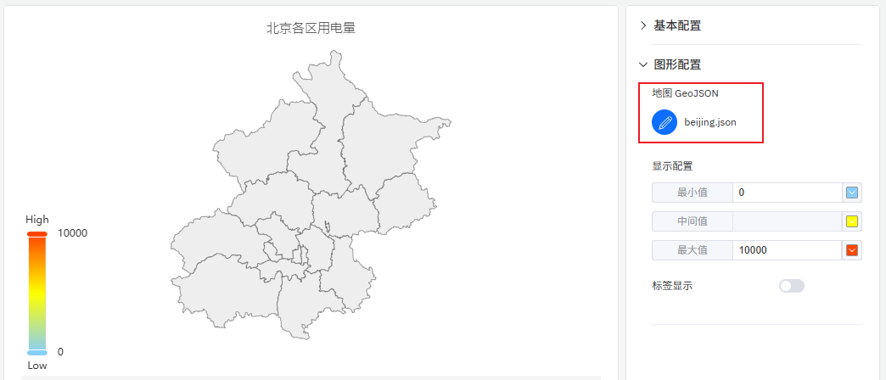
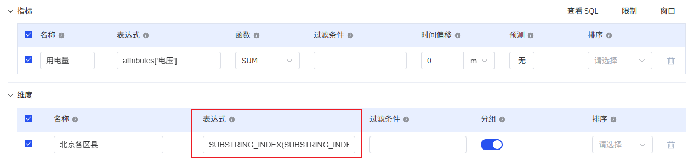

# 地图

地图主要用于地理区域数据的可视化，展示不同区域的统计数据，比如北京市各区县用电量。

## 配置项

### 图形配置

#### 地图文件

上传地图文件，地图文件需要 GeoJSON 格式。展开“图形配置”，点击地图上传按钮，选择 json 格式的地图文件后上传，则在中间主区域显示地图，地图支持缩放和拖动。

地图数据需要按照地图中的区域名称来汇总数据。常用的数据配置方式如下图所示，按照地址来汇总，如果地址数据和地图中区域名称无法直接匹配，则需要使用表达式对地址数据进行处理。

#### 显示配置

可以配置最小值及其对应的颜色，最大值及其对应的颜色，以及过度颜色。在地图上每个地区的颜色，会根据其统计值在这个色带中位置所对应的颜色来渲染。

#### 标签显示

开启后，则直接在地图上显示地名和统计值。

## 配置项增强 roadmap

为了持续提升您的使用体验，我们将在后续的产品更新中，不断增加实用配置，让您能够享受到更丰富、更贴心的分析功能。

| 项目       | 说明                                                         |
|------------|-------------------------------------------------------------|
| 轨迹回放    | 可回放指定时间段内的运行轨迹        |
| 地图多图层  | 可多图层显示地图          |
| 在线地图    | 可接入在线地图          |
