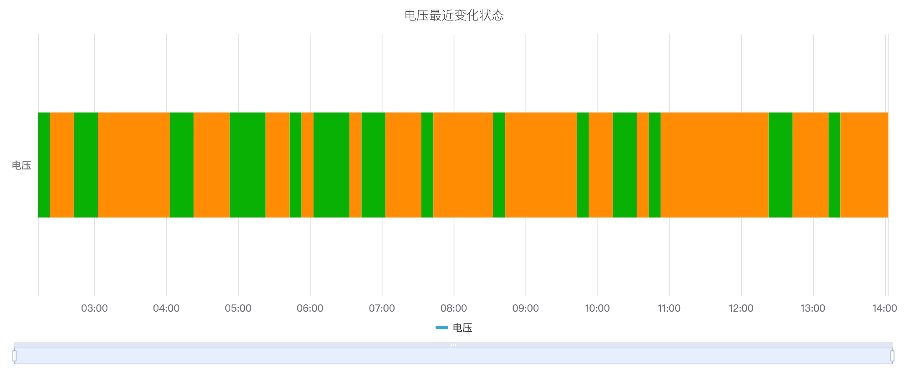
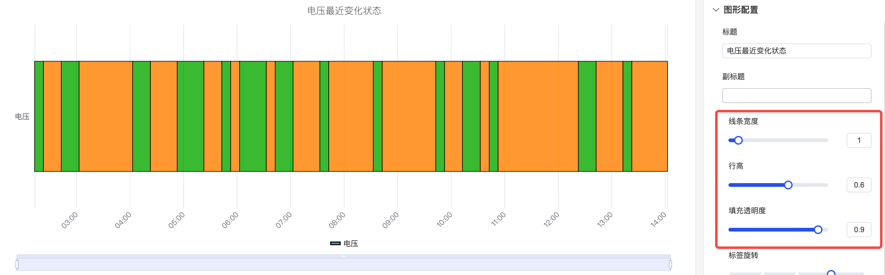
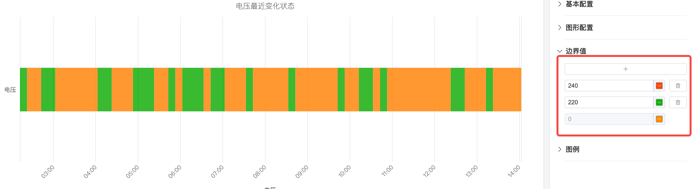
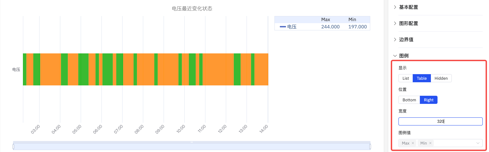

# 状态时间线图

状态时间线图是一种用于可视化离散状态（或类别）如何随时间变化的图表。 它强调的是状态在特定时间段内的持续和转换。

## 配置项

### 图形配置

#### 样式

#### 线条样式

如下图，可以调整时间状态线图的线条宽度、行高、填充透明度、标签旋转。其中行高默认占图表的三分之一，最大为百分百，撑满整个图表。

### 边界值

可以配置边界值，自定义指标中的值的范围用不同的颜色作为一个状态标识出来作为一种状态，更利于分析和观察。

### 图例

可配置显示样式、位置、最大值、最小值等统计值，其中当位置在 Right 且为 Table 模式时，还可以调整 Table 的宽度。

## 配置项增强 roadmap

为了持续提升您的使用体验，我们将在后续的产品更新中，不断增加实用配置，让您能够享受到更丰富、更贴心的分析功能。

| 项目       | 说明                                                         |
|------------|--------------------------------------------------------------|
| 指标配色方案  | 目前每个指标的颜色是固定的；后续可提供配色方案，由您决定用什么颜色显示 |
