# 散点图

散点图的核心价值在于探索和展示两个变量之间的关系。散点图的主要功能包括通过观察点的分布形态，可以判断两个变量之间是否存在关联，以及关联的方向和强度、发现异常值、观察数据分布，进行聚类分析和回归分析（线性回归、指数回归、多项式回归）。

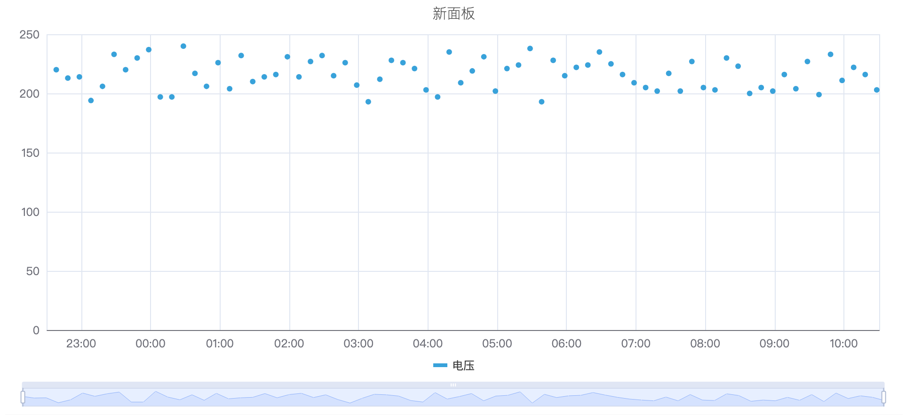

## 配置项

### 图形配置

#### 样式

散点的样式，默认是圆点，支持下拉选择 `心形`、`笑脸`、`恶魔` 等八种图案样式。

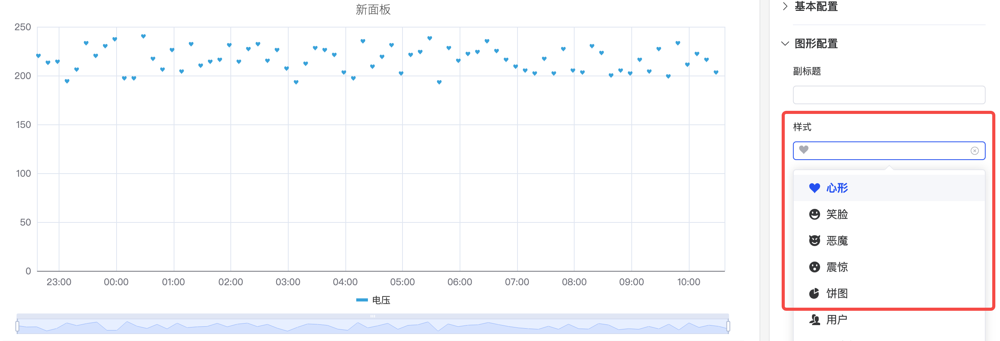

#### 点大小和透明度

如下图，可以调整散点图的点的大小和透明度来调整图的展示。

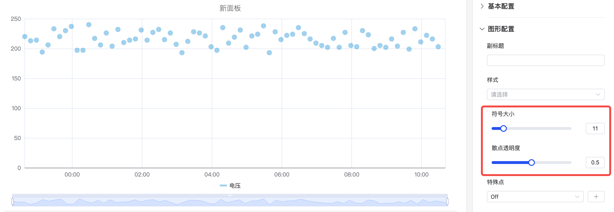

#### 特殊点位

入下图，可以选择一个指标选择显示最大值最小值的特殊标记，通过自定义颜色来进行标识。

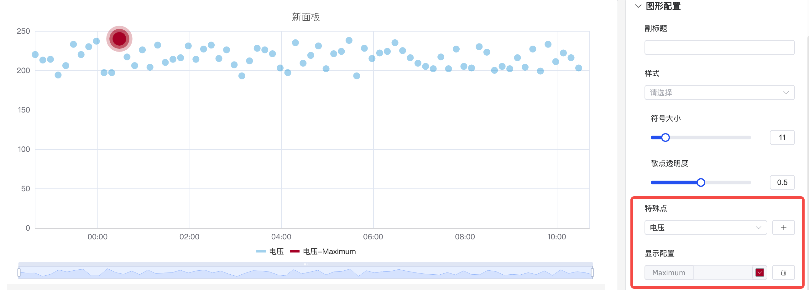

#### 标签

如下图所示，如果标签过于密集相互重叠则有碍观感，此时可以通过**标签旋转**或**标签间隔**来解决这类问题。

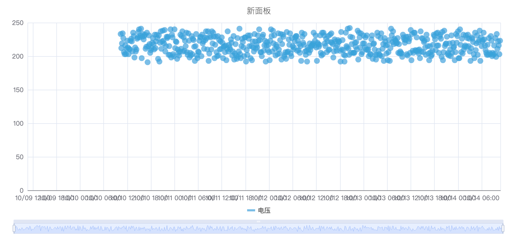

1. 配置标签旋转角度，避免标签重叠

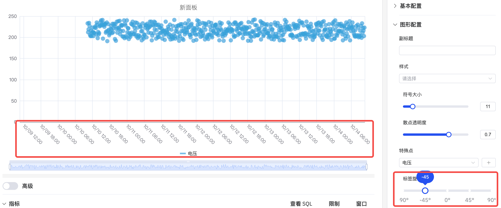

2. 调整标签间隔，降低标签密度

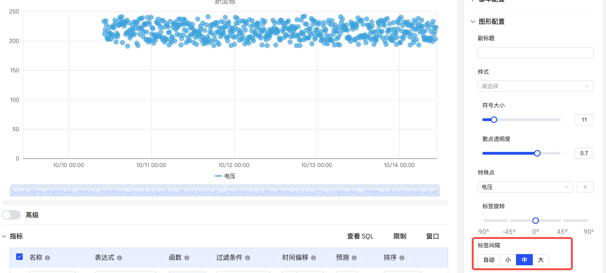

### 坐标轴

坐标轴可配置显示坐标轴名称及其计量单位

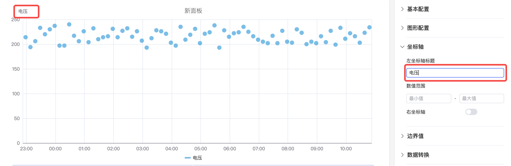

在一个图中显示两个指标，如果两个指标的量程具有数量级的差别，会影响其中一个指标的分析效果，如下图所示，当加入电压和电流两个指标，由于电流指标值过小，则无法观测出电流的明显变化趋势。

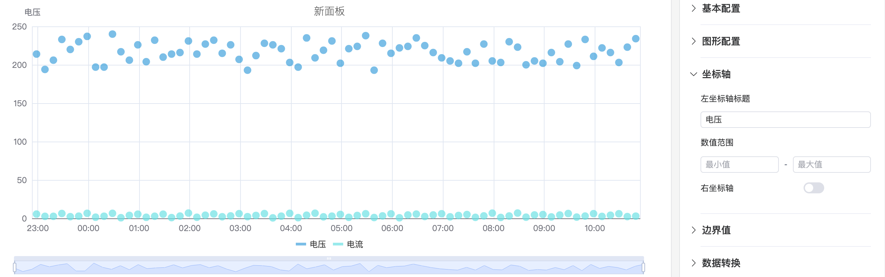

此时可以启用`右坐标轴`，使用双 Y 轴模式来显示指标。

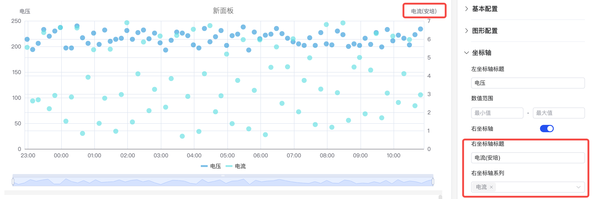

### 边界值

可以配置边界值，将指标中的安全区域和警戒区域标识出来，更利于分析和观察。

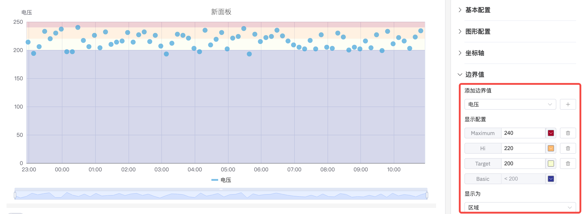

### 聚类分析

选择数据转换中的数据聚合，使用不同颜色的点来区分不同的类别或组别从而达到聚类分析效果。

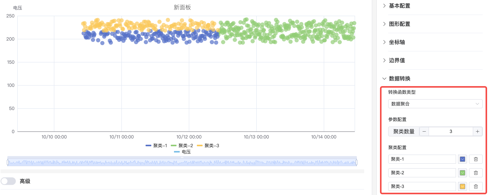

### 回归分析
在图中添加一条最符合数据点趋势的直线或曲线（如线性回归线），帮助更清晰地展示变量关系的总体趋势。可配置的函数有 `线性回归`、`指数回归`、`多项式回归`，其中多项式回归可自定义多项式阶数。

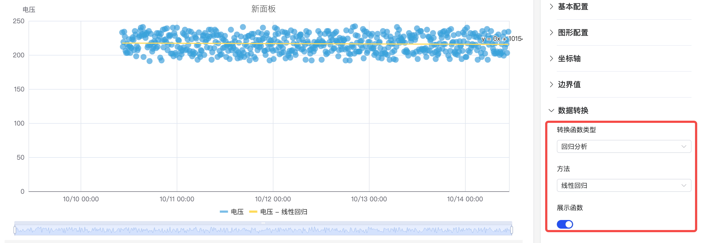

### 图例

可配置显示样式、位置、最大值、最小值等统计值，其中当位置在 Right 且为 Table 模式时，还可以调整 Table 的宽度。

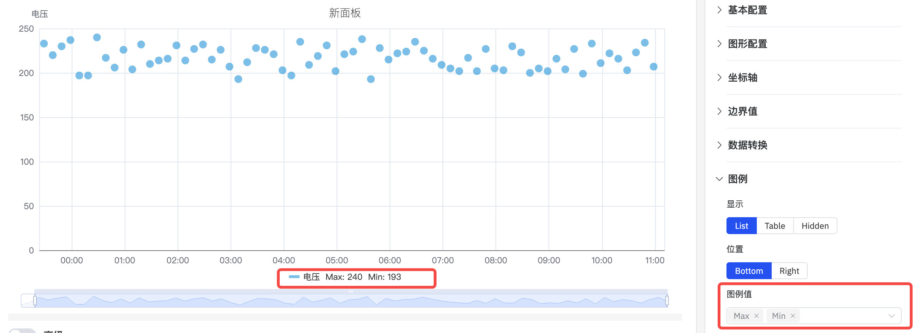

## 配置项增强 Roadmap

为了持续提升您的使用体验，我们将在后续的产品更新中，不断增加实用配置，让您能够享受到更丰富、更贴心的分析功能。

| 项目       | 说明                                                         |
|------------|--------------------------------------------------------------|
| 回归分析函数  | 支持更多的拟合函数               |
| 坐标轴单位  | 选择显示单位，以便统一单位来显示指标，比如使用“毫安”来显示电流     |
| 最大值/最小值 | 设置坐标轴显示的最大值和最小值     |
| 指标配色方案  | 目前每个指标的颜色是固定的；后续可提供配色方案，由您决定用什么颜色显示 |
