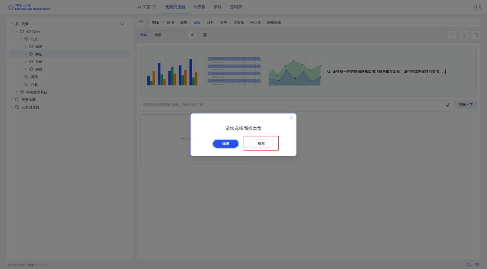
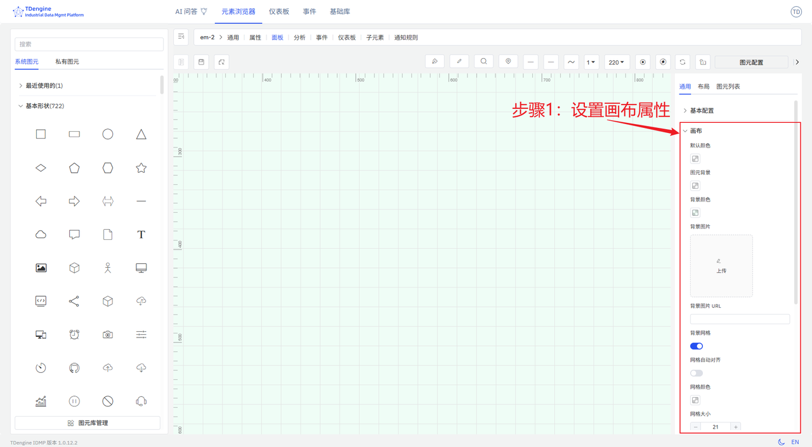
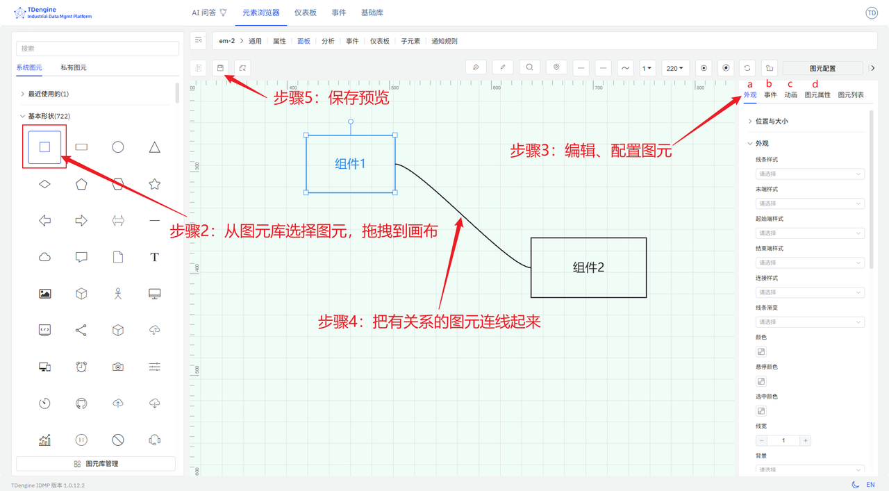

# 5.1 创建组态

选择元素，然后选择面板，点击`新建面板`，然后选择`组态`即进入组态编辑界面。

设计组态，分为如下步骤：

1. 设置画布的属性，包括布局、颜色、背景颜色、网格等
   
2. 从图元库选择图元，拖拽到画布
3. 编辑、配置图元，包括：
   - 给图元配置文本、颜色、背景颜色等
   - 给图元配置事件，设置事件类型（比如点击、图元值变化）、事件行为（比如设置图元属性、播放动画）、触发条件（比如阈值判断），让数据驱动图元的展示效果
   - 给图元加上动画效果，系统内置了上下跳动、左右跳动、心跳、旋转等多种动画效果，你可以自定义动画。
   - 配置图元属性，包括值、进度、进度颜色、状态等，并且与 IDMP 元素的属性绑定，这样采集的数据就能实时驱动图元的展示。

4. 把有关系的图元连线起来，可以配置连线类型以及连线动画
5. 编辑过程中，可以预览，编辑完后，保存即可

这些步骤不是需要固定按照顺序执行，可以打乱。
