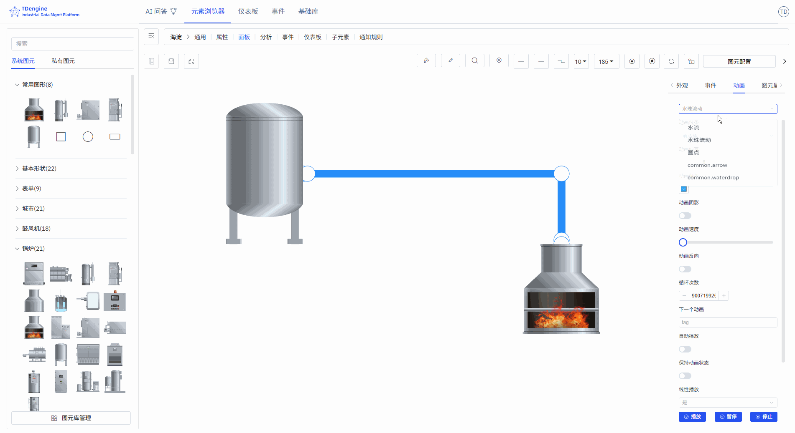

# 5.3 连线

连线用于表示设备之间的物料流动、信号传递或逻辑关系。例如：

1. 管道连接表示物料输送
2. 虚线连接表示信号传输
3. 不同颜色的连线表示不同介质

通过连线动画，您可以直观展示物料的实时流动状态。

## 5.3.1 连线的绘制

### 5.3.1.1 钢笔绘制连线

选择线型，再点击钢笔，可激活使用某一个线型的绘制。

开始：单击左键；

暂停：单击右键 或 enter；

结束：esc。

#### 曲线、线段、直线、脑图曲线

可以使用钢笔绘制不同类型的曲线，也可以选中一条连线，修改其线型。

#### 横线

按下快捷键 Shift，点击鼠标左键绘制，右键结束绘制（连线类型选择直线）。

#### 竖线

按下快捷键 Ctrl，点击鼠标左键绘制，右键结束绘制（连线类型选择直线）。

#### 斜线

连线类型选择直线，选择钢笔，鼠标左键点击绘制起点，按住快捷键 Ctrl+Shift，鼠标移动角度（以 15° 为递增角度），左键单击绘制第二个点，右键结束绘制。

### 5.3.1.2 铅笔绘制连线

使用铅笔可以绘制任意线型。点击"铅笔"激活铅笔工具，在画布上按下左键开启绘制，将会按照鼠标移动轨迹绘制连线，松开鼠标结束绘制。

### 5.3.1.3 连接图元

鼠标悬浮在某一个图元上，激活锚点，在某一个锚点上按下鼠标拖拽到另一个图元的锚点上，松开鼠标，即可在两个图元的锚点间绘制一条曲线。

### 5.3.1.4 连线变图元

在连线上点击鼠标右键，选择"转换为节点"。

## 5.3.2 切割/合并连线

切割连线：选中线，鼠标移入要断开的线锚点，点击，按下 S 键。

合并连线：线连接线时，拖动当前选中连线连接端，对齐另一条连线连接端，按下 Alt 键，鼠标抬起，结束 Alt 键。

## 5.3.3 连线样式

选中连线后，在右侧属性配置区域可设置连线的外观样式：

- 线条样式：实线、虚线
- 连线类型：曲线、折线、直线
- 连接样式：斜角、圆角、默认
- 线条渐变：无、线性渐变
- 线条颜色、浮动颜色、选中颜色
- 线条宽度
- 背景：纯色背景、线性渐变、径向渐变
- 背景颜色、浮动背景颜色、选中背景颜色
- 透明度：0-1
- 锚点颜色、锚点半径（≥0）
- 阴影颜色、阴影模糊、阴影 X 偏移、阴影 Y 偏移
- 边框颜色、边框宽度（≥0）

## 5.3.4 连线动画

IDMP 为连线内置了三种动画效果，让画面更有动效。

- 动画效果：水流、水珠流动、圆点。
- 动画线宽（≥0），动画颜色，动画速度，反向流动，循环次数。
- 下个动画：tag，自动播放，保持动画状态，线性播放：是/否。

