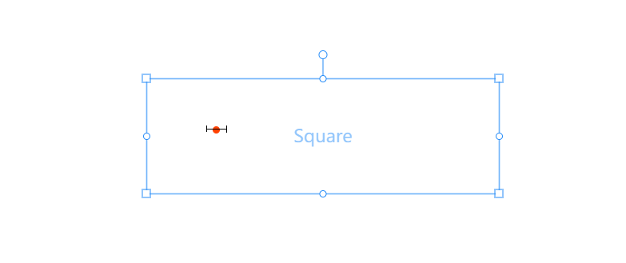
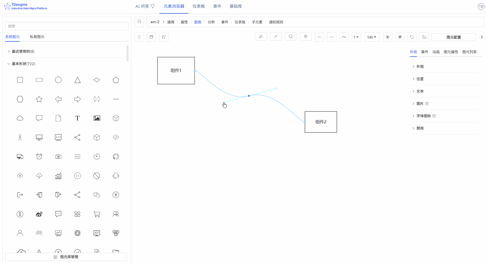

# 5.4 锚点

锚点是保持设备连接的"魔术扣"，确保当您移动设备图元时，连接的管线会自动跟随调整，保持画面整洁。

## 添加/删除锚点（A）

图元和连线都可以添加/删除锚点。

键盘按下快捷键"A"，鼠标移入图元，点击鼠标左键即可添加锚点。

键盘按下快捷键"A"，鼠标移入锚点，呈现如下状态，点击鼠标左键，可以删除锚点。

## 移动锚点（G）

将光标移动到锚点上，按一下快捷键 G，拖动鼠标完成锚点移动。

## 手柄

### 手柄的作用

手柄可以精准调整局部形态，不会破坏曲线其他区段的形状，支持对曲线细节进行精细化微调。

1. **控制曲线弯曲方向**：手柄的指向决定曲线在该锚点处的进出方向，曲线会沿手柄延长线自然过渡，避免生硬折角。
2. **调节曲线弧度与曲率**：拖动手柄改变长度与角度，可直接调整曲线的弯曲程度：手柄越长，曲率越平缓；手柄越短，曲率越陡峭。
3. **实现平滑过渡与尖角切换**：双侧对称手柄：可制作连续、流畅的平滑曲线；单侧独立调节：可在同一锚点处实现折线 + 曲线的混合效果，满足复杂造型需求。

### 添加手柄（H）/ 删除手柄（D）

点击连线上的锚点，键盘按下快捷键 H 可以添加手柄，来调节连线。

激活手柄状态下，键盘按下快捷键 D 可以删除手柄。

激活手柄状态下，键盘按一下 Shift 键，切换三种不同的手柄类型：

1. 两端手柄完全对称
2. 一端手柄可以任意伸缩长度
3. 一端手柄可以任意伸缩长度和变换角度

## 自动锚点

在工具箱中点击"自动锚点"按钮，激活自动锚点。此时在画布中连线，此连线两端如果没有锚点，则自动找最近的锚点自动连接。

## 禁用锚点

禁用锚点，即不显示锚点。
