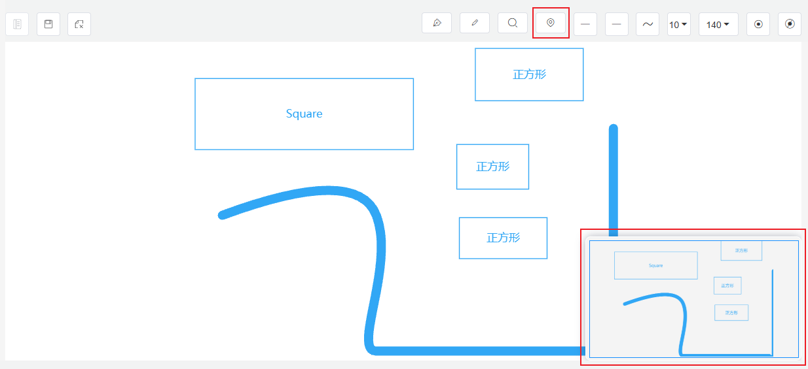

# 工具箱

## 钢笔

1. 开始：单击左键
2. 暂停：单击右键 或 enter
3. 结束：esc
4. 闭合/取消闭合：enter

## 铅笔

1. 开始：连续拖动左键
2. 暂停：释放左键
3. 结束：esc
4. 闭合/取消闭合：enter

## 放大镜

用来观察图中细节。

## 鹰眼地图（缩略图）

组态图的全局视图，鼠标点击鹰眼地图，可以在画布中快速切换中心位置。

