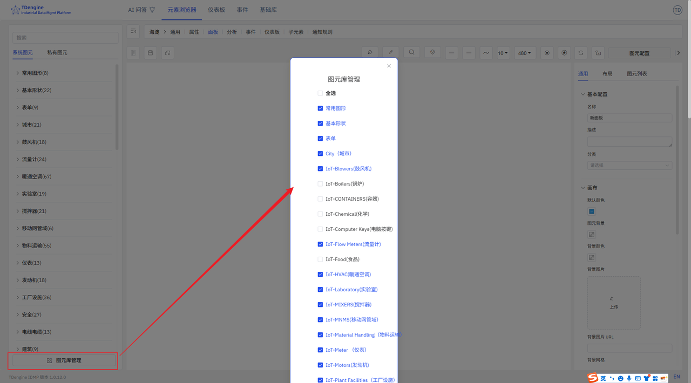

# 5.7 图元库

IDMP 系统已经包含了基础图形库和一些行业的图元库。在您使用过程中如果有更多需求，可以自己制作图元上传，也可联系 IDMP 团队，我们可以提供相应的设计支持。

## 5.7.1 系统图元库

IDMP 内置的图元库，能满足大部分行业的基本需求。格式有三种：原生代码（JS）、阿里字体（iconfont）、图片（svg、gif），video 标签支持 MP4、WebM、Ogg 三种格式。

## 5.7.2 私有图元库

IDMP 组态软件图形库是一种可扩展、开放性的图形库，可根据不同的需求定制各种酷炫的组件效果和场景。支持创建图元库，上传图元等。

## 5.7.3 图元库管理

图元库管理可以配置是否显示图元库，可以仅显示您所需要的图元库。

