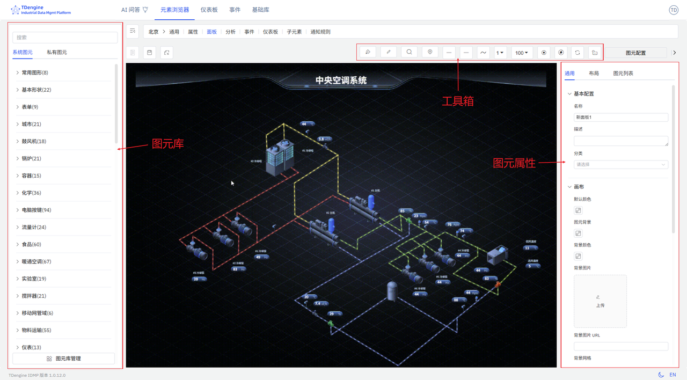

# 组态面板

TDengine IDMP 支持 Grafana 风格的面板之外，还支持工业场景流行的组态，让业务人员通过"拖拉拽"的形式"零代码"实现 Web 组态、SCADA 等解决方案，可视化地呈现设备、流程的当前运行状态。目前它支持 2D 与 2.5D，今后将支持 3D。它与 IDMP 的资产模型无缝结合，能快速交付方案、降低开发成本。它具有如下的特点：

1. **直观易用的拖拽编辑**：无需技术背景，像搭积木一样轻松创建监控画面
2. **智能数据驱动**：配置一次即可让实时数据自动更新画面，减少重复操作
3. **丰富的动画效果**：内置多种动画，支持自定义，让监控画面生动直观
4. **灵活的状态管理**：通过数据变化自动切换设备状态，如运行/停止/报警
5. **可扩展的图形库**：支持上传自定义图形（JS、SVG、图片等），满足特殊需求
6. **强大的性能表现**：单画面可支持上万个图元，满足大型工业场景需求

下面是一个典型的组态编辑界面：

整个编辑画面由几大块组成：

1. **画布**：画布即中央的绘画区域，将图元拖拽到画布进行编辑，绘制组态图。画布有各种属性，比如背景颜色、网格、标尺等，他们都可以个性化配置。
2. **图元**：它是画布的基本单元，图形表达的基本元素，图上的各种设备、组件都是图元。图元有各种属性，比如颜色、背景颜色、大小、显示的文本、进度 (Progress)、值 (value)、状态 (State) 等。
3. **工具箱**：顶部工具箱，可使用钢笔、铅笔、放大镜、鹰眼地图（缩略图）、连线起点、连线终点、连线线宽、视图比例、自动锚点、禁用锚点等画图工具。
4. **图元库**：有基础图形库和行业图形库，而且容许用户自己上传绘制的图形。
5. **配置**：对画布、画布上的各个图元进行配置，比如颜色、背景颜色、字体、事件、动画等，可以修改其显示、交互行为等。

本文档仅对基本概念以及基本操作做一简单介绍，更多的细节需要自己多用才能发现。

import DocCardList from '@theme/DocCardList';

<DocCardList />
