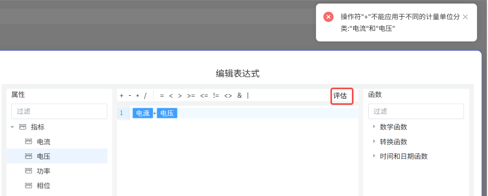
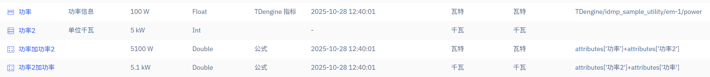
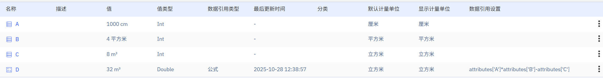
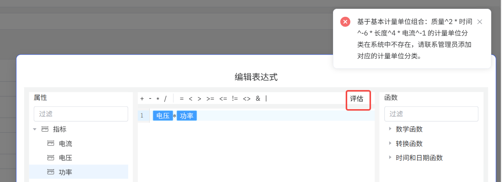
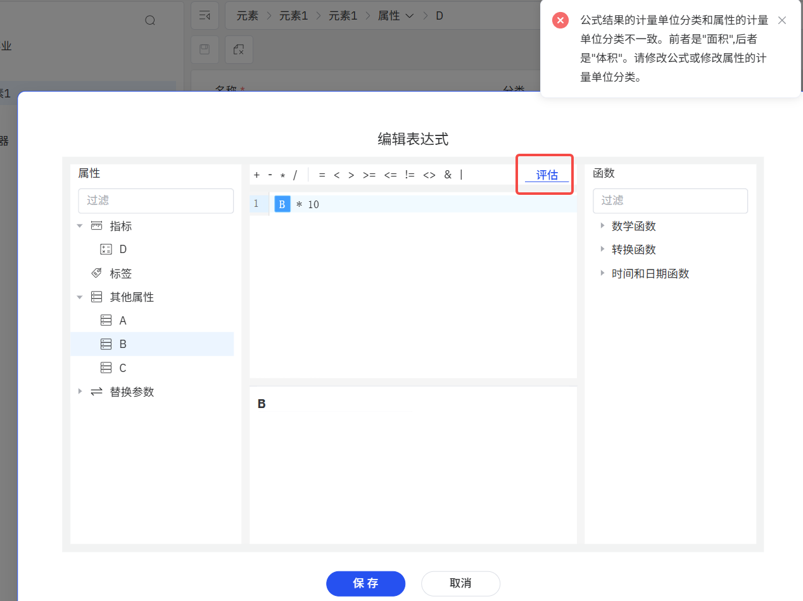

# 计量单位

## 计量单位管理

在物联网、工业场景，每个采集量采用的计量单位 (UOM) 都可能不一致。即使在入库时做计量单位的转换，但由于项目实施的时间不同，还有其他各种原因，这些采集量存入到数据库后，仍然存在计量单位不一致的可能。因此为提供准确的数据分析，我们必须进行计量单位的转换。

已经存入到数据库的数据不宜修改，因此 IDMP 容许您对元素的一个属性配置计量单位，而且容许您配置用于显示的计量单位。无论是做表达式的计算，还是简单的显示，IDMP 会基于存储的数据的计量单位，做自动的单位转换。

IDMP 已经内置了质量、长度、时间、温度、体积、力、电流、电压、能量、存储、功率、摩尔数等各种计量单位，但您可以继续扩展。

计量单位的管理在主菜单“基础库”之下，因为很直观，不做过多说明。

## 公式的计量单位

[公式引用](../basic/data-model#公式)的表达式可以很复杂，当配置了计量单位的属性参与到表达式运算的时候，会出现多种情况。下面是各种情况的处理规则。为了简化说明，下面的描述中我们用大写字母表示参与运算的量，如 A、B，它们可能代表一个属性，也可能代表一个中间计算结果。

### 加减运算

对于 A + B 或 A - B 形式的公式：
1. 如果 A 和 B 属于不同的计量单位分类（UOM Class）则会报错。
2. 如果相加的两个量属于相同的计量单位分类但计量单位不同，比如一个单位是功率瓦 (W)，一个单位是功率千瓦 (kW), 那么会将第二个量的计量单位转为第一个量的计量单位。
3. 如果相加的两个量一个有计量单位一个没有，那么自动将没有计量单位的量转为与另一个量有相同计量单位的量，然后再计算。比如你可以将电流与一个没有单位的常量相加。

#### 示例
例如试图将电流和电压两个属性相加时会提示错误：“操作符'+'不能应用于不同的计量单位分类:'电流'和'电压'"。

再例如下面两个属性 Power 和 Power2，计量单位结果的单位是 W，公式`Power + Power2` 结果的单位是 W， 公式 `Power2 + Power` 结果的单位是 kW。

:::tip
在编辑属性的公式引用的时候，您可以通过点击表达式编辑窗右上角的“评估”按钮提前预览表达式的值或提前发现错误。
点击“评估”按钮还有一个好处：页面会记住表达式评估结果的计量单位，如果此时属性还没有设置计量单位分类和默认计量单位，关闭表达式编辑窗之后，页面会自动将最后一次评估的结果的计量单位设置为属性的默认计量单位。这省去了手动选择计量单位的麻烦。
:::

### 乘除运算

对于 A/B 或 A*B 形式的公式：
1. 我们会将 A 和 B 转成相应计量单位分类（UOM Class）的基本计量单位再进行计算。
2. 结果的“计量单位分类”可以通过这些基本计量单位的组合找到，结果的“计量单位”就是找到的“计量单位分类”的默认计量单位。
3. 如果乘除运算的结果的计量单位分类在系统中未定义，那么编辑公式的时候会提示错误。

#### 示例
例如有属性 A 单位是厘米 (cm), 属性 B 单位是平方米 (m2),属性 C 的单位是立方米 (m3)。这里涉及 3 个计量单位分类，分别是：长度、面积和体积。对于公式 `A*B-C`, 会先把 A 转换成计量单位为米的值，然后与 B 相乘得到的结果的计量单位是立方米，最后再与 C 进行减法运算。如下图：

再例如将电压与功率相乘，得到的计量单位是没有意义的，系统中也不存在，则会提示错误。如下图：

### 比较运算和位运算

表达式支持比较运算符： `=`，`<>`, `>`, `<`, `>=`, `<=`；也支持位运算：`|` 和 `&`; 对于这些运算符两边的量的 UOM 处理规则如下：
1. 如果两边都有 UOM 但属于不同的 UOM Class，则报错。
2. 如果一边有 UOM，一边没有 UOM，则忽略 UOM。
3. 如果两边都有 UOM 且属于相同的 UOM Class，则
    * 如果 UOM 相同，则直接运算。
    * 如果 UOM 不同，则将右侧的 UOM 转化成左侧的 UOM 再运算。

### 函数

公式表达式中如果使用了函数，那么函数的结果的 UOM 和函数的第一个参数的 UOM 一致。比如公式 `SIN(A)` 的结果的 UOM 为 A 的 UOM。

## 计量单位自动转换

如上，带计量单位的量参与公式运算的时候，会根据情况自动转化计量单位。除此之外，还有两个场景会自动转化计量单位：
1. 属性的默认计量单位和显示计量单位不一致的时候，自动按显示的计量单位展示属性值。
2. 公式结果的计量单位和属性的计量单位不一致的时候，自动将公式结果的计量单位转换为属性的计量单位展示。（此处的“属性的计量单位”指用于展示属性值的计量单位）。

如果公式结果的计量单位与属性的计量单位不属于同一个计量单位分类，那将无法自动转换。如下图：
