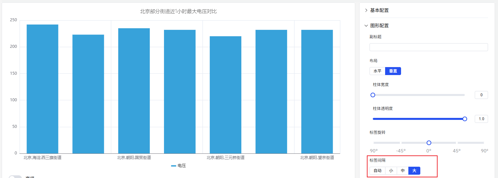

# 柱状图

柱状图（或称条形图）是一种通过柱形的高度（横向的情况下则是宽度）来表现数据大小的一种常用图表类型，通常用于根据标签聚合或者时间窗口聚合的分析场景。

## 配置项

### 图形配置

#### 布局

柱状图的布局有`水平`和`垂直`，默认为`垂直`布局，设置为水平布局时，展示如下。

#### 柱体样式

如下图，可以调整柱状图柱体的`宽度`和`透明度`。柱体宽度如果不设置，则会根据当前图表的整体宽度和柱体数量自动计算柱体宽度，具有比较好的适应性。只有在固定宽度的显示屏上展示时，为了调整到最合适的状态才手工去设置此宽度，否则不建议设置。

#### 标签

如下图所示，配置标签旋转角度，可避免过长的标签重叠

调整标签间隔，降低标签密度

### 坐标轴

坐标轴可配置显示坐标轴名称及其计量单位

在一个图中显示两个指标时，如果两个指标的量程具有数量级的差别，会影响对一个指标的分析效果。此时可以启用`右坐标轴`，使用双 Y 轴模式来显示指标。

### 边界值

可以配置边界值，将指标中的安全区域和警戒区域标识出来，更利于分析和观察。

### 图例

可开启在图例中显示最大值、最小值等统计值。

## 配置项增强 roadmap

为了持续提升您的使用体验，我们将在后续的产品更新中，不断增加实用配置，让您能够享受到更丰富、更贴心的分析功能。

| 项目       | 说明                                                         |
|------------|--------------------------------------------------------------|
| 坐标轴比例  | 坐标轴可以设置指数级别，可以线性观察指数增长的指标               |
| 坐标轴单位  | 选择显示单位，以便统一单位来显示指标，比如使用“毫安”来显示电流     |
| 最大值/最小值 | 设置坐标轴显示的最大值和最小值     |
| 指标配色方案  | 目前每个指标的颜色是固定的；后续可提供配色方案，由您决定用什么颜色显示 |
| 图例位置  | 目前图例固定显示在图的正下方，后续可配置显示位置 |
| 柱体渐变色  | 可配置柱体渐变色，数值越大，颜色越深 |
