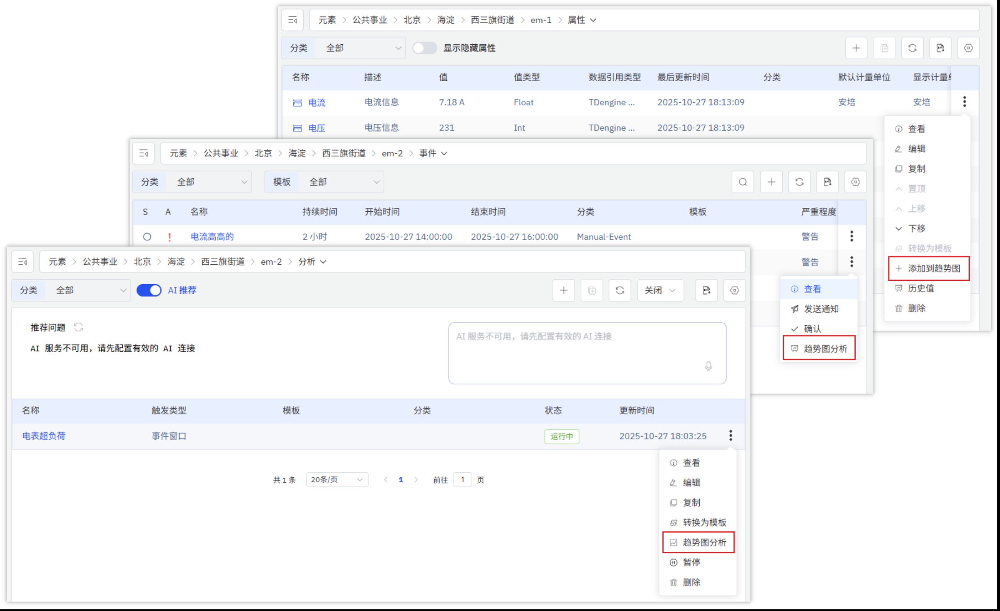

# 事件趋势图

事件趋势图通过趋势图展示事件相关指标，并高亮标注事件发生的时间范围。用户可将任意设备监测指标及事件添加至分析视图，直观呈现数据随时间的波动趋势。

## 数据来源

可添加任意元素的`属性`、`事件`、`分析`到事件趋势图中。添加`事件`时，会把触发该事件相关的属性加入到事件趋势图中并高亮显示事件持续的时间范围。添加`分析`时，会把分析中引用的元素属性都加入图中，另外该分析生成的事件都会被加入到图中。

## 分析工具

### 多泳道

默认开启多泳道。多泳道模式下，一个指标占据一条泳道。

### 按开始时间对齐

默认不开启。开启后，按照开始时间对齐并截取多段指标片段，同期对比指标规律，可观察是否具有相同的变化趋势或规律。

### 高亮显示事件相关指标

当鼠标悬浮在某一个事件区域上时，会高亮显示和该事件触发相关的指标，其他事件和指标置灰。

### 事件列表

点击左上角的`事件列表`按钮，可打开事件列表弹窗；如图所示，展示时间名称、开始时间、结束时间、持续时间等，弹窗可以自由拖动。

事件列表中默认勾选，勾选的事件高亮显示，未勾选的事件会被置灰。事件可删除。

## 保存为面板

点击左上角的“保存”按钮，可以将分析视图永久保存为面板。保存时，可以选择保存在哪个元素下，此时可以选择当前视图内相关的元素树节点及其祖先节点。

