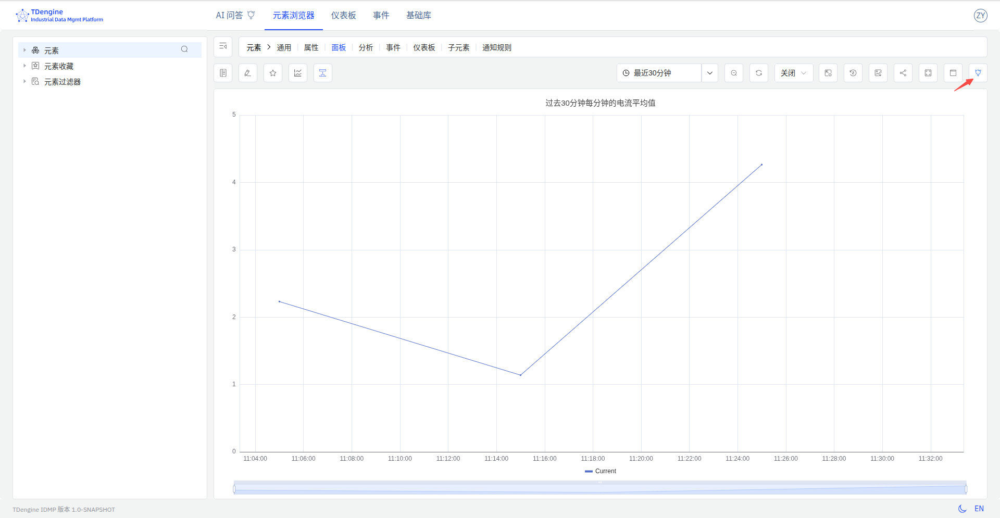

# 面板数据解读

面板数据解读功能，利用 AI 对当前面板的所有数据进行分析，自动生成结构化、易于理解且具有业务洞察力的专属分析报告，帮助用户快速抓住数据核心价值，降低数据解读门槛。

## 功能亮点

- **自动分析**：无需手动整理数据，AI 自动输出分析结论。
- **业务洞察**：结合业务场景，挖掘数据背后的潜在价值。
- **结构化报告**：报告内容条理清晰，便于理解和后续决策。
- **交互便捷**：支持一键生成、重新生成和关闭，操作简单。

## 使用场景

适用于需要快速理解面板数据、辅助决策、向团队成员汇报数据结论等场景。

## 如何使用

1. 在面板的查看页面，点击右上角的 **解读面板** 按钮。
2. 系统会自动打开数据解读区域，并流式输出 AI 分析报告。

3. 生成的分析报告会在页面右侧展示，内容包括数据概览、趋势分析、异常检测、业务建议等。

## 重新生成分析报告

如果对当前分析结果不满意，或数据发生变化，可点击数据解读区域右上方的“重新生成”按钮，AI 将基于最新数据重新生成分析报告。

## 关闭数据解读

如需收起分析报告，可点击数据解读区域右上方的“关闭”按钮，隐藏数据解读区域。

## 注意事项

- AI 分析结果仅供参考，建议结合实际业务场景进行判断。
- 若面板数据量较大，分析过程可能需要较长时间，请耐心等待。
- 若遇到无法生成报告的情况，请检查面板数据是否完整，或点击 **重新生成** 进行重试。
