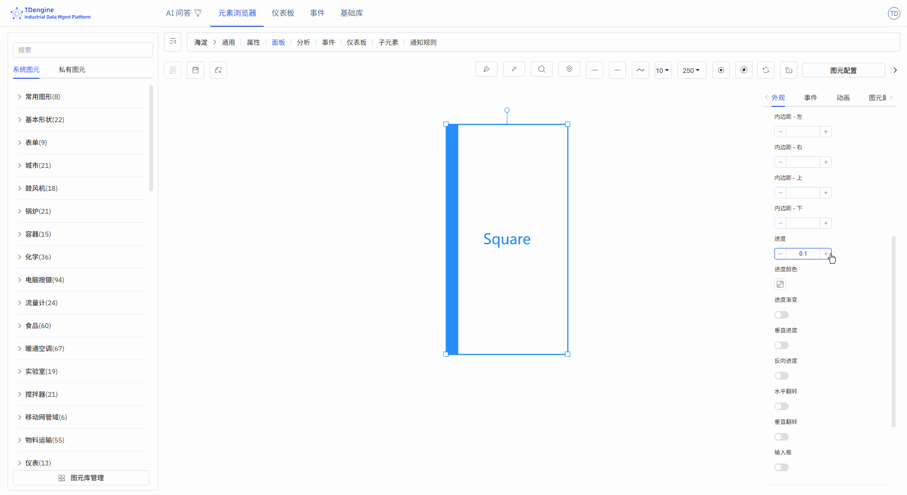
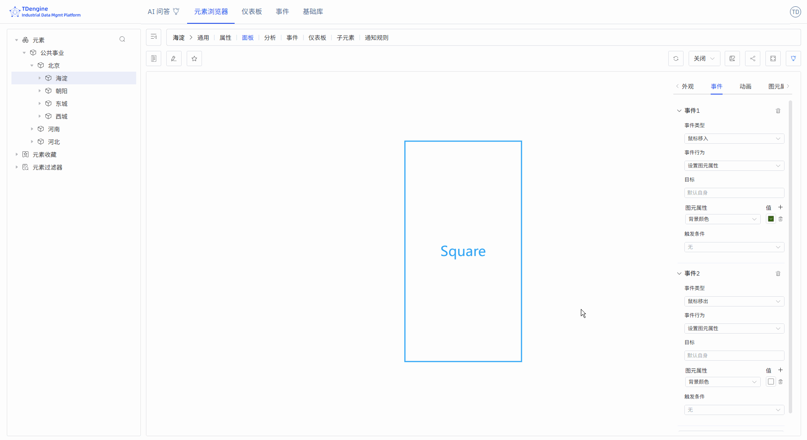
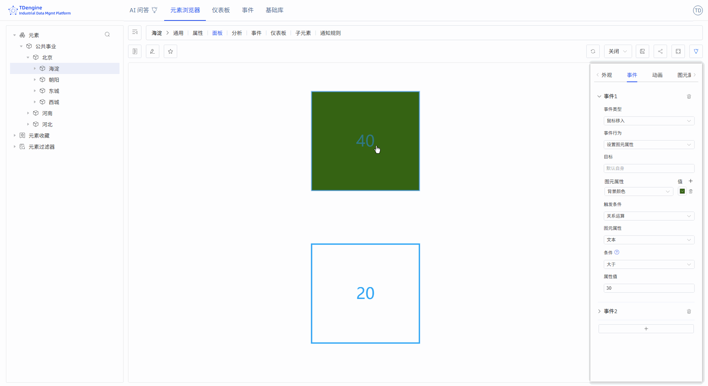
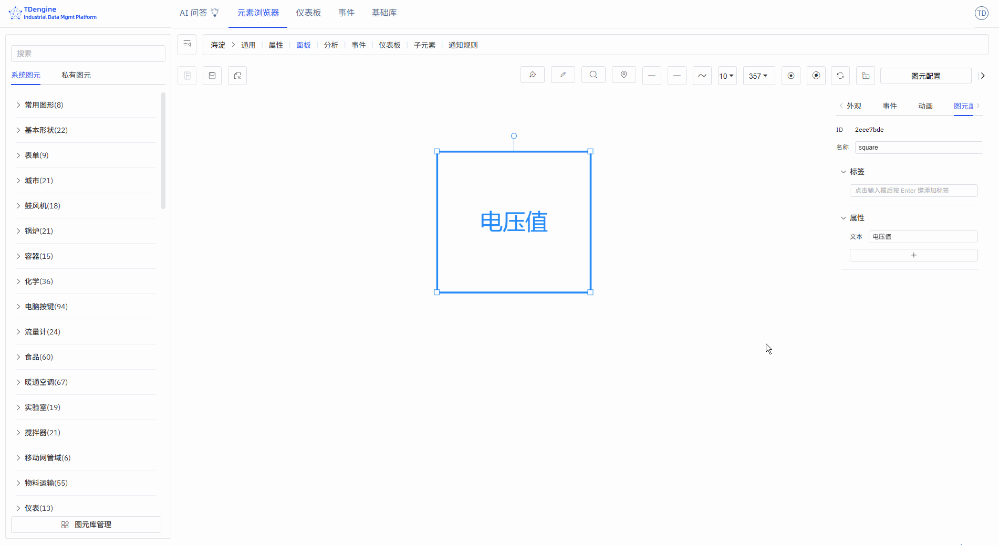

# 图元

图元是构成监控画面的基本元素，就像乐高积木一样，每个设备图标、封闭图形都是一个图元。通过组合不同的图元，您可以构建出完整的工业监控系统。

## 外观设置

### 图元样式

角度：设置尖角与圆角，值的范围：0~1

旋转：设置图形的旋转角度

进度：任意封闭图形，都可以当进度条：矩形、圆、svg、封闭连线、或其他任意封闭图形，值的范围：0~1

### 图片外观样式

可以上传图片作为图元的外观或者背景图片。

### 字体图标外观样式

可设置图元上显示文字的字体、大小、颜色、样式、粗细、行高、所在位置等。

## 事件

创建组态的关键一步是事件的定义，包括事件类型、事件动作与触发条件。事件类型有鼠标移入、鼠标移出、选中等，但最重要的是"图元属性值变化"。图元的属性可以与 IDMP 元素的一个属性绑定，当这个值的某个触发条件满足时，就可以触发指定的事件动作。而事件动作包括开始动画、停止动画等，但最重要的动作是"设置图元属性"，可以改变图元的展现形式，比如图元的颜色、背景颜色、显示的文本等。下面挨个进行详细说明。

### 添加事件

添加相应事件，即可实现相应的事件行为。tip: 部分事件行为只有在查看时才展示效果，编辑时无法展示。

事件类型：鼠标移入、鼠标移出、选中、取消选中、鼠标按下、鼠标弹起、单击、双击、图元属性值变化。

事件行为：打开链接、设置图元属性、执行动画、暂停动画、停止动画、执行 JavaScript、执行 Window 函数、自定义消息。

如下图，为画布中图元设置了两个事件：当鼠标移入时，将背景色设置为绿色，当鼠标移出时，恢复背景色。

### 条件触发器

可以为事件添加触发条件。触发条件最常用的是"关系运算"，可以对图元的属性，包括值、进度、状态、文本进行逻辑判断（其他属性不提供逻辑判断的支持）。

如下图，设置当图元文本大于 30 时鼠标移入才会触发事件。图中演示，文本为 40 的图元满足条件，会触发背景变绿，而文本为 20 的图元不满足，鼠标移入时并不触发背景变绿。

## 动效

IDMP 内置很多种图元动画效果，也容许逐帧自定义动画。

### 图元动画

给图元添加动画、鼠标提示，设置动画时长、动画效果、循环次数、下个动画 tag、是否自动播放、是否保持动画状态。

### 内置动画

无、上下跳动、左右跳动、心跳、成功、警告、错误、炫耀、旋转、自定义。

### 自定义动画

通过新增动画帧，逐帧自定义动画。

### 鼠标提示

鼠标悬浮在图元上时，显示鼠标提示信息。支持两种方式：

1. 参考 Markdown 语法编写鼠标提示
2. 编写 Mark 函数，显示函数的返回值

## 图元组合、状态

在画布中可选择多个图形，然后右键菜单选择组合/组合为状态，可拼接组合为任意想要的方式，可以对组合图元中的任意子图元进行图元的处理操作，有利于图元复用。

两个或更多图元组合为状态，是极为有效的表现方式。例如开和关，风机的转动与停止就可以组合为一个状态。不同颜色的报警灯，比如红、黄、绿，可以组合为一个状态。可以通过事件或绑定IDMP元素属性来驱动状态的修改，实现动效。

## 图元属性

图元有很多属性，包括颜色、文本字体、字体颜色、进度等，这些通用属性都可以在外观设置里直接手动进行设置。但你可以通过配置，自动控制如下图元属性：背景颜色、颜色、文本颜色、文本、X、Y、高度、宽度、可见、进度值、进度颜色、值、状态、旋转、禁用等。

上述的属性里，其中的文本、进度值、状态、值四个属性，还可以在事件的事件触发条件里进行逻辑判断。

事件的设置里，你可以通过选择"设置图元属性"事件行为来自动控制图元的属性。还有一种方式，就是将这些属性与IDMP的元素属性进行绑定。

绑定变量，能快速实现实时数据动态展示。如下图所示，添加属性绑定，将图元的 "文本" 绑定到元素 "em-1" 的电压。当元素电压采集值变化时，图元的文本在刷新数据时，也会跟着实时变化。

:::tip
绑定变量之前，建议选择合适的输入方式，手动输入属性值，测试自己想要的效果，比如进度条的变化，状态的改变，事件的触发等。等测试达到自己想要的效果后，再将属性绑定到IDMP某个元素的属性。投入生产运营的组态，图元的属性一定是与元素的属性进行绑定了的。
:::
